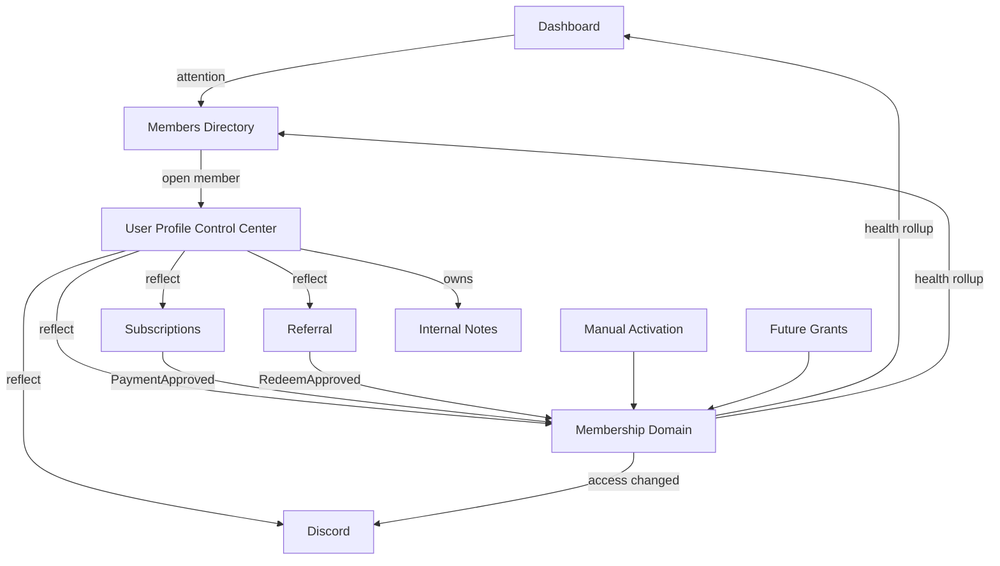
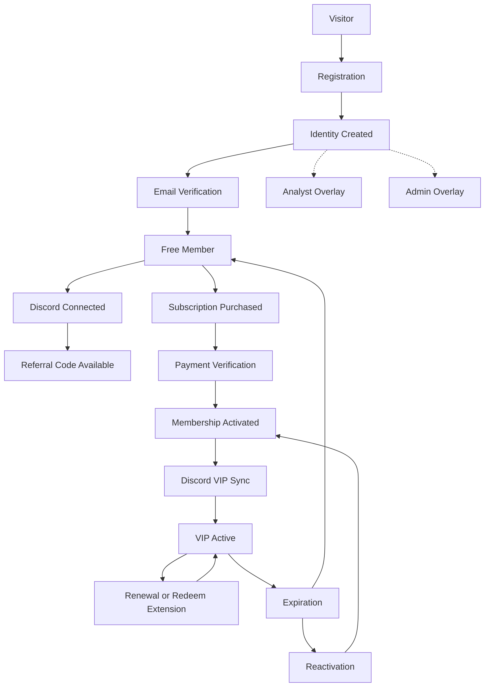
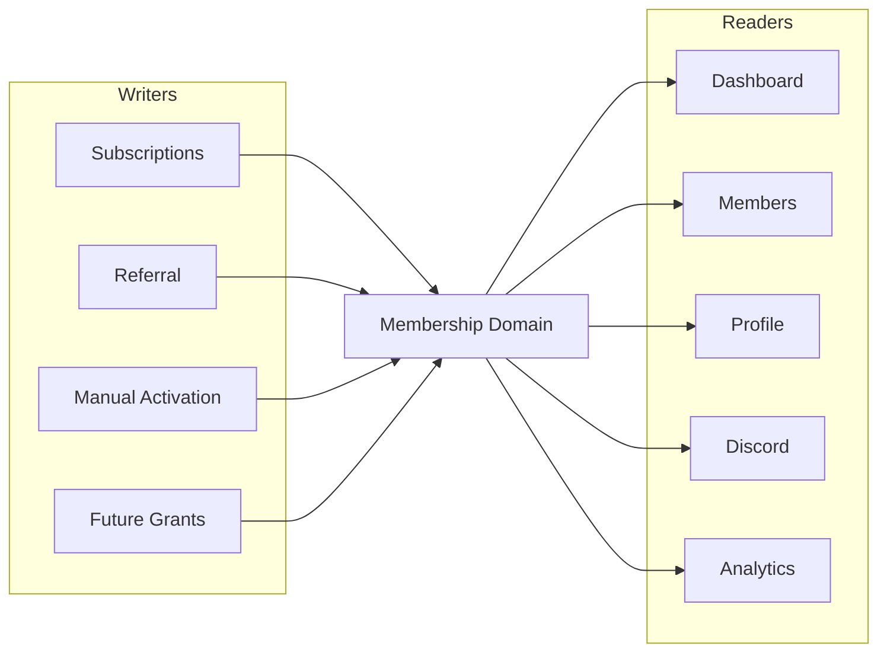
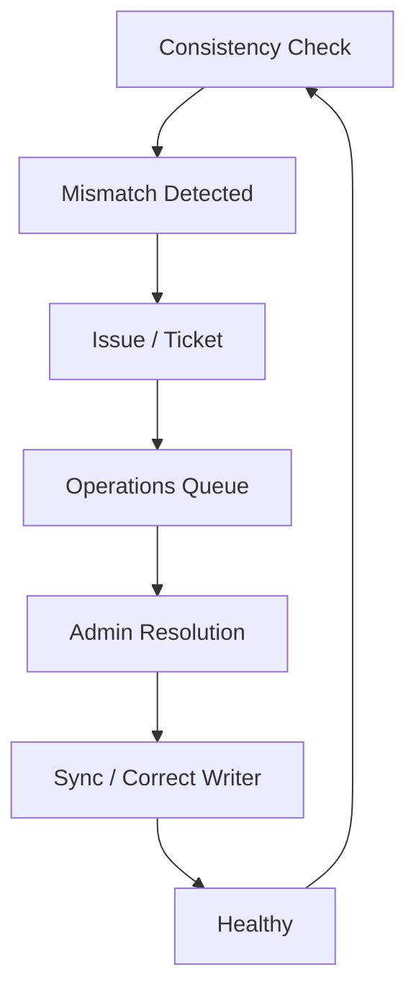
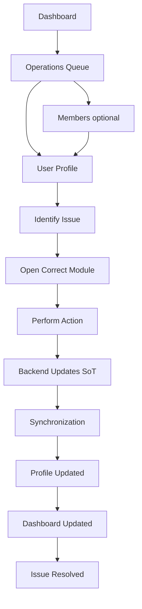

# TraderCity Admin Ecosystem & User Lifecycle Architecture

**Version:** 1.0.0 (Draft)  
**Status:** Architecture Discovery & Product Analysis  
**Authority:** Product Architecture Layer (`docs/04_Product_Architecture/`)  
**Audience:** Product Owner · Backend Engineers · Frontend Engineers · Future Contributors · AI Development Agents

---

## Document Role

This document is **not** an implementation specification.

It defines the complete architecture of the TraderCity Admin Dashboard ecosystem by reconstructing relationships between every module, documenting ownership boundaries, describing the full user lifecycle, and explaining how data flows across the platform.

It is the **highest-level ecosystem reference** before backend implementation continues.

| This document owns | Related docs (do not replace) |
|--------------------|--------------------------------|
| Ecosystem spine & module relationships | Admin UI vision: `docs/AI/Agents/Admin/07`, `05`, `03` |
| User model & complete lifecycle | Field ownership: `CROSS_MODULE_DATA_SYNCHRONIZATION_ARCHITECTURE.md` |
| Sync / reconciliation / health synthesis | Referral domain: `REFERRAL_SYSTEM_ARCHITECTURE.md` |
| Implementation vs architecture maturity | Payment stack: Admin `08` |
| Gap analysis & backend readiness | Governance: `PROJECT_ARCHITECTURE.md`, Phase-Roadmap |

**Constraint:** Respect existing documentation. Improve understanding. Connect architecture. Do not invent parallel ownership models or redesign UI.

---

## Authority Stack

When documents disagree, resolve in this order:

1. [`CROSS_MODULE_DATA_SYNCHRONIZATION_ARCHITECTURE.md`](./CROSS_MODULE_DATA_SYNCHRONIZATION_ARCHITECTURE.md) — data ownership / Membership domain
2. Admin `07` + `05` — operations philosophy / Control Center
3. Admin `03` — UI contracts
4. Admin `08` — pricing / payment verification stack
5. [`REFERRAL_SYSTEM_ARCHITECTURE.md`](./REFERRAL_SYSTEM_ARCHITECTURE.md) — referral domain
6. `docs/Development/Admin/Phase-Roadmap.md` / `PROJECT_STATUS.md` — intended build order
7. Current frontend (`src/app/admin/**`, `src/components/members/**`) — implementation maturity truth

Concepts labeled **architectural synthesis** (User Health Engine, Reconciliation Architecture) are derived from existing System Health, Operations Queue, Discord Sync, and Referral clawback language — not new Admin sidebar modules.

---

## Table of Contents

1. [Executive Summary](#1-executive-summary)
2. [Current Project State](#2-current-project-state)
3. [Complete Module Relationship Map](#3-complete-module-relationship-map)
4. [TraderCity User Model](#4-tradercity-user-model)
5. [Complete User Lifecycle](#5-complete-user-lifecycle)
6. [Membership Domain Architecture](#6-membership-domain-architecture)
7. [Synchronization Architecture](#7-synchronization-architecture)
8. [Reconciliation Architecture](#8-reconciliation-architecture)
9. [User State Engine](#9-user-state-engine)
10. [User Health Engine](#10-user-health-engine)
11. [Event Architecture](#11-event-architecture)
12. [Admin Operational Workflow](#12-admin-operational-workflow)
13. [Data Ownership Matrix](#13-data-ownership-matrix)
14. [Current Implementation vs Architecture](#14-current-implementation-vs-architecture)
15. [Gap Analysis](#15-gap-analysis)
16. [Architecture Recommendations](#16-architecture-recommendations)
17. [Backend Readiness Assessment](#17-backend-readiness-assessment)
18. [Final Conclusion](#18-final-conclusion)

---

## 1. Executive Summary

TraderCity Admin is an **Operations Center** for Member Management — not a collection of isolated pages and not an extension of the marketing site.

**Current maturity:**

| Layer | Maturity |
|-------|----------|
| Product / ops vision | Strong (Admin chapters `00`–`08`) |
| Data ownership / Membership domain | Documented (Cross-Module Sync Architecture) |
| Frontend shell (Phases 0–3) | Complete on mocks |
| Discord + Referrals Admin UI | Largely complete on mocks (ahead of some phase trackers) |
| Subscriptions Admin UI | **Critical gap** — route is a placeholder |
| Backend / NestJS / real APIs | Not started for Admin modules |
| Multi-module reconciliation / event bus | Documented intent; not implemented |

**One-sentence verdict:** The Admin Dashboard is a **UI-first, mock-driven Member Management shell** with a clear philosophical spine (modules own, Profile reflects, Membership is the access SoT) — but production multi-module state cannot go live until Membership writers, payment verification, Discord sync, System Health, and an event log exist on the backend.

**What this document gives a new engineer:** how users move through TraderCity, how Admin modules connect, who owns each field, how sync and reconciliation should work, how Admins resolve issues, what already exists in code, and what still blocks backend.

---

## 2. Current Project State

### 2.1 Completed (docs + UI on mocks)

| Area | Routes / surfaces | Notes |
|------|-------------------|--------|
| Admin Foundation | `src/app/admin/layout.tsx`, shell, nav, primitives | Phase 0 |
| Dashboard | `/admin` | Operations widgets, queue, activity, platform health (decorative) |
| Members Directory | `/admin/members` | Search, filters, System Health column |
| User Profile (Control Center) | `/admin/members/[id]` | Reflection cards, notes, activity timeline |
| Discord Module UI | `/admin/discord`, `/admin/discord/[id]` | Directory, details, sync actions (stubbed) |
| Referrals Module UI | `/admin/referrals`, `/admin/referrals/[id]`, `/admin/referrals/intelligence` | Ops + Intelligence |

### 2.2 Partially implemented

| Area | Status |
|------|--------|
| Subscriptions | Route exists; **`ModulePlaceholder` only** — no tickets UI |
| System Health | Display badge + mock field; not server-computed |
| Platform Health | Decorative status strip; links to missing `/admin/health` |
| Profile Manage → Subscriptions | Deep-links land on placeholder |
| Domain actions (approve, sync, redeem) | UI present where built; NestJS TODOs / alerts |
| Cross-module consistency | Independent mock arrays — not a shared store |

### 2.3 Planned / deferred

| Area | Status |
|------|--------|
| Payments (standalone Admin page) | Deferred by design — Subscriptions owns payment ops (`07`) |
| Settings | Phase 8 |
| Reports / Community / Media | Phase 7 → Content Platform |
| Notifications / Audit Logs | Phase 9 / automation roadmap |
| Real NestJS Admin APIs | Pending Platform / Freeze policy + backend work |
| Membership Admin page | **Never planned** — Membership is a backend domain only |

### 2.4 Governance context

- **Engineering Freeze:** Active for product feature work until Migration / Platform v2 completes.
- **Engineering Platform v2.0:** Planned; checklist largely incomplete.
- **Tension:** Admin UI Phases 0–3 (and substantial Discord/Referrals UI) already shipped on mocks while Freeze / Platform v2 still constrain production feature delivery. This document records that tension; it does not authorize violating Freeze.

---

## 3. Complete Module Relationship Map

### 3.1 Ecosystem spine



### 3.2 Ownership, dependencies, communication

| Module / Domain | Owns | Depends on | Communicates by | Reflects in |
|-----------------|------|------------|-----------------|-------------|
| **Dashboard** | Nothing | All domain health / queues | Deep-links into modules | N/A (is the inbox) |
| **Members** | Identity directory UX | Membership, Sub, Discord, Referral (reads) | Navigate to Profile | Directory columns |
| **User Profile** | Notes + presentation | All domains | Manage → links | Full Control Center |
| **Membership** | Access / VIP lifecycle | Writers only | Events + projections | Profile, Members, Dashboard, Discord triggers |
| **Subscriptions** | Payment tickets / verification | Membership (write target) | Approve → Membership update | Profile Subscription card |
| **Discord** | Sync / role / connection | Membership access decisions | Sync jobs / tickets | Profile Discord card |
| **Referral** | Code / credits / redeem | Membership (on redeem) | Approve → Membership extend | Profile Referral card |
| **Payments** (depth) | Future financial ops depth | Subscription verification | Same payment domain | Profile / Subscriptions |
| **Reports** | Deferred analytics surfaces | Event stream | Read aggregates | Future |
| **Notifications** | Deferred alerts | Events | Push / inbox | Future |
| **Audit Logs** | Deferred immutable trail | Events | Append-only log | Future |

### 3.3 Sidebar vs backend domains

**Canonical Admin sidebar (Phases 0–6):** Dashboard · Members · Subscriptions · Discord · Referrals

**Backend domains without dedicated sidebar pages:** Membership (lifecycle SoT), Payments depth (under Subscriptions), future Notifications / Audit.

### 3.4 Reflection rule

> Show ≠ Own.

Members and Profile may **display** Subscription, Discord, Referral, and Membership state. They do **not** execute those domains’ business actions. Dashboard monitors and routes only.

---

## 4. TraderCity User Model

Everything operational about a person attaches to one **TraderCity User**.

```text
TraderCity User
        │
        ├── Identity          (email, Discord username link, account ids)
        ├── Membership        (plan, VIP/access, activation, expiry, renewals)
        ├── Subscription      (payment tickets, verification, hashes, wallets)
        ├── Discord           (connection, roles, sync status, history)
        ├── Referral          (code, attributions, credits, redeem)
        ├── Notes             (admin-only Internal Notes — Profile-owned)
        ├── Activity          (aggregated operational events — presentation)
        │
        ├── Learning          (future)
        ├── Reports           (future member/content consumption)
        ├── Permissions       (future RBAC overlays: Analyst, Admin staff)
        ├── Audit             (future immutable trail)
        └── Analytics         (future derived metrics)
```

**Rules:**

1. Domains are **projections / owned records** under one user id — not five competing “users.”
2. **Membership** answers: *Does this user have access, and until when?*
3. **Subscription** answers: *What payment ticket produced or failed that access?*
4. **Discord** answers: *Is the communication platform synced with TraderCity truth?*
5. **Referral** answers: *What growth economics attach to this user?*
6. **Profile** answers: *What is the complete operational picture right now?*

Permissions such as Analyst / Admin are **identity / RBAC overlays**. They must not fork a second VIP flag outside Membership.

---

## 5. Complete User Lifecycle

### 5.1 Lifecycle spine



### 5.2 Stage catalog

| Stage | Entry criteria | Exit criteria | Backend actions | Frontend reflections | Admin responsibilities |
|-------|----------------|---------------|-----------------|----------------------|------------------------|
| **Visitor** | Hits marketing / auth entry | Registers | — | Marketing only | None |
| **Registration** | Submits signup | Identity persisted | Create user / Identity | Redirect to Free Dashboard | Investigate failed signups (future) |
| **Identity Created** | User row exists | Stable account id | Persist email, ids | Members row appears | Directory search |
| **Email Verification** | Product requires verify | Verified flag | Token / verify job | Banner / lockouts if required | Support unlock (future) |
| **Free Member** | Identity active; no VIP Membership | Purchases / granted VIP | Default Membership = free/none | Free Dashboard, Profile Free | Monitor abuse only |
| **Discord Connected** | OAuth / invite complete | Linked Discord id | Store link; Public role sync | Discord card Connected | Resolve link failures |
| **Referral Generated** | Eligible member | Code issued | Create referral code | Referral card | Fraud / rules (Referrals) |
| **Subscription Purchased** | Payment submitted | Ticket created | Create payment ticket / quote | Subscription Pending | Queue attention |
| **Payment Verification** | Ticket pending | Approved / rejected | Verification engine | Status on Profile / Sub module | Approve / reject in Subscriptions |
| **Membership Activated** | Writer succeeds | Active VIP Membership | Update Membership domain | Membership Activity card | Confirm outcome on Profile |
| **Discord VIP Sync** | Membership access requires VIP role | Role matches Membership | Discord sync job | Discord card role / sync | Sync Now / tickets |
| **VIP Active** | Membership Active | Expires / revoked | Access gates | VIP surfaces | Routine ops |
| **Renewal** | Payment renew or redeem | Membership dates extended | Writer → Membership | Updated days remaining | Subscriptions / Referrals |
| **Expiration** | Expiry reached | Access removed | Membership → Expired; Discord demote | Health → Needs Attention / Expired | Queue + Sync |
| **Reactivation** | New payment / grant | Membership Active again | Same activation path | Profile refreshed | Same modules |
| **Analyst / Admin** | Staff assigns overlay | Role revoked | Permissions domain | Admin auth only | Settings / RBAC (future) |

### 5.3 Lifecycle separation (do not conflate)

| Lifecycle | Owner | Example states |
|-----------|-------|----------------|
| **User / Membership access** | Membership domain | Free · Active VIP · Expired |
| **Payment ticket** | Subscription | Pending · Verifying · Successful · Rejected |
| **Referral entity** | Referral | Created · In Progress · Successful · Redeemed |
| **Discord sync** | Discord | Connected · Synced · Mismatch · Left server |

“Pending Verification” belongs primarily to the **payment ticket**, not as a forever Membership SoT state — though Profile may show pending payment while Membership remains Free until activation.

---

## 6. Membership Domain Architecture

### 6.1 Why Membership exists

VIP / access can originate from many places:

- Paid subscription
- Referral redeem
- Manual Admin grant
- Future: coupon, gift, giveaway, staff, founder, partner, enterprise seats

If **Subscriptions owned lifecycle**, it would become a catch-all for non-payment VIP — mixing concerns.

### 6.2 Why Subscription does not own lifecycle

| Event | Payment involved? | Still changes access? |
|-------|-------------------|------------------------|
| Payment approved | Yes | Yes |
| Referral redeem approved | No | Yes |
| Manual VIP creation | No | Yes |
| Promotional / gift / staff / founder | No | Yes |

Subscriptions own **payment tickets**. Membership owns **resulting access state**.

### 6.3 Membership as central backend domain

```text
                    MEMBERSHIP
             (Backend Domain Model)
                     │
────────────────────────────────────────
      Source of Truth for access
────────────────────────────────────────
Current Plan · Membership Status · VIP Status
Activation Date · Expiry Date · Renewal Count
Membership Duration · Days Remaining
```

**Not an Admin page. Not a sidebar item.**

### 6.4 Writers and readers



| Writer | Trigger |
|--------|---------|
| Subscriptions | Payment approved / verified activation |
| Referral | Redeem approved |
| Manual Activation | Admin grant without payment |
| Future Grants | Coupon, gift, staff, founder, partner, etc. |

| Reader | Use |
|--------|-----|
| User Profile | Membership Activity card |
| Members | Status / health columns |
| Dashboard | Expiry / attention queues |
| Discord | Access-driven sync |
| Analytics | Cohorts (future) |

Canonical detail: [`CROSS_MODULE_DATA_SYNCHRONIZATION_ARCHITECTURE.md`](./CROSS_MODULE_DATA_SYNCHRONIZATION_ARCHITECTURE.md).

---

## 7. Synchronization Architecture

### 7.1 Principle

> One owner. Many readers.  
> Backend decides. Discord executes. Database is physical SoT.

Frontend never invents parallel VIP / payment / role truth.

### 7.2 Who publishes / who consumes

| Publisher (domain event) | Consumers |
|--------------------------|-----------|
| Identity created / updated | Members, Profile, Audit (future) |
| Payment ticket status changed | Profile, Dashboard queue, Membership writer (on success) |
| Membership activated / extended / expired | Profile, Members, Dashboard, Discord sync, Referral qualify jobs |
| Discord sync result | Profile, Members health, Dashboard queue |
| Referral reward / redeem | Profile, Membership writer (on redeem), Intelligence |
| Internal note added | Profile only (plus Audit future) |

### 7.3 Core sync sequences

**Payment success**

```text
Payment Verified (Subscription)
        ↓
Membership Updated
        ↓
Discord Sync Requested
        ↓
Discord Domain Updated
        ↓
Profile / Members / Dashboard reflect
```

**Referral redeem**

```text
Redeem Approved (Referral)
        ↓
Membership Extended
        ↓
Profile Membership card updated
        ↓
Discord sync if access window changed
        ↓
Dashboard / Members reflect
```

**Discord left server**

```text
Discord Service detects leave
        ↓
Discord Domain Updated
        ↓
Profile / Members / Dashboard reflect
```

Membership access is **not** automatically redefined by Discord leave unless product rules explicitly revoke access. Discord owns connection/role sync; Membership owns VIP lifecycle.

### 7.4 Reflection rules

1. Profile cards are read-only projections + Manage links.
2. Members directory health is derived, not independently editable business truth.
3. Dashboard queue items are attention pointers into owning modules.
4. After any Admin write, backend updates SoT → all readers refresh (One Loop from Admin `05`).

Field-level matrix: Cross-Module §5; expanded in [§13](#13-data-ownership-matrix).

---

## 8. Reconciliation Architecture

**Architectural synthesis** — not a new sidebar module. Built from System Health, Operations Queue, Discord Sync Now, and Referral clawback language already in the docs.

### 8.1 Purpose

Backend validates consistency across domains. When projections diverge from SoT, the system creates an **issue** for Admin resolution.

### 8.2 Generic loop



### 8.3 Reconciliation scenarios

| Scenario | Detected when | Issue type | Admin module | Resolution |
|----------|---------------|------------|--------------|------------|
| Membership VIP but Discord Public | Role ≠ Membership access | Sync ticket | Discord | Sync Now / role repair |
| Membership Free but Discord VIP | Orphan VIP role | Sync ticket | Discord | Demote / sync |
| Payment Successful but Membership not Active | Writer failed / not run | Critical payment gap | Subscriptions | Re-run activation / fix Membership |
| Redeem Approved but Membership not extended | Writer failed | Referral/Membership gap | Referrals | Re-apply extend |
| Membership Expired but Discord still VIP | Expiry job missed | Sync ticket | Discord (+ Membership job) | Expire sync |
| Discord left; health still “Connected OK” | Connection stale | Sync / health | Discord | Refresh connection state |
| Referral ledger ≠ wallet cache | Projection drift | Internal reconcile | Referrals / jobs | Rebuild from ledger (Referral arch) |
| Quote amount ≠ verified chain amount | Under/overpay | Verification ticket | Subscriptions | Follow `08` outcomes |

### 8.4 Healthy end state

Issue resolved → SoT corrected → Discord synced if needed → System Health recalculated → Profile / Members / Dashboard show consistent state → Queue item cleared.

---

## 9. User State Engine

**Architectural synthesis** from Admin System Health vocabulary (`Healthy` / `Needs Attention` / `Action Required`) plus payment and Membership states.

Backend derives a **member operational state** from multiple domains. Frontend displays; frontend does not invent.

### 9.1 Suggested derivation inputs

| Domain signal | Examples |
|---------------|----------|
| Membership | Active, Expired, None/Free |
| Subscription | Pending verification, Rejected, Successful |
| Discord | Connected, Sync mismatch, Left server |
| Referral | Pending redeem approval, fraud flag |
| Permissions | Suspended (future) |

### 9.2 Derived states (product vocabulary)

| Derived state | Typical meaning | Maps toward existing UI |
|---------------|-----------------|-------------------------|
| **Healthy** | Membership, Discord, and payments consistent; no open tickets | System Health: Healthy |
| **Needs Attention** | Soft mismatch or soon-expiring Membership | Needs Attention |
| **Critical / Action Required** | Hard mismatch or blocking ticket | Action Required |
| **Pending Verification** | Open payment ticket awaiting Admin | Queue → Subscriptions |
| **Expired** | Membership expired (access ended) | Membership Expired + health |
| **Suspended** | Permissions / policy hold (future) | Future badge |

Exact precedence rules belong to backend implementation; this document requires **one computed state**, not five independent UI guesses.

---

## 10. User Health Engine

### 10.1 Problem

If Dashboard, Members, and Profile each invent health from local fields, they will disagree.

### 10.2 Rule

> **One calculated User Health (System Health) per member.**  
> Dashboard, Members Directory, and User Profile **consume** it.

| Consumer | How it uses health |
|----------|--------------------|
| Dashboard | Aggregate counts / queue prioritization |
| Members | Column + filter |
| User Profile | Header / status widgets |

### 10.3 Computation ownership

| Layer | Responsibility |
|-------|----------------|
| Backend | Compute from Membership + Subscription + Discord + Referral (+ Suspended) |
| Frontend | Display badge / filters only |
| Mocks today | Precomputed `systemHealth` on mock members — temporary |

### 10.4 Naming

Product docs and UI currently say **System Health** / Overall Status. “User Health Engine” in this document means that **same calculated field**, not a second concept.

---

## 11. Event Architecture

### 11.1 Principle

Every meaningful platform action becomes an **Event**. Events power operational surfaces without duplicating business logic.

### 11.2 Example event catalog

| Event | Typical publisher |
|-------|-------------------|
| Registration | Identity |
| Email Verification | Identity |
| Discord Connected | Discord |
| Subscription Purchased | Subscription |
| Payment Verified / Rejected | Subscription |
| Membership Activated / Renewed / Expired | Membership |
| Referral Completed / Redeemed | Referral |
| Role Updated | Discord |
| Manual Verification / Manual Activation | Subscriptions / Manual writer |
| Admin Note Added | Profile (Notes) |
| Permission Updated | Permissions (future) |

### 11.3 Event consumers

```text
Event
  ├── Activity Timeline (Profile)
  ├── Recent Activity (Dashboard)
  ├── Operations Queue (when action required)
  ├── Audit Logs (future)
  ├── Notifications (future)
  └── Analytics (future)
```

### 11.4 Current frontend reality

Timelines exist as **mock arrays** on Profile / Discord / Referral details. There is **no shared event bus**. Backend should introduce an append-only event (or outbox) model that all modules publish into.

Referral architecture already specifies domain events and BullMQ jobs — that pattern should generalize.

---

## 12. Admin Operational Workflow

Daily Admin loop (from Operations Center vision):



### 12.1 Workflow rules

1. Dashboard answers: *What needs attention today?*
2. Profile answers: *What is the complete state of this member?*
3. Domain modules answer: *Perform the action.*
4. Never approve payments on Profile. Never sync Discord on Profile. Never redeem referrals on Profile.
5. After action: One Loop — DB → Profile → Members health → Dashboard.

### 12.2 Example paths

| Queue item | Module | Action | Domains updated |
|------------|--------|--------|-----------------|
| Payment pending | Subscriptions | Approve / reject | Subscription → Membership → Discord |
| Role mismatch | Discord | Sync Now | Discord (Membership unchanged unless rules say so) |
| Redeem pending | Referrals | Approve redeem | Referral → Membership → Discord |
| Member unclear | Profile | Read + note | Notes only |

---

## 13. Data Ownership Matrix

Expanded from Cross-Module Sync Architecture.

| Information | Owner | Writable from | Read modules | Reflection location | Sync / write trigger |
|-------------|-------|---------------|--------------|---------------------|----------------------|
| Email | Identity | Registration / future identity edit | Members, Profile, Dashboard | Profile header, Members | Registration |
| Discord Username (linked) | Identity | Link / OAuth flows | Members, Profile, Discord | Header / directory | Discord connect |
| Membership Status / Plan / Dates | Membership | Sub, Referral, Manual, Future grants | Profile, Members, Dashboard, Discord | Membership Activity card | PaymentApproved, RedeemApproved, ManualGrant, ExpiryJob |
| Payment Status / Tx Hash / Wallet | Subscription | Subscriptions Module | Profile, Dashboard | Subscription card | Payment submit / verify |
| Discord Role / Connection / Sync | Discord | Discord Sync Service / Module | Profile, Members, Dashboard | Discord card | Membership change, Sync Now, Discord webhook |
| Referral Progress / Credits / Redeem | Referral | Referrals Module | Profile, Dashboard, Intelligence | Referral card | Attribution, reward, redeem |
| Internal Notes | User Profile | Profile Notes UI | Profile | Notes section | Admin saves note |
| System Health | Derived (backend) | Engine only | Dashboard, Members, Profile | Badges / filters | Any domain change |
| Recent Activity (presentation) | Aggregate | Event log | Profile, Dashboard | Timeline / Recent Activity | Any event |

**Editable in User Profile:** Internal Notes only.

---

## 14. Current Implementation vs Architecture

| Module | Documentation | Current code | Status |
|--------|---------------|--------------|--------|
| Dashboard | Complete | Complete (mock / hardcoded queue) | Aligned (UI) |
| Members | Complete | Complete (mock) | Aligned (UI) |
| User Profile | Complete | Complete (mock); stale “Phase 5/6” copy on some tabs | Mostly aligned |
| Subscriptions | Complete specs | **Placeholder only** | **Critical gap** |
| Discord | Specs complete; phase tracker often “not started” | **UI largely complete (mock)** | Doc–code drift |
| Referrals | Product arch + Admin specs; phase tracker often “not started” | **Ops + Intelligence UI complete (mock)** | Doc–code drift |
| Payments page | Deferred / owned by Subscriptions | Missing (by design) | Aligned with `07` |
| Membership page | Must not exist | Does not exist | Aligned |
| Reports / Notifications / Audit / Settings | Deferred | Missing | Deferred |
| NestJS APIs | Assumed | Not wired | Gap |
| System Health engine | Specified as backend-computed | Mock precomputed field | Gap |
| Reconciliation jobs | Synthesized / partial (Sync Now, clawback) | No multi-domain reconcile service | Gap |
| Shared event bus | Specified for future | Independent mock timelines | Gap |

### 14.1 Code anchors

| Concern | Path |
|---------|------|
| Routes | `src/app/admin/**` |
| Shell / nav | `src/components/admin/layout/` |
| Domain UI | `src/components/members/sections/` |
| Mocks | `src/lib/members/mock/` |
| Hooks | `src/lib/members/hooks/` (`TODO NestJS`) |
| Types | `src/types/admin/**`, `src/types/members/**` |
| Pricing helpers (not Admin Sub UI) | `src/lib/membership/` |

---

## 15. Gap Analysis

| Gap | Why it exists |
|-----|----------------|
| **Subscriptions Admin UI missing** | Phase 4 not built; placeholder left for route stability |
| **Broken Manage → Subscriptions deep-links** | Profile/Dashboard assume Phase 4 surface |
| **No NestJS Admin APIs** | Frontend-first delivery; Freeze / Platform v2 constrain production backend sequencing |
| **Independent mocks** | Speed of UI delivery; no shared SoT yet |
| **No Membership domain API** | Ownership doc is new; backend not started |
| **No payment verification engine in production path** | Specified in Admin `08`; not implemented |
| **No Discord bot/service integration** | UI stubs (`alert` / TODO) |
| **No formal reconciliation engine** | Ops language exists; jobs not unified |
| **No shared event / audit log** | Timelines are per-mock |
| **System Health not computed** | Mock field only |
| **Deep-link param drift** | Docs (`?referral=`) vs code (`?status=`); dashboard `?source=` not fully handled |
| **Pricing / network / referral-credit contradictions** | Multiple historical SoTs (member UI, catalog `08`, Arena contracts, Admin `$10×6` vs tiered Referral arch) |
| **Phase tracker vs code drift** | Discord/Referrals UI advanced faster than Phase-Roadmap tables |
| **`/admin/health` linked but missing** | Platform Health decorative |
| **Engineering Freeze vs advanced Admin UI** | Governance timeline vs UI experimentation on mocks |
| **Lifecycle stages like Email Verification / Suspended** | Mentioned unevenly; not fully productized in Admin |

These gaps are expected at a **UI-architecture stage**. They become blockers only when claiming production multi-module consistency.

---

## 16. Architecture Recommendations

Prefer evolution over redesign.

1. **Finish Subscriptions Admin UI (Phase 4)** — unblocks Profile/Dashboard deep-links and the payment → Membership writer path.
2. **Treat Cross-Module Sync Architecture as mandatory backend contract** before production multi-module state.
3. **Implement Membership as a first-class backend domain** with multiple writers; never add a Membership sidebar page.
4. **Server-compute System Health** once; delete inventing health in three UIs.
5. **Introduce a shared event/outbox model** feeding Timeline, Dashboard Recent Activity, future Audit/Notifications.
6. **Add reconciliation jobs** for Membership↔Discord and payment/redeem writer failures; surface via Operations Queue.
7. **Unify deep-link query contracts** across `03`, `05`, `06`, and code.
8. **Document-resolve pricing & network contradictions** in one pricing authority (`08` + Referral arch) — do not silently “average” them in frontend.
9. **Update Phase-Roadmap / PROJECT_STATUS** to reflect Discord/Referrals UI reality (still mock-backed).
10. **Keep Profile as Control Center** — no domain approve/sync/redeem actions on Profile.
11. **Respect Freeze / Platform v2** for production feature sequencing; continue architecture docs freely.

---

## 17. Backend Readiness Assessment

### 17.1 Ready enough to design against

| Area | Ready? |
|------|--------|
| Ops philosophy (modules own / Profile reflects) | Yes |
| Membership vs Subscription split | Yes (Cross-Module) |
| Referral domain contract | Yes (Referral Architecture) |
| Payment verification conceptual stack | Yes (Admin `08`) |
| Admin UI shapes for Discord / Referrals / Profile | Yes (mocks) |
| Folder / isolation rules | Yes (`06`, MODULE_OWNERSHIP) |

### 17.2 Remaining blockers before production Admin backend

| Blocker | Notes |
|---------|--------|
| Engineering Freeze / Platform v2 incomplete | Policy gate for feature delivery |
| Membership domain API + persistence | Writers must share one SoT |
| Payment Verification Engine + quote persistence | Admin `08` checklist |
| Discord sync service / bot | Backend decides; Discord executes |
| Event / job infrastructure | NestJS + BullMQ assumed in Universal rules |
| System Health computation service | Replace mock field |
| Reconciliation jobs + Operations Queue API | Replace hardcoded queue |
| Auth / RBAC for Admin | Not Admin-UI complete |
| Subscriptions Admin UI | Frontend gap blocking operator workflows |
| Resolved pricing / chain network authority | Avoid shipping contradictory economics |

### 17.3 Verdict

**Architecture is ready for backend design.**  
**Architecture is not yet ready to claim production multi-module consistency.**

Backend should implement ownership + Membership writers + verification + Discord sync + events + health **before** treating Admin modules as live operations.

---

## 18. Final Conclusion

TraderCity Admin is one ecosystem:

```text
Dashboard (inbox)
  → Members (find)
    → Profile (understand)
      → Domain modules (act)
        → Membership / Subscription / Discord / Referral (own)
          → Sync & Health (reconcile)
            → Profile & Dashboard (reflect)
```

**Membership** is the access source of truth without being an Admin page.  
**Subscriptions** own payments.  
**Discord** synchronizes communication roles to TraderCity truth.  
**Referral** owns growth economics and may extend Membership.  
**User Profile** is a Control Center — not a data center.  
**System Health** must be one calculated signal.  
**Events** should power timelines, queues, and future audit/notifications.

This document is the **highest-level reference** for understanding the Admin ecosystem, user lifecycle, synchronization model, reconciliation model, and cross-module relationships.

For field-level ownership, defer to [`CROSS_MODULE_DATA_SYNCHRONIZATION_ARCHITECTURE.md`](./CROSS_MODULE_DATA_SYNCHRONIZATION_ARCHITECTURE.md).  
For daily ops philosophy, defer to Admin `07` and `05`.  
For implementation maturity, trust the codebase over outdated phase tables — and close the Subscriptions gap next.

---

## Appendix A — Related Paths

| Path | Role |
|------|------|
| `docs/04_Product_Architecture/CROSS_MODULE_DATA_SYNCHRONIZATION_ARCHITECTURE.md` | Field ownership / Membership domain |
| `docs/04_Product_Architecture/REFERRAL_SYSTEM_ARCHITECTURE.md` | Referral SoT |
| `docs/AI/Agents/Admin/00`–`08` | Admin handbook |
| `docs/Development/Admin/Phase-Roadmap.md` | Build order |
| `docs/00_Project_Governance/PROJECT_ARCHITECTURE.md` | Product domains |
| `docs/Universal/TraderCity_Architecture_Rules.md` | Backend assumptions |
| `src/app/admin/**` | Routes |
| `src/components/members/sections/**` | Domain UI |
| `src/lib/members/mock/**` | Current data source |

---

## Appendix B — Non-Goals of This Document

- Modify application code
- Redesign Admin UI
- Touch homepage / marketing
- Invent a Membership Admin page
- Silently resolve pricing/network contradictions
- Claim Discord/Referrals are production-ready (UI complete; backend absent)
