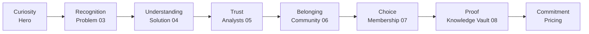

# TraderCity Homepage Refinement Strategy

**Version:** 1.0  
**Status:** Living document — primary execution guide for Agent A  
**Scope:** Homepage refinement only (`src/app/page.tsx`, `src/components/home/**`, `src/components/pricing/**`, `globals.css`, `layout.tsx` metadata)

> Read this document **first** before any homepage work. Chapters 01–10 in this folder provide depth; this document sequences **what to do, in what order, and what never to break**.

---

## Related Documentation

| Document | Role |
|----------|------|
| **This file** | Executable refinement strategy |
| [`docs/Frontend/Homepage_Design_Engineering_Blueprint.md`](../../Frontend/Homepage_Design_Engineering_Blueprint.md) | As-built audit and component inventory |
| [`docs/AI/Playbooks/multitask-prompts.md`](../../Playbooks/multitask-prompts.md) | Agent A copy-paste prompt for parallel work |
| [`docs/AI/Playbooks/homepage-pass.md`](../../Playbooks/homepage-pass.md) | Allowed refinement scope |
| [`AGENTS.md`](../../../AGENTS.md) | Global agent constraints |

---

## Handbook Index (Chapters 01–10)

| # | Chapter | Read when you need… |
|---|---------|---------------------|
| 01 | [Foundation and Product Vision](01_Foundation_and_Product_Vision.md) | Mission, identity, success criteria |
| 02 | [TraderCity Ecosystem](02_TraderCity_Ecosystem.md) | Product pillars, Free→VIP journey, positioning |
| 03 | [Narrative and Storytelling](03_Homepage_Narrative_and_Storytelling_Framework.md) | Section-by-section story contract |
| 04 | [Architecture and Engineering Patterns](04_Homepage_Architecture_and_Engineering_Patterns.md) | Folder structure, Background/Content pattern |
| 05 | [Design System and Visual Language](05_TraderCity_Design_System_and_Visual_Language.md) | Color, type, spacing, glass cards, motion |
| 06 | [Component Architecture and Primitives](06_Component_Architecture_and_Reusable_Primitives.md) | Extraction rules, composition hierarchy |
| 07 | [Engineering Operations Manual](07_Homepage_Engineering_Operations_Manual.md) | UX framework, QA workflow, definition of done |
| 08 | [Master Operating System and Future Vision](08_Master_Operating_System_and_Future_Vision.md) | Long-term roadmap, multi-agent roles |
| 09 | [Component Inventory (Appendix)](09_Current_Homepage_Architecture_Component_Inventory.md) | Audit checklist, debt register rules |
| 10 | [Repository-Aware Reference](10_Repository_Aware_Homepage_Engineering_Reference.md) | **Live codebase map, P1–P3 priorities, refinement passes** |
| 11 | [Code Implementation Guide](11_Code_Implementation_Guide.md) | **Sprint-by-sprint code execution — PR tasks, acceptance criteria, agent prompts** |

**Agent reading order:** 00 (this file) → 11 (sprint tasks) → 10 (codebase map) → task-specific chapter → Blueprint as needed.

---

## 1. Strategic Intent

### Mission

Transform the TraderCity homepage into the highest-quality representation of the ecosystem — **without redesigning it**. Every refinement improves clarity, trust, premium perception, and conversion through education.

### Core Positioning

> **One Ecosystem. Multiple Experts.**

### What TraderCity Is

- A Crypto Intelligence Ecosystem
- A Professional Research Platform
- A Learning Framework
- A Community of Specialists
- A Membership Product

### What TraderCity Is Not

- A signal-selling business
- A Telegram pump group
- A crypto casino
- A marketing-first landing page

### Guiding Principles

1. Clarity over decoration
2. Consistency over novelty
3. Information before animation
4. Product before marketing
5. Systems before isolated components
6. Trust before conversion

### Success Criteria

After refinement, the homepage should:

- Explain TraderCity within seconds
- Establish institutional credibility
- Demonstrate ecosystem depth (analysts, research, community)
- Feel like one continuous operating system — not isolated blocks
- Convert qualified visitors through understanding, not urgency

If a change weakens any of these, do not implement it.

---

## 2. Narrative Guardrails

The homepage is one continuous story. Every section answers a question raised by the previous section. **Never add, remove, reorder, or rewrite messaging.**

### Section Contract

| Order | Section | Eyebrow | User Question | Emotional Goal | Must Preserve |
|-------|---------|---------|---------------|----------------|---------------|
| — | Hero | (none) | What is TraderCity? | Curiosity, professionalism | 3D grid, ecosystem diagram, headline trilogy |
| 03 | Problem Awareness | The Trader's Reality | Why do traders struggle? | Recognition, empathy | Context-over-effort thesis, 6-step journey |
| 04 | Trader Solution | The Solution | How is TC different? | Relief, structure | Context-not-opinions, pipeline illustration |
| 05 | Analyst Team | The Analysts | Who produces intelligence? | Credibility | Named specialists, carousel |
| 06 | Community | Community | Who will I learn with? | Belonging | Discord evidence, flow diagram |
| 07 | Membership | Membership | What do I get? | Choice | Free→VIP, OBSERVE→UPGRADE journey |
| 08 | Research Framework | Knowledge Vault | How deep is this? | Proof | Terminal preview, locked states |
| — | Pricing | Pricing Plans | What does it cost? | Commitment | Plan selector, value-first framing |

### Emotional Journey



### Conversion Ladder (Educate, Don't Sell)

Attention → Understanding → Credibility → Evidence → Trust → Belonging → Membership

CTAs must remain:
- Free / Discord: `/login?plan=free`
- VIP / Upgrade: `/pricing`
- Become VIP Member: `/login?plan=free` (audit in Phase 1) // it should land the pricing plan

### Agent Decision Framework (Before Any Section Change)

1. What question does this section answer?
2. Does it support the overall story?
3. Does it improve trust or clarity?
4. Does it connect to the next section?
5. Does it preserve the TraderCity vision?

If any answer is "no," reconsider.

---

## 3. Architectural Constraints

### Preserve Always

```
Section.tsx
├── *Background.tsx   → absolute inset-0, decorative only
└── *Content.tsx     → relative z-10, copy + interaction
```

- [`src/app/page.tsx`](../../../src/app/page.tsx) stays a flat composition layer — no business logic in the route
- Section order: Hero → ProblemAwareness → TraderSolution → AnalystTeam → Community → MembershipComparison → ResearchFramework → Pricing
- Feature-grouped folders under `src/components/home/{section}/`

### Agent A Scope

| In scope | Out of scope |
|----------|--------------|
| `src/components/home/**` | `src/components/admin/**` |
| `src/components/pricing/**` | `src/components/dashboard/**` |
| `src/app/globals.css` | Backend, routing changes |
| `src/app/layout.tsx` (metadata only) | Mounting `EcosystemDetailed.tsx` without approval |

### Server vs Client

- **Server:** All `*Background.tsx`, section shells, HeroContent, ProblemAwarenessContent, TraderSolutionContent
- **Client:** AnalystTeamContent, CommunityDiscord, CommunityIllustratiion, MembershipComparisonContent, ResearchFrameworkContent, PricingContent

### Primitive Extraction Rules

Do **not** create `src/components/ui/` or `src/components/shared/` until repeated patterns are stable (Chapter 10 warning).

Extract only when justified by duplication:

| Primitive | Extract when | Phase |
|-----------|--------------|-------|
| `SectionEyebrow` | 3+ sections use identical eyebrow pattern | 2 |
| `SectionContainer` | Container widths/padding normalized | 2 |
| `GlassCard` | Analyst + Membership + Pricing cards aligned | 2 |
| `GradientText` | Gradient headline classes repeated 5+ times | 2 |
| `PremiumButton` | CTA styles unified | 2 |

### Orphan Component

[`EcosystemDetailed.tsx`](../../../src/components/home/EcosystemDetailed.tsx) — not mounted. Archive or integrate in Phase 5 only with explicit product decision. 
Manual Consideration - remove this file as it has no need now 

---

## 4. Design System Execution Rules

### Brand Palette

| Role | Hex |
|------|-----|
| Deep Space Navy | `#05081A` |
| Purple | `#9B5DE5`, `#A855F7` |
| Indigo | `#5E5CE6` |
| Cyan | `#06D6F7`, `#0A84FF` |
| Gold | `#D4AF37` |
| Muted text | `#8F9BB3` |
| Section backgrounds | `#02030A`, `#03040C`, `#050816` |

### Typography Scale (Target)

| Level | Usage | Current state |
|-------|-------|---------------|
| Display XL | Hero primary headline | Arbitrary `text-[36px] lg:text-[60px]` |
| Display LG | Section H2s | Varies per section |
| Heading | Card titles, feature names | `text-[15px] font-medium` |
| Body | Supporting copy | `text-[15px] leading-[1.8] text-[#8F9BB3]` |
| Caption | Descriptions, metadata | `text-[13px]` |
| Label | Eyebrows | `tracking-[0.2em] uppercase text-sm` |

**Phase 1 fix:** Wire Geist Sans to `body` in `globals.css` (currently falls back to Arial).

### Glass Card Recipe (Unify in Phase 2)

Target across Analyst featured card, Membership cards, Pricing container:

```
bg-black/40 backdrop-blur-md border border-white/20 rounded-3xl
shadow-[subtle accent glow]
```

### Motion Language

- **Allowed:** fade, slide, subtle scale (1.01–1.02), hover translate
- **Reference implementation:** ResearchFramework `AnimatePresence` cross-fades
- **Forbidden:** bounce, spin, large parallax, excessive delays
- **Phase 3:** Re-enable commented `whileInView` with easing `[0.22, 1, 0.36, 1]`
- **Phase 3:** Add `prefers-reduced-motion: reduce` fallbacks

### Background Tiers (Do Not Break)

1. **Hero:** Cinematic — radial glows, 3D perspective grid, orbital SVG
2. **Problem Awareness:** Hero fold transition — inverted 3D grid + staggered 2D emergence
3. **Sections 04–08 + Pricing:** Dual-layer 40px technical grid on `#03040C`

---

## 5. Phased Refinement Roadmap

Synthesized from Chapter 08, Blueprint Section 12, and Chapter 10 priorities.

### Phase 1 — Foundation (Weeks 1–4)

**Goal:** Fix infrastructure gaps that undermine premium perception.

| # | Task | File(s) | Priority |
|---|------|---------|----------|
| 1 | Replace placeholder metadata | `src/app/layout.tsx` | P1 |
| 2 | Wire Geist Sans to body | `src/app/globals.css` | P1 |
| 3 | Audit pricing CTA destination | `src/components/pricing/PricingContent.tsx` | P1 |
| 4 | Fix CommunityIllustratiion filename typo | `community/CommunityIllustratiion.tsx` + imports | P2 |
| 5 | Fix PricingBackground export name | `pricing/PricingBackground.tsx` | P2 |
| 6 | Remove large commented historical blocks | All home content files | P2 |
| 7 | Document color/spacing recipes | New section in globals.css `@theme` | P2 |
| 8 | Restore/verify public/images assets | `public/images/` | P1 |
| 9 | Fix Community margin typo `sm:-mt+6` | `CommunityIllustratiion.tsx` | P2 |
| 10 | Preserve Background/Content pattern | All sections | P1 |

**Success metric:** Zero broken images; Geist renders; no placeholder metadata; build passes.

### Phase 2 — Premium Polish (Weeks 5–10)

**Goal:** Typography, spacing, and surface consistency per [`homepage-pass.md`](../../Playbooks/homepage-pass.md).

| # | Task | Scope |
|---|------|-------|
| 1 | Typography pass — arbitrary px → scale | All 8 sections |
| 2 | Spacing pass — normalize section `py` rhythm | Hero `py-20` vs Trader Solution `py-2` gap |
| 3 | Glass card pass | Analyst, Membership, Pricing |
| 4 | Extract `SectionEyebrow` | Sections 03–08 |
| 5 | Standardize container widths | 1200 → 1300 → 1440 → 1080 |
| 6 | Consolidate gold/purple/cyan gradients | Headlines, accents |
| 7 | Unify icon library | Pick Tabler OR Lucide |
| 8 | Extract divider pattern | Section closers, eyebrows |

**Success metric:** Side-by-side sections show consistent type, spacing, and card treatment.

### Phase 3 — Cohesion (Weeks 11–16)

**Goal:** Subtle motion connects sections into one environment.

| # | Task | Scope |
|---|------|-------|
| 1 | Re-enable scroll reveals (unified easing) | Analyst, Community, Membership |
| 2 | `prefers-reduced-motion` policy | All motion-enabled files |
| 3 | Unified CTA micro-interactions | Membership, Pricing |
| 4 | Cross-section lighting continuity audit | Hero → Problem → Grid tiers |

**Success metric:** Scroll feels continuous; motion is institutional, not distracting.

### Phase 4 — Depth (Weeks 17–22)

**Goal:** Accessibility, performance, and maintainability.

| # | Task | File(s) |
|---|------|---------|
| 1 | Split ResearchFrameworkContent | `research-framework/ResearchFrameworkContent.tsx` |
| 2 | Accessibility pass | Focus-visible, heading hierarchy, contrast |
| 3 | Analyst carousel keyboard nav | `analyst-team/AnalystTeamContent.tsx` |
| 4 | Research Framework mobile overflow | `ResearchFrameworkContent.tsx` |
| 5 | `next/image` migration | Community Discord, Knowledge Vault thumbnails |
| 6 | Lazy-load Research Framework terminal | Client bundle optimization |

**Success metric:** WCAG AA contrast on muted text; keyboard-usable carousel; no mobile overflow.

### Phase 5 — Product Maturity (Months 6–12)

**Goal:** Cross-surface consistency and long-term maintainability.

| # | Task |
|---|------|
| 1 | Cross-surface design tokens with dashboards |
| 2 | Visual QA screenshot baseline |
| 3 | Keep Chapter 10 synchronized with codebase |
| 4 | Decide fate of `EcosystemDetailed.tsx` |
| 5 | Analytics-informed iteration (when stack exists) |

---

## 6. Section-by-Section Refinement Actions

What to refine — not redesign — per section.

### Hero

| Action | Detail |
|--------|--------|
| Preserve | 3D grid floor, orbital SVG, EcosystemLite diagram, headline trilogy |
| Refine | Type scale at `lg:text-[60px]`; brand wordmark tracking |
| Fix | Commented scroll indicator — restore or remove cleanly |
| Files | `hero/HeroBackground.tsx`, `hero/HeroContent.tsx`, `ecosystem-lite/EcosystemLiteContent.tsx` |

### Problem Awareness (03)

| Action | Detail |
|--------|--------|
| Preserve | Hero fold transition, 6-step journey, FRAGMENTED INTELLIGENCE close |
| Refine | Journey row `sm:flex-row` layout; closing punch `tracking-[0.3em]` |
| Refine | Two-column `lg:flex-row` balance |
| Files | `problem-awareness/ProblemAwarenessBackground.tsx`, `ProblemAwarenessContent.tsx` |

### Trader Solution (04)

| Action | Detail |
|--------|--------|
| Preserve | Pipeline SVG, 3-column feature grid, MARKET CLARITY close |
| Refine | Compressed `py-2 lg:py-6` — evaluate against neighbors |
| Refine | Pipeline SVG `w-[1800px]` mobile crop behavior |
| Files | `trader-solution/TraderSolutionContent.tsx`, `TraderSolutionIllustration.tsx` |

### Analyst Team (05)

| Action | Detail |
|--------|--------|
| Preserve | 3-card carousel, timeline nav, gold accent system |
| Refine | Glass card recipe; unify with Membership/Pricing |
| Refine | Re-enable subtle scroll reveal; `activeIndex` default (ChartInDepth) |
| Fix | Keyboard navigation for carousel dots and side cards |
| Files | `analyst-team/AnalystTeamContent.tsx` |

### Community (06)

| Action | Detail |
|--------|--------|
| Preserve | Discord screenshot with mask fade, flow diagram |
| Fix | `sm:-mt+6 lg:-mt+8` → `sm:-mt-6 lg:-mt-8` |
| Refine | Illustration overlap composition on tablet |
| Refine | Headline scale `text-[20px] sm:text-[30px] lg:text-[48px]` rhythm |
| Files | `community/CommunityDiscord.tsx`, `CommunityIllustratiion.tsx` |

### Membership (07)

| Action | Detail |
|--------|--------|
| Preserve | Free vs VIP grid, journey column OBSERVE→UPGRADE |
| Refine | Free/VIP card parity (borders, shadows, blur) |
| Refine | `whileHover={{ x: 4 }}` on CTAs — extend pattern |
| Refine | Mobile journey strip `flex lg:hidden` |
| Files | `membership-comparison/MembershipComparisonContent.tsx` |

### Research Framework (08)

| Action | Detail |
|--------|--------|
| Preserve | Terminal UI, AnimatePresence cross-fades, locked topic states |
| Refine | Split into mode tabs, selectors, detail panel, nav (Phase 4) |
| Refine | Mobile list panel `max-h-[260px]` |
| Use as | Motion reference for Phase 3 re-enablement |
| Files | `research-framework/ResearchFrameworkContent.tsx`, data files |

### Pricing

| Action | Detail |
|--------|--------|
| Preserve | Plan selector (quarterly default), 6 VIP features, route reuse with `/pricing` |
| Audit | CTA `/login?plan=free` — confirm product intent |
| Refine | Extract plan card component; unify gold accent with Analyst section |
| Files | `pricing/PricingContent.tsx`, `PricingBackground.tsx` |

---

## 7. Refinement Pass Playbook

Run passes in order during Phase 2+. Each pass has a focused scope.

### Typography Pass

| | |
|---|---|
| **Objective** | Consistent hierarchy without changing copy |
| **Scan** | All `*Content.tsx` files |
| **Actions** | Map arbitrary `text-[Npx]` to scale; verify `font-sans`; check line-height and tracking |
| **Do not break** | Headline messaging, gradient text targets, eyebrow numbering |

### Spacing Pass

| | |
|---|---|
| **Objective** | Smooth vertical rhythm section-to-section |
| **Scan** | Section `py`, `px`, `mb`, `gap`, `max-w` values |
| **Actions** | Normalize padding; align container widths; balance Hero vs Trader Solution density |
| **Do not break** | Hero `min-h-screen`; Problem fold spatial transition |

### Glass Card Pass

| | |
|---|---|
| **Objective** | Unified card surfaces |
| **Scan** | AnalystTeamContent, MembershipComparisonContent, PricingContent |
| **Actions** | Inventory borders, blur, shadow, radius; normalize; extract `GlassCard` if 3+ match |
| **Do not break** | Section accent colors (gold Analyst, purple Free, etc.) |

### Animation Pass

| | |
|---|---|
| **Objective** | Subtle, institutional motion |
| **Scan** | All `'use client'` content files |
| **Actions** | Separate active vs commented motion; add reduced-motion; unify easing |
| **Do not break** | ResearchFramework `AnimatePresence` behavior |

### Accessibility Pass

| | |
|---|---|
| **Objective** | Keyboard-usable, sufficient contrast |
| **Scan** | Interactive controls, headings, images |
| **Actions** | `focus-visible` styles; `aria-label` on carousel; heading hierarchy audit; alt text |
| **Do not break** | Visual hierarchy order |

### Performance Pass

| | |
|---|---|
| **Objective** | Protect LCP, CLS, interaction responsiveness |
| **Scan** | Images, client components, large SVGs |
| **Actions** | `next/image` where practical; lazy-load Research Framework; check TraderSolution SVG size |
| **Do not break** | Server component shells |

### Responsive Pass

| | |
|---|---|
| **Objective** | Desktop, tablet, mobile polish |
| **Viewports** | 1440px, 1024px, 768px, 390px |
| **Actions** | No horizontal overflow; touch targets; text wrapping; hidden lg elements |
| **Do not break** | Mobile-specific nav (Analyst dots, Membership strip) |

### Homepage QA Pass

| Step | Action |
|------|--------|
| 1 | `npm run build` |
| 2 | Open `/` — scroll Hero through Pricing |
| 3 | Click CTAs — verify `/login?plan=free`, `/pricing` |
| 4 | Test Analyst carousel, Research terminal, Pricing plan selector |
| 5 | Check 375px and 1440px viewports |
| 6 | Record regressions |

---

## 8. Technical Debt Register

Consolidated from Chapters 09–10. Reduce this list every release.

### P1 — Address in Phases 1–3

| Issue | File(s) | Owner | Phase |
|-------|---------|-------|-------|
| Geist loaded but body uses Arial | `globals.css` | Frontend | 1 |
| Placeholder metadata | `layout.tsx` | Frontend | 1 |
| Pricing CTA mismatch risk | `PricingContent.tsx` | Product | 1 |
| Missing/broken images | `public/images/` | Frontend | 1 |
| No reduced-motion strategy | Motion-enabled files | Animation | 3 |
| No shared primitives | `home/**`, `pricing/**` | Design System | 2 |
| Hardcoded color/spacing tokens | Most section files | Design System | 1–2 |
| Preserve Background/Content pattern | All sections | Frontend | 1 |
| Heading hierarchy gaps | All content files | Frontend | 4 |
| Contrast on `#8F9BB3` muted text | All content files | Frontend | 4 |
| Focus-visible missing on controls | Interactive sections | Frontend | 4 |
| Research Framework mobile overflow | `ResearchFrameworkContent.tsx` | Frontend | 4 |
| Large ResearchFrameworkContent | `ResearchFrameworkContent.tsx` | Frontend | 4 |

### P2 — Address in Phases 2–4

| Issue | File(s) | Phase |
|-------|---------|-------|
| CommunityIllustratiion filename typo | `community/` | 1 |
| PricingBackground exports LoginBackground | `pricing/PricingBackground.tsx` | 1 |
| Stale function names (Section3Content, etc.) | Content files | 1 |
| Large commented code blocks | Multiple content files | 1 |
| Inconsistent icon libraries (Tabler + Lucide) | home/** | 2 |
| Section spacing rhythm varies | All sections | 2 |
| Dormant scroll motion (commented) | Analyst, Community, Membership | 3 |
| Community margin typo | `CommunityIllustratiion.tsx` | 1 |
| No `next/image` usage | Community, Research Framework | 4 |

### P3 — Address in Phase 5

| Issue | Phase |
|-------|-------|
| Orphan `EcosystemDetailed.tsx` | 5 |
| Move inline data arrays to data modules | 5 |
| Visual QA screenshot baseline | 5 |
| Cross-surface token sharing with dashboards | 5 |

---

## 9. Operations and QA

### Engineering Mindset Order

Never start with code. Think in this sequence:

Business → User → Narrative → Experience → Architecture → Implementation → Optimization → Verification

### Decision Matrix (Priority Order)

1. Product clarity
2. User trust
3. Information hierarchy
4. Maintainability
5. Accessibility
6. Performance
7. Visual polish

Visual novelty never outranks clarity.

### QA Workflow (6 Phases)

| Phase | Focus |
|-------|-------|
| 1 | Self review — reasoning, affected files, trade-offs |
| 2 | Visual review — hierarchy, consistency, premium feel |
| 3 | Responsive review — desktop, tablet, mobile |
| 4 | Accessibility review — keyboard, focus, contrast, semantics |
| 5 | Performance review — build, bundle, LCP/CLS risks |
| 6 | Regression review — section order, CTAs, images, motion, TS errors |

### Regression Checklist

- [ ] Section order unchanged (8 sections)
- [ ] CTA destinations unchanged
- [ ] Images render (Community Discord, Knowledge Vault thumbnails)
- [ ] Motion behaves (Research terminal, Pricing selector, Analyst carousel)
- [ ] Typography consistent across sections
- [ ] Cards consistent (glass recipe)
- [ ] No console errors
- [ ] No TypeScript errors
- [ ] `npm run build` passes

---

## 10. Multi-Agent Alignment

### Agent A Execution

This strategy **supersedes** scattered phase lists in other docs. When running Agent A:

1. Read this file first
2. Read Chapter 10 for repo-specific detail
3. Follow phase order (do not skip to Phase 3 before Phase 1–2 complete)
4. Use [`multitask-prompts.md`](../../Playbooks/multitask-prompts.md) Section 3 for worktree setup

### Parallel Workstream Rules

- Agent A owns `home/**`, `pricing/**`, `globals.css`, `layout.tsx` metadata
- Agent B (admin) must not edit homepage files
- Merge Agent A before Agent B when both run in parallel
- Do not create `src/components/ui/` until Phase 2 extraction is justified

### AI Collaboration Roles (Chapter 08)

| Role | Responsibility |
|------|----------------|
| Homepage Architect | Narrative, product consistency, phase prioritization |
| Design System Engineer | Tokens, primitives, visual language |
| Frontend Engineer | Implementation, refactoring, performance |
| QA Engineer | Regression, accessibility, responsive testing |

---

## 11. Definition of Done

A homepage refinement is complete only when **all** apply:

### Product

- [ ] Narrative spine preserved (8 sections, same order, same copy)
- [ ] Emotional journey intact (Curiosity → Commitment)
- [ ] CTAs unchanged (`/login?plan=free`, `/pricing`)

### Architecture

- [ ] Background/Content pattern intact in every section
- [ ] No unnecessary client components added
- [ ] New primitives justified by repeated usage (min 3 occurrences)
- [ ] No new packages without approval

### Quality

- [ ] Desktop, tablet, and mobile verified
- [ ] Keyboard navigation works on interactive sections
- [ ] `npm run build` passes
- [ ] No TypeScript errors introduced

### Documentation

- [ ] Chapter 10 updated if architecture changes
- [ ] Technical debt register item closed or deferred with rationale
- [ ] Blueprint cross-referenced if component inventory changes

### Final Commitment (Chapter 08)

Every refinement must answer "yes" to all three:

1. Does this strengthen the TraderCity vision?
2. Does this improve the visitor's understanding?
3. Does this make the product more coherent?

---

## 12. Quick Start for Agents

```
1. Read this file (00_Homepage_Refinement_Strategy.md)
2. Read Chapter 10 (repository-aware reference)
3. Identify current phase (1–5) — do not skip ahead
4. Run the relevant refinement pass(es)
5. Complete QA workflow (Section 9)
6. Update debt register and docs
```

**Branch:** `refine/homepage-phase-{N}`  
**Worktree:** Recommended for all homepage work touching 5+ files

---

*This strategy is a living document. Update when phases complete, debt is resolved, or architecture changes. If code and handbook disagree, align whichever is incorrect.*
