# TraderCity Homepage Refinement Agent

## Chapter 10 -- Repository-Aware Homepage Engineering Reference

**Version:** 1.0  
**Status:** Living Engineering Handbook  
**Repository Scope:** `D:\Tradercity Project\Tradercity Website Cursor`  
**Primary Runtime:** Next.js App Router, React, TypeScript, Tailwind CSS

> This chapter documents the current TraderCity homepage implementation as it exists in the repository. It is not an idealized architecture. When something is missing from the repository, it is marked as **Not found in repository.**

---

# 1. Executive Summary

TraderCity is currently implemented as a Next.js App Router frontend. The homepage is rendered directly from `src/app/page.tsx`, which composes eight top-level sections in a fixed order:

1. `Hero`
2. `ProblemAwareness`
3. `TraderSolution`
4. `AnalystTeam`
5. `Community`
6. `MembershipComparison`
7. `ResearchFramework`
8. `Pricing`

Most homepage sections follow a two-file pattern:

- A section shell component, for example `Hero.tsx`
- A background component, for example `HeroBackground.tsx`
- A content component, for example `HeroContent.tsx`

There are exceptions. `Community` uses `CommunityDiscord` and `CommunityIllustratiion` instead of a single content component. `HeroContent` also imports `EcosystemLiteContent`, so the ecosystem illustration is nested inside the hero.

The project does not currently contain shared UI primitives under `src/components/shared` or `src/components/ui`. The current implementation uses local JSX, Tailwind utility strings, local icon helpers, arrays declared inside content files, and a small amount of local state in interactive sections.

## Overall Homepage Architecture

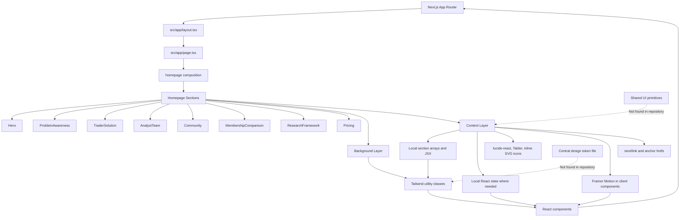

Engineering note: the architecture is composition-first, but the design system is not yet extracted into reusable primitives.

---

# 2. Current Folder Tree

The following tree is derived from the repository files that exist today.

```mermaid
flowchart TD
  Root["TraderCity frontend root"]
  Root --> Docs["docs/ - engineering docs, playbooks, reference images"]
  Root --> Public["public/ - static assets served by Next"]
  Root --> Src["src/ - application source"]
  Root --> Config["config files - package, tsconfig, eslint, Next config"]

  Src --> App["src/app/ - App Router routes, layout, globals"]
  Src --> Components["src/components/ - page and section components"]

  App --> AppHome["page.tsx - homepage route /"]
  App --> AppLayout["layout.tsx - root layout, Geist fonts, metadata"]
  App --> Globals["globals.css - Tailwind import, CSS variables"]
  App --> PricingRoute["pricing/page.tsx - route /pricing"]
  App --> LoginRoute["login/page.tsx - route /login"]
  App --> ActivationRoute["payment-activation/page.tsx - route /payment-activation"]
  App --> FreeRoute["dashboard/free/page.tsx - route /dashboard/free"]
  App --> VipRoute["dashboard/vip/page.tsx - route /dashboard/vip"]

  Components --> Home["home/ - homepage sections and homepage-only data"]
  Components --> PricingComp["pricing/ - reusable pricing page/section"]
  Components --> LoginComp["login/ - login route components"]
  Components --> PaymentComp["payment-activation/ - payment activation route components"]
  Components --> DashboardComp["dashboard/ - free and VIP dashboard components"]

  Home --> HeroDir["hero/ - Hero shell, background, content"]
  Home --> ProblemDir["problem-awareness/ - problem story section"]
  Home --> SolutionDir["trader-solution/ - solution section and illustration"]
  Home --> AnalystDir["analyst-team/ - analyst carousel section"]
  Home --> CommunityDir["community/ - Discord screenshot and community illustration"]
  Home --> MembershipDir["membership-comparison/ - Free vs VIP comparison"]
  Home --> ResearchDir["research-framework/ - learning and report interface"]
  Home --> EcosystemLite["ecosystem-lite/ - compact ecosystem graphic used in hero"]
  Home --> EcosystemDetailed["EcosystemDetailed.tsx - detailed ecosystem component, not rendered by page.tsx"]

  Public --> Images["images/ - hero and community image assets"]
  Images --> HeroBg["Hero-Background.png"]
  Images --> HeroLogo["hero-logo.png"]
  Images --> DiscordImg["Community/Discord.png"]

  Components --> MissingShared["shared/ - Not found in repository"]
  Components --> MissingUi["ui/ - Not found in repository"]
  Src --> MissingLib["lib/ - Not found in repository"]
  Src --> MissingTypes["types/ - Not found in repository"]
  Src --> MissingHooks["hooks/ - Not found in repository"]
  Src --> MissingConstants["constants/ - Not found in repository"]
  Src --> MissingAssets["assets/ - Not found in repository"]
```

| Folder | Responsibility | Status |
|---|---|---|
| `src/app` | Route entry points, layout, global CSS | Implemented |
| `src/components/home` | Homepage sections | Implemented |
| `src/components/pricing` | Pricing section reused by homepage and `/pricing` | Implemented |
| `src/components/login` | Login route UI | Implemented |
| `src/components/payment-activation` | Payment activation UI | Implemented |
| `src/components/dashboard` | Free and VIP dashboards | Implemented |
| `src/components/shared` | Shared primitives | Not found in repository |
| `src/components/ui` | UI primitive library | Not found in repository |
| `src/lib` | Utility functions | Not found in repository |
| `src/types` | Shared TypeScript types | Not found in repository |
| `src/hooks` | Shared hooks | Not found in repository |
| `public/images` | Static visual assets | Implemented |

---

# 3. Homepage Rendering Flow

The real rendering order is defined in `src/app/page.tsx`.

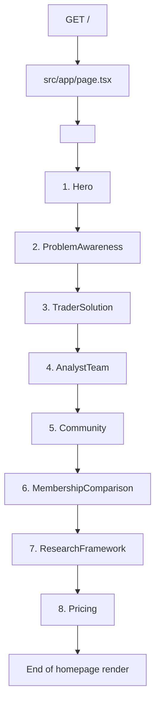

There is no separate `Homepage.tsx` component in the repository. The homepage composition happens directly in `src/app/page.tsx`.

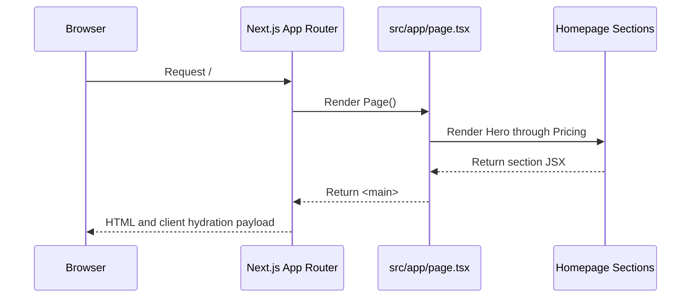

---

# 4. Component Inventory

## Homepage Section Shells

| Component | Location | Purpose | Dependencies | Export | Reusable | Complexity | Owner |
|---|---|---|---|---|---|---|---|
| `Hero` | `src/components/home/hero/Hero.tsx` | Hero shell and layering | `HeroBackground`, `HeroContent` | default | Section-only | Low | Homepage |
| `ProblemAwareness` | `src/components/home/problem-awareness/ProblemAwareness.tsx` | Trader pain-point section shell | Background, content | default | Section-only | Low | Homepage |
| `TraderSolution` | `src/components/home/trader-solution/TraderSolution.tsx` | Solution section shell | Background, content | default | Section-only | Low | Homepage |
| `AnalystTeam` | `src/components/home/analyst-team/AnalystTeam.tsx` | Analyst section shell | Background, content | default | Section-only | Low | Homepage |
| `Community` | `src/components/home/community/Community.tsx` | Community section shell | Background, Discord, illustration | default | Section-only | Low | Homepage |
| `MembershipComparison` | `src/components/home/membership-comparison/MembershipComparison.tsx` | Free vs VIP section shell | Background, content | default | Section-only | Low | Homepage |
| `ResearchFramework` | `src/components/home/research-framework/ResearchFramework.tsx` | Research and learning section shell | Background, content | default | Section-only | Low | Homepage |
| `Pricing` | `src/components/pricing/Pricing.tsx` | Pricing section shell | Background, content | default | Reused by `/` and `/pricing` | Low | Pricing |

## Content Components

| Component | Purpose | Key dependencies | Local state | Future improvement |
|---|---|---|---|---|
| `HeroContent` | Brand, hero headline, ecosystem illustration | `EcosystemLiteContent`, inline SVG | No | Extract brand lockup and typography primitives |
| `EcosystemLiteContent` | Compact ecosystem node graphic | Local `ExpertNode` | No | Make reusable if ecosystem appears elsewhere |
| `ProblemAwarenessContent` | Trader reality narrative and journey list | Tabler icons, `journeySteps` array | No | Rename exported function from `Section3Content` to file-aligned name |
| `TraderSolutionContent` | Solution copy, feature columns, illustration | `TraderSolutionIllustration`, `features` array | No | Extract feature-list primitive |
| `TraderSolutionIllustration` | SVG-based solution diagram | local `blocks` array | No | Isolate SVG constants and naming |
| `AnalystTeamContent` | Analyst carousel-like section | React state, Framer Motion, lucide icons, inline SVG icons | `activeIndex` | Wire active state into visible card content or document static card behavior |
| `CommunityDiscord` | Community heading and Discord image | Framer Motion import, inline `UsersIcon`, image | No | Remove unused `motion` import if inactive |
| `CommunityIllustratiion` | Analyst/Discord/trader flow illustration | Framer Motion, lucide icons, inline Discord icon | No | Rename misspelled file to `CommunityIllustration` with import update |
| `MembershipComparisonContent` | Free/VIP comparison and CTA panel | Framer Motion, local icon helpers, local arrays | No | Extract plan cards and CTA rows |
| `ResearchFrameworkContent` | Interactive learning/report browser | React state, local icon helpers, imported data arrays | Multiple state indexes | Split into panels, tabs, navigation, and content viewer |
| `PricingContent` | Interactive pricing plan selector | React state, Framer Motion, lucide icons, `next/link` | `selectedPlan` | Extract plan data and radio-card component |

## Data Modules

| Module | Location | Purpose | Export |
|---|---|---|---|
| `learningFrameworks` | `src/components/home/research-framework/learningFrameworks.ts` | Learning framework modules and topics | named and default |
| `microstructureReports` | `src/components/home/research-framework/microstructureReports.ts` | Report categories and reports | named and default |

## Component Dependency Graph By Section

### Hero

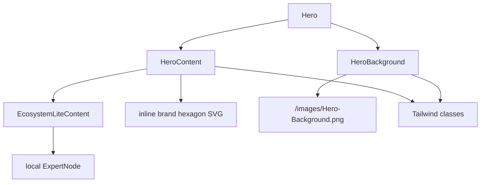

### Problem Awareness

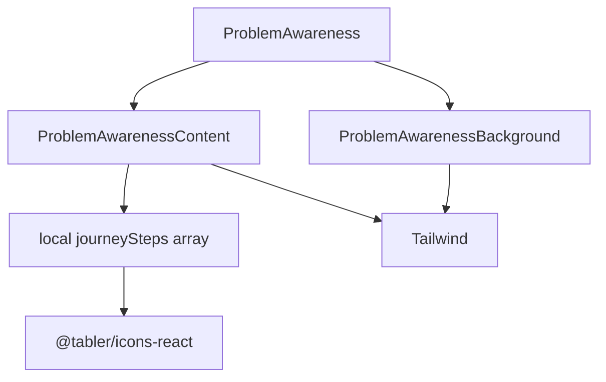

### Trader Solution

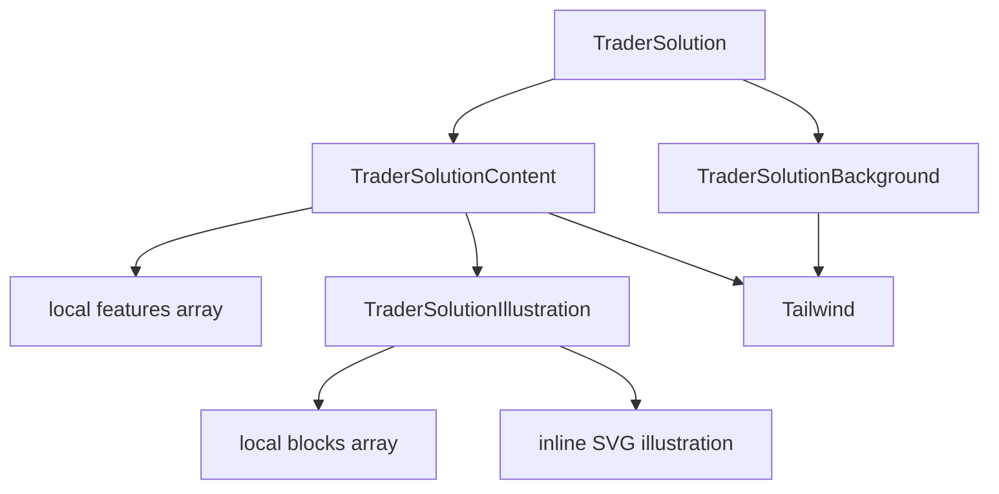

### Analyst Team

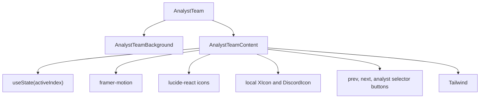

### Community

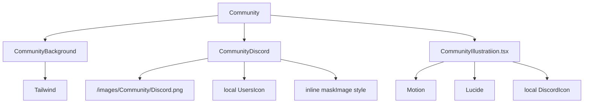

### Membership Comparison

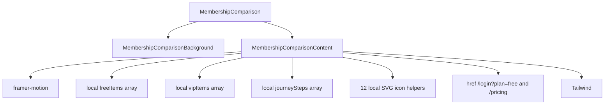

### Research Framework

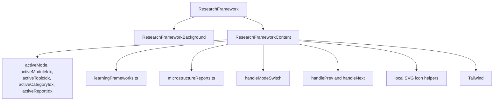

### Pricing

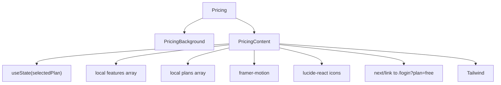

---

# 5. Background + Content Pattern

The dominant section pattern is:

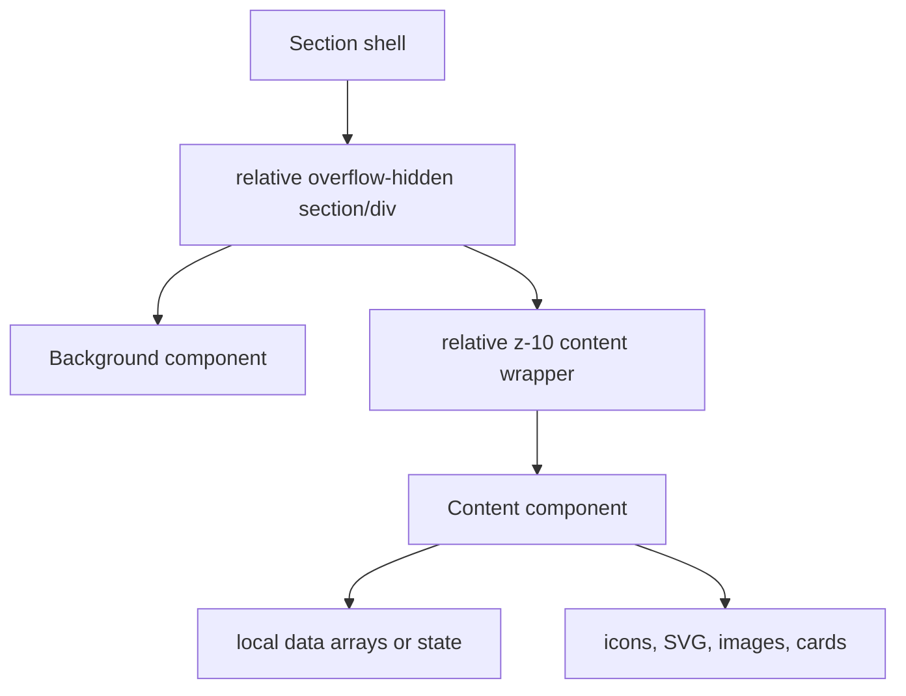

| Section | Background component | Content component | Pattern status |
|---|---|---|---|
| Hero | `HeroBackground` | `HeroContent` | Follows pattern |
| ProblemAwareness | `ProblemAwarenessBackground` | `ProblemAwarenessContent` | Follows pattern |
| TraderSolution | `TraderSolutionBackground` | `TraderSolutionContent` | Follows pattern |
| AnalystTeam | `AnalystTeamBackground` | `AnalystTeamContent` | Follows pattern, content not wrapped in explicit z-layer by shell |
| Community | `CommunityBackground` | `CommunityDiscord`, `CommunityIllustratiion` | Variant pattern |
| MembershipComparison | `MembershipComparisonBackground` | `MembershipComparisonContent` | Follows pattern |
| ResearchFramework | `ResearchFrameworkBackground` | `ResearchFrameworkContent` | Follows pattern |
| Pricing | `PricingBackground` | `PricingContent` | Follows pattern |

Recommendation: keep the pattern, but standardize names and wrappers. A future `SectionShell` primitive could accept `background` and `children`, but only after the repeated pattern is stable.

---

# 6. Data Flow Diagram

There is no API data used by the homepage in the current repository. Data is static and local.

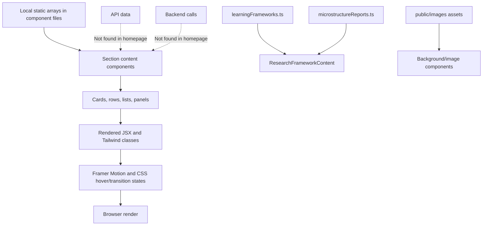

State ownership:

| Component | State | Purpose |
|---|---|---|
| `AnalystTeamContent` | `activeIndex` | Tracks selected analyst navigation state |
| `ResearchFrameworkContent` | `activeMode`, module/topic/category/report indexes | Drives learning/report browser panels |
| `PricingContent` | `selectedPlan` | Tracks selected membership duration |

---

# 7. Component Composition Diagrams

## Hero Composition

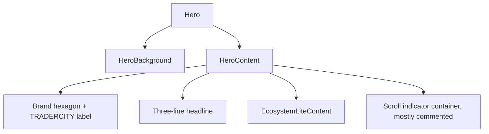

## Problem Awareness Composition

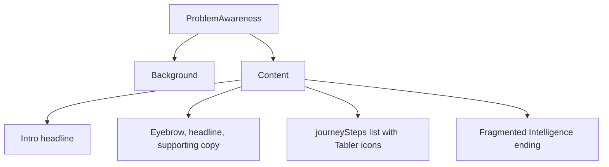

## Trader Solution Composition

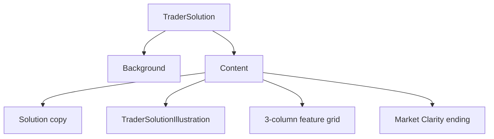

## Analyst Team Composition

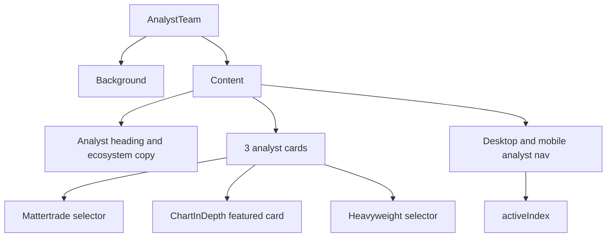

## Community Composition

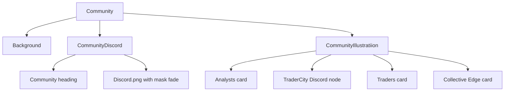

## Membership Composition

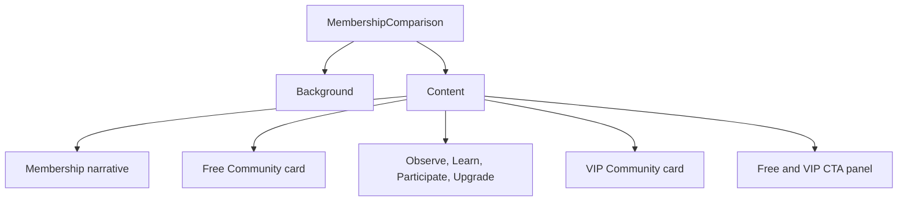

## Research Framework Composition

```mermaid
graph TD
  ResearchFramework --> Background
  ResearchFramework --> Content
  Content --> ModeTabs["Frameworks vs Reports mode"]
  Content --> Sidebar["Module/category selector"]
  Content --> DetailPanel["Topic/report details"]
  Content --> PrevNext["Previous/Next navigation"]
  Content --> Data["learningFrameworks and microstructureReports"]
```

## Pricing Composition

```mermaid
graph TD
  Pricing --> Background
  Pricing --> Content
  Content --> Header["Pricing Plans header"]
  Content --> ValueProp["VIP value proposition"]
  Content --> FeatureList["Included features"]
  Content --> PlanSelector["Monthly, Quarterly, Yearly cards"]
  PlanSelector --> State["selectedPlan"]
  Content --> CTA["Become a VIP Member link to /login?plan=free"]
```

---

# 8. Design System Dependency Graph

There is no central design token file. Design values are mostly Tailwind utility classes and hardcoded hex colors inside components.

```mermaid
graph TD
  Tailwind["Tailwind CSS v4 import in globals.css"] --> Utilities["Utility classes in TSX"]
  CSSVars["globals.css CSS variables: --background, --foreground"] --> Utilities
  HardcodedColors["Hardcoded colors: #A855F7, #D4AF37, #3B82F6, #06D6F7, #F59E0B"] --> Utilities
  Typography["Inline typography classes and Geist font variables"] --> Components
  Spacing["Inline spacing classes: px, py, gap, mb, max-w"] --> Components
  Effects["Inline blur, shadows, borders, gradients"] --> Components
  Utilities --> Components
  Components --> Sections
  Sections --> Homepage

  TokenFile["Token module"] -. "Not found in repository" .-> Utilities
  SharedTypography["Typography primitive"] -. "Not found in repository" .-> Components
  SharedGlass["GlassCard primitive"] -. "Not found in repository" .-> Components
```

Token audit:

| Category | Current implementation | Risk | Recommendation |
|---|---|---|---|
| Colors | Hardcoded in TSX and Tailwind arbitrary values | Drift across sections | Define a small documented token map before extracting components |
| Typography | Per-section utility classes | Inconsistent scale and tracking | Create display/heading/body recipes |
| Spacing | Per-section `px`, `py`, `gap`, `mb` classes | Vertical rhythm varies | Standardize section padding and max widths |
| Shadows | Arbitrary shadow values | Hard to tune globally | Extract glass and glow recipes |
| Radius | `rounded-xl`, `rounded-2xl`, `rounded-3xl`, `rounded-[2rem]`, `rounded-[24px]` | Premium feel varies | Constrain radii by component type |
| Motion | Framer Motion plus CSS transitions, many reveal props commented | Motion ownership unclear | Centralize motion patterns and reduced-motion behavior |

---

# 9. Animation Flow

Current animation is mostly local. Several Framer Motion wrappers remain, while many initial/whileInView props are commented out.

```mermaid
flowchart TD
  PageLoad["Page load"] --> StaticRender["Server/client render of sections"]
  StaticRender --> CSSMotion["CSS transitions and hover classes"]
  StaticRender --> MotionComponents["Framer Motion components"]

  MotionComponents --> Analyst["AnalystTeamContent: motion div wrappers, hover/transition classes"]
  MotionComponents --> CommunityIllo["CommunityIllustratiion: motion wrapper, reveal props commented"]
  MotionComponents --> Membership["MembershipComparisonContent: motion wrappers, many reveal props commented"]
  MotionComponents --> Pricing["PricingContent: active hover/tap scale on plan cards and CTA"]

  CSSMotion --> Hover["Hover: borders, shadows, translate, opacity"]
  CSSMotion --> Ping["animate-ping in analyst/membership nav"]
  CSSMotion --> Transitions["transition-all/transition-colors"]

  Hover --> CTA["CTA feedback"]
  Pricing --> CTA
  CTA --> RouteChange["Next route navigation when links are clicked"]

  ReducedMotion["Reduced-motion handling"] -. "Not found in repository" .-> MotionComponents
```

Animation owners:

| Owner | Files | Current behavior |
|---|---|---|
| Pricing | `PricingContent.tsx` | `whileHover`, `whileTap` on cards and CTA |
| Membership | `MembershipComparisonContent.tsx` | Motion wrappers, CTA hover x movement |
| Analyst | `AnalystTeamContent.tsx` | Motion wrappers plus Tailwind hover transforms |
| Community | `CommunityIllustratiion.tsx`, `CommunityDiscord.tsx` | Motion import/wrapper, most reveal props commented |
| Research | `ResearchFrameworkContent.tsx` | Some historical motion code is commented; active UI relies mostly on CSS transitions |

---

# 10. Responsive Flow

Responsive behavior is implemented with Tailwind breakpoints directly inside components.

```mermaid
flowchart LR
  Desktop["Desktop lg/xl"] --> Tablet["Tablet md/sm"]
  Tablet --> Mobile["Mobile base"]

  Desktop --> DesktopLayout["Multi-column grids, wide max-widths, desktop nav, large typography"]
  Tablet --> TabletLayout["Reduced columns, constrained cards, medium typography"]
  Mobile --> MobileLayout["Single-column stacks, hidden desktop controls, mobile nav strips"]

  DesktopLayout --> Components["Same component files"]
  TabletLayout --> Components
  MobileLayout --> Components
```

Section adaptation:

| Section | Desktop | Tablet | Mobile |
|---|---|---|---|
| Hero | Centered headline, ecosystem graphic | Smaller type | Stacked headline and graphic |
| ProblemAwareness | Two-column copy/journey | Stacked or reduced gaps | Single column journey rows |
| TraderSolution | Copy and illustration side-by-side | Two/three feature grid changes | Single-column feature list |
| AnalystTeam | Three-card carousel layout | Two-column transition | Featured card first, mobile nav |
| Community | Wide Discord screenshot and illustration overlay | Reduced screenshot padding | Smaller node illustration |
| MembershipComparison | Four-column comparison grid | Cards stack | Mobile journey strip |
| ResearchFramework | Interactive dense panels | Constrained panels | Higher overflow risk due dense data UI |
| Pricing | Two-column pricing card | Single/two-column adaptations | Plan duration column hidden |

Responsive warning: there is a likely typo in `CommunityIllustratiion.tsx`: `sm:-mt+6 lg:-mt+8` is not a valid Tailwind negative margin class pattern. It should be reviewed visually.

---

# 11. User Journey Flow

The actual frontend route map supports this journey:

```mermaid
flowchart TD
  Visitor["Visitor"] --> Homepage["/ homepage"]
  Homepage --> Hero["Hero: product framing"]
  Hero --> Problem["ProblemAwareness: pain and context gap"]
  Problem --> Solution["TraderSolution: multi-perspective context"]
  Solution --> Analysts["AnalystTeam: analyst credibility"]
  Analysts --> Community["Community: Discord proof"]
  Community --> Membership["MembershipComparison: free vs VIP"]
  Membership --> Research["ResearchFramework: knowledge/reports preview"]
  Research --> Pricing["Pricing section on homepage"]
  Pricing --> Login["/login?plan=free via Pricing CTA"]
  Membership --> LoginFree["/login?plan=free via Free CTA"]
  Membership --> PricingRoute["/pricing via VIP CTA"]
  PricingRoute --> PricingComponent["Pricing component"]
  Login --> Activation["/payment-activation route exists"]
  Activation --> FreeDashboard["/dashboard/free route exists"]
  Activation --> VipDashboard["/dashboard/vip route exists"]
  Discord["Discord"] -. "Shown as image and product concept; no outbound invite found in homepage code" .-> Community
```

Important route note: `PricingContent` CTA text says "Become a VIP Member" but links to `/login?plan=free`. That may be intentional onboarding or may be a product-flow mismatch.

---

# 12. Conversion Funnel

```mermaid
flowchart TD
  Visitor --> ReadsHero["Reads Hero"]
  ReadsHero --> Drop1{"Drop-off: message unclear?"}
  Drop1 -->|Continues| ProblemAwareness["Problem awareness"]
  ProblemAwareness --> Drop2{"Drop-off: pain not recognized?"}
  Drop2 -->|Continues| Solution["Solution: context over opinions"]
  Solution --> Drop3{"Drop-off: value not concrete?"}
  Drop3 -->|Continues| Analysts["Analysts credibility"]
  Analysts --> Drop4{"Drop-off: trust not established?"}
  Drop4 -->|Continues| Community["Community proof"]
  Community --> Drop5{"Drop-off: Discord proof not persuasive?"}
  Drop5 -->|Continues| Membership["Membership comparison"]
  Membership --> Drop6{"Drop-off: free vs VIP unclear?"}
  Drop6 -->|Continues| Research["Knowledge and reports preview"]
  Research --> Drop7{"Drop-off: interface too dense?"}
  Drop7 -->|Continues| Pricing["Pricing"]
  Pricing --> Drop8{"Drop-off: price or CTA mismatch?"}
  Drop8 -->|Continues| Registration["/login"]
  Registration --> Activation["/payment-activation"]
  Activation --> VIP["/dashboard/vip"]
```

Conversion engineering notes:

- The funnel is implemented as a single-scroll homepage plus route CTAs.
- Drop-off measurement is not implemented in the repository.
- Analytics, event tracking, and A/B testing are not found in repository.

---

# 13. Product Ecosystem Diagram

The frontend presents the product ecosystem. It does not implement backend, payment, or Discord API integration in the homepage.

```mermaid
flowchart TD
  Homepage["Homepage"] --> Learning["Learning Frameworks preview"]
  Homepage --> Research["Research and microstructure reports preview"]
  Homepage --> Analysts["Analyst positioning"]
  Homepage --> Community["Community/Discord positioning"]
  Homepage --> Membership["Free vs VIP membership"]
  Homepage --> Pricing["Pricing plans"]

  Learning --> ResearchFrameworkContent["ResearchFrameworkContent"]
  Research --> ResearchFrameworkContent
  Analysts --> AnalystTeamContent["AnalystTeamContent"]
  Community --> CommunityDiscord["CommunityDiscord + Discord screenshot"]
  Membership --> MembershipComparisonContent["MembershipComparisonContent"]
  Pricing --> PricingContent["PricingContent"]

  PricingContent --> Login["/login"]
  Login --> PaymentActivation["/payment-activation route exists"]
  PaymentActivation --> Dashboards["/dashboard/free and /dashboard/vip routes exist"]

  Admin["Admin"] -. "Route not found in repository" .-> Homepage
  Backend["Backend"] -. "Referenced in docs only; frontend integration not found" .-> Homepage
  Payments["Payments"] -. "Payment activation UI exists; payment API not found" .-> PaymentActivation
  DiscordAPI["Discord API/invite integration"] -. "Not found; screenshot asset only" .-> Community
```

---

# 14. AI Agent Responsibility Diagram

```mermaid
flowchart TD
  Architect["Homepage Architect"] --> Boundaries["Preserve route order and product narrative"]
  Architect --> DesignSystem["Design System Engineer"]
  Architect --> Frontend["Frontend Engineer"]
  Architect --> Animation["Animation Engineer"]
  Architect --> QA["QA Engineer"]
  Architect --> Docs["Documentation Engineer"]

  DesignSystem --> DSBoundary["Own tokens, typography recipes, card/button primitives when extracted"]
  Frontend --> FEBoundary["Own TSX refactors, component splits, accessibility wiring"]
  Animation --> MotionBoundary["Own subtle motion, hover states, reduced-motion support"]
  QA --> QABoundary["Own desktop/tablet/mobile checks, build, lint, visual regression notes"]
  Docs --> DocsBoundary["Own handbook updates and diagrams"]

  Backend["Backend Engineer"] -. "Do not modify backend from homepage task" .-> Architect
  Routing["Routing changes"] -. "Do not modify unless explicitly requested" .-> Frontend
```

Boundaries:

- Homepage Architect owns section order and story continuity.
- Design System Engineer may extract reusable primitives only when duplication is proven.
- Frontend Engineer must keep existing architecture working.
- Animation Engineer must not add motion that distracts from comprehension.
- QA Engineer must verify desktop, tablet, and mobile.
- Documentation Engineer must keep diagrams aligned with actual files.

---

# 15. Navigation Map

Actual routes found under `src/app`:

```mermaid
flowchart TD
  Home["/"] --> PricingSection["Pricing section embedded on homepage"]
  Home --> PricingRoute["/pricing"]
  Home --> LoginRoute["/login"]
  Home --> PaymentRoute["/payment-activation"]
  Home --> FreeDashboard["/dashboard/free"]
  Home --> VipDashboard["/dashboard/vip"]

  PricingRoute --> PricingComponent["src/components/pricing/Pricing"]
  LoginRoute --> LoginComponent["src/components/login/Login"]
  PaymentRoute --> ActivationComponent["src/components/payment-activation/PaymentActivation"]
  FreeDashboard --> FreeComponent["src/components/dashboard/free/FreeDashboard"]
  VipDashboard --> VipComponent["src/components/dashboard/vip/VipDashboard"]

  Admin["/admin"] -. "Not found in repository" .-> Home
```

CTA map:

| Source | Target | Code status |
|---|---|---|
| `MembershipComparisonContent` free CTA | `/login?plan=free` | Implemented |
| `MembershipComparisonContent` VIP CTA | `/pricing` | Implemented |
| `PricingContent` CTA | `/login?plan=free` | Implemented |
| Discord invite | Not found | Screenshot only |

---

# 16. Component Lifecycle

```mermaid
stateDiagram-v2
  [*] --> Design
  Design --> Implementation
  Implementation --> Review
  Review --> Testing
  Testing --> Deployment
  Deployment --> Maintenance
  Maintenance --> Refactoring
  Refactoring --> Review
  Review --> [*]

  Design: Preserve product vision and premium restraint
  Implementation: Keep section architecture intact
  Review: Check readability, strict TS, naming, duplication
  Testing: Build, lint, desktop/tablet/mobile verification
  Deployment: No deployment config documented in repo
  Maintenance: Update docs and diagrams with real changes
  Refactoring: Extract only repeated, stable patterns
```

---

# 17. Technical Debt Map

```mermaid
flowchart TD
  Debt["Technical Debt Register"] --> High["High Priority"]
  Debt --> Medium["Medium Priority"]
  Debt --> Low["Low Priority"]

  High --> H1["No shared primitives: repeated cards/buttons/icons"]
  High --> H2["ResearchFrameworkContent is large and stateful"]
  High --> H3["CTA mismatch risk in PricingContent"]
  High --> H4["No reduced-motion strategy"]

  Medium --> M1["Hardcoded color/spacing tokens across files"]
  Medium --> M2["Commented historical code increases scan cost"]
  Medium --> M3["File/function naming drift: Section3Content, Section6Discord"]
  Medium --> M4["CommunityIllustratiion filename typo"]

  Low --> L1["Metadata still says Create Next App"]
  Low --> L2["Unused or inactive motion imports/props"]
  Low --> L3["No `shared`, `ui`, `lib`, `hooks`, `types` folders yet"]

  H1 --> OwnerDesign["Owner: Design System Engineer"]
  H2 --> OwnerFrontend["Owner: Frontend Engineer"]
  H3 --> OwnerProduct["Owner: Homepage Architect/Product"]
  H4 --> OwnerMotion["Owner: Animation Engineer"]
```

| Issue | Severity | Files | Recommendation | Priority | Owner |
|---|---|---|---|---|---|
| No shared primitives | High | `src/components/home/**`, `src/components/pricing/**` | Extract only repeated stable primitives after audit | P1 | Design System |
| Large research component | High | `ResearchFrameworkContent.tsx` | Split into mode tabs, selectors, detail panel, nav | P1 | Frontend |
| Pricing CTA mismatch | High | `PricingContent.tsx` | Confirm whether VIP CTA should use `plan` query or payment route | P1 | Product |
| Reduced motion missing | High | Motion-enabled files | Add reduced-motion policy | P1 | Animation |
| Hardcoded tokens | Medium | Most section files | Consolidate color/type/spacing recipes | P2 | Design System |
| Commented historical code | Medium | Several content files | Remove once behavior is confirmed | P2 | Frontend |
| Naming drift | Medium | `ProblemAwarenessContent`, `CommunityDiscord` | Align function names with filenames | P2 | Frontend |
| Metadata placeholder | Low | `src/app/layout.tsx` | Replace title/description | P3 | Frontend |

---

# 18. Refactoring Roadmap

```mermaid
flowchart LR
  Current["Current: section-local JSX, local arrays, hardcoded tokens"] --> Short["Short term: cleanup naming, metadata, CTA audit, remove dead comments"]
  Short --> Medium["Medium term: extract typography, section shell, glass/card/button recipes"]
  Medium --> Long["Long term: split large interactive components and centralize data"]
  Long --> Ideal["Ideal: documented design system + small section modules + verified motion/responsive QA"]
```

Quick wins:

- Replace placeholder metadata in `src/app/layout.tsx`.
- Rename exported function names that still reference old section labels.
- Fix `CommunityIllustratiion` spelling.
- Confirm `/login?plan=free` from the VIP pricing CTA.
- Remove inactive commented implementation blocks after visual approval.

Medium refactors:

- Extract `SectionEyebrow`, `SectionHeading`, and `SectionDivider`.
- Extract `GlassPanel` or `PremiumCard` after comparing card patterns.
- Move pricing `plans` and `features` to a local data file if reused.
- Split `ResearchFrameworkContent` into smaller components.

Large refactors:

- Introduce a small design token layer.
- Add reduced-motion utilities.
- Add visual QA snapshots for homepage sections.

---

# 19. Cursor Navigation Guide

| Task | Start here | Supporting files |
|---|---|---|
| Change homepage order | `src/app/page.tsx` | Section shell files |
| Refine hero | `src/components/home/hero/HeroContent.tsx` | `HeroBackground.tsx`, `ecosystem-lite/EcosystemLiteContent.tsx` |
| Refine problem narrative | `ProblemAwarenessContent.tsx` | `ProblemAwarenessBackground.tsx` |
| Refine solution section | `TraderSolutionContent.tsx` | `TraderSolutionIllustration.tsx` |
| Refine analyst cards | `AnalystTeamContent.tsx` | `AnalystTeamBackground.tsx` |
| Refine community | `CommunityDiscord.tsx` | `CommunityIllustratiion.tsx`, `public/images/Community/Discord.png` |
| Refine free/VIP comparison | `MembershipComparisonContent.tsx` | `MembershipComparisonBackground.tsx` |
| Refine research UI | `ResearchFrameworkContent.tsx` | `learningFrameworks.ts`, `microstructureReports.ts` |
| Refine pricing | `src/components/pricing/PricingContent.tsx` | `Pricing.tsx`, `PricingBackground.tsx` |
| Change global typography variables | `src/app/layout.tsx` | `src/app/globals.css` |
| Find route entry points | `src/app/**/page.tsx` | route components |

---

# 20. AI Playbooks

## Typography Pass

```mermaid
flowchart TD
  Start["Start with one section"] --> Audit["Audit h1/h2/h3/body/caption classes"]
  Audit --> Compare["Compare against neighboring sections"]
  Compare --> Adjust["Adjust size, line-height, weight, tracking"]
  Adjust --> Mobile["Verify mobile wrapping"]
  Mobile --> Review["Review premium hierarchy"]
```

Expected output: consistent hierarchy without changing copy or section order.

## Spacing Pass

```mermaid
flowchart TD
  Section["Choose section"] --> Container["Check max-width and px"]
  Container --> Vertical["Check py, mb, gap"]
  Vertical --> Density["Balance density with premium whitespace"]
  Density --> Breakpoints["Verify sm, md, lg"]
```

Expected output: smoother vertical rhythm and no cramped mobile content.

## Glass Card Pass

```mermaid
flowchart TD
  Cards["Find repeated card styles"] --> Inventory["List borders, background, blur, shadow, radius"]
  Inventory --> Normalize["Normalize repeated values"]
  Normalize --> Extract{"Enough duplication?"}
  Extract -->|Yes| Primitive["Create primitive"]
  Extract -->|No| LocalCleanup["Keep local and simplify"]
```

Expected output: fewer one-off card treatments.

## Animation Pass

```mermaid
flowchart TD
  MotionFiles["Find motion files"] --> Active["Separate active motion from commented motion"]
  Active --> Reduced["Add reduced-motion consideration"]
  Reduced --> Hover["Tune hover scale/translate"]
  Hover --> Performance["Avoid layout-shifting motion"]
```

Expected output: subtle, consistent motion.

## Accessibility Pass

```mermaid
flowchart TD
  Interactive["Find buttons/links"] --> Labels["Check accessible labels and intent"]
  Labels --> Focus["Check visible focus states"]
  Focus --> Semantics["Check headings and section semantics"]
  Semantics --> Images["Check image alt text"]
  Images --> Contrast["Check contrast"]
```

Expected output: keyboard-usable homepage sections with clear semantics.

## Performance Pass

```mermaid
flowchart TD
  Assets["Audit images"] --> Components["Audit client components"]
  Components --> Bundle["Check heavy imports and large files"]
  Bundle --> Layout["Check CLS risks"]
  Layout --> Build["Run npm run build"]
```

Expected output: no avoidable regressions to LCP, CLS, or hydration cost.

## Responsive Pass

```mermaid
flowchart TD
  Desktop["Desktop viewport"] --> Tablet["Tablet viewport"]
  Tablet --> Mobile["Mobile viewport"]
  Mobile --> Overflow["Check horizontal overflow"]
  Overflow --> Text["Check text wrapping"]
  Text --> Touch["Check touch targets"]
```

Expected output: all sections usable and polished across breakpoints.

## Homepage QA Pass

```mermaid
flowchart TD
  Build["npm run build"] --> Route["Open /"]
  Route --> Scroll["Scroll Hero through Pricing"]
  Scroll --> CTA["Click major CTAs"]
  CTA --> Routes["Verify /pricing, /login, /payment-activation, dashboards"]
  Routes --> Notes["Record regressions and screenshots"]
```

Expected output: verified homepage with documented route and visual behavior.

---

# 21. Definition of Done

```mermaid
flowchart TD
  Done["Definition of Done"] --> Architecture["Architecture preserved"]
  Done --> Visual["Premium visual refinement"]
  Done --> Responsive["Desktop/tablet/mobile verified"]
  Done --> Accessibility["Keyboard, focus, alt, headings reviewed"]
  Done --> Performance["Build/lint pass or failures documented"]
  Done --> Product["Product narrative unchanged"]
  Done --> Docs["Diagrams updated if architecture changes"]
```

Checklist:

- No backend modifications.
- No route changes unless explicitly requested.
- No removed homepage sections.
- No new package without approval.
- No unnecessary architecture rewrite.
- All affected sections checked on desktop, tablet, and mobile.
- Any new primitive is justified by repeated usage.
- Documentation reflects actual repository files.

---

# 22. Future Evolution

The homepage should evolve from section-local implementation toward a small, real design system.

```mermaid
flowchart TD
  Current["Current repository"] --> Tokens["Document color/type/spacing recipes"]
  Tokens --> Primitives["Extract shared primitives"]
  Primitives --> Sections["Simplify section content files"]
  Sections --> QA["Add repeatable visual QA"]
  QA --> Handbook["Keep Chapter 10 synchronized"]
```

Recommended future structure, only after extraction is justified:

```mermaid
flowchart TD
  Components["src/components"] --> Home["home/"]
  Components --> Pricing["pricing/"]
  Components --> SharedFuture["shared/ - future, not currently present"]
  Components --> UiFuture["ui/ - future, not currently present"]
  SharedFuture --> Typography["Typography recipes"]
  SharedFuture --> SectionPrimitives["Section primitives"]
  SharedFuture --> Cards["Card primitives"]
  SharedFuture --> Buttons["Button primitives"]
```

Warning: do not create folders just to match an ideal diagram. Create them only when a real refactor needs them.

---

# 23. AI Recommendations

Top improvements sorted by impact, complexity, and priority:

| # | Improvement | Impact | Complexity | Priority |
|---:|---|---|---|---|
| 1 | Confirm pricing CTA target and query behavior | High | Low | P1 |
| 2 | Replace placeholder metadata | High | Low | P1 |
| 3 | Add reduced-motion handling for Framer/CSS motion | High | Medium | P1 |
| 4 | Split `ResearchFrameworkContent` into smaller components | High | Medium | P1 |
| 5 | Create typography recipes after auditing all sections | High | Medium | P1 |
| 6 | Normalize section container widths and padding | High | Medium | P1 |
| 7 | Fix `CommunityIllustratiion` filename typo | Medium | Low | P2 |
| 8 | Rename stale exported function names | Medium | Low | P2 |
| 9 | Remove large commented historical blocks | Medium | Low | P2 |
| 10 | Extract repeated section eyebrow pattern | Medium | Low | P2 |
| 11 | Extract repeated divider pattern | Medium | Low | P2 |
| 12 | Extract feature-list row primitive | Medium | Medium | P2 |
| 13 | Extract pricing plan card component | Medium | Medium | P2 |
| 14 | Extract membership benefit card component | Medium | Medium | P2 |
| 15 | Extract local icon helpers where repeated | Medium | Medium | P2 |
| 16 | Add focus-visible styling to interactive controls | High | Medium | P1 |
| 17 | Review button elements without accessible names | High | Low | P1 |
| 18 | Review heading hierarchy across full homepage | High | Low | P1 |
| 19 | Audit contrast for low-opacity text | High | Medium | P1 |
| 20 | Review image strategy and consider `next/image` where practical | Medium | Medium | P2 |
| 21 | Add visual QA screenshots for homepage | High | Medium | P1 |
| 22 | Add route smoke test checklist | Medium | Low | P2 |
| 23 | Document design colors before centralizing them | Medium | Low | P2 |
| 24 | Consolidate recurring gold/purple/blue gradients | Medium | Medium | P2 |
| 25 | Consolidate glass card shadows | Medium | Medium | P2 |
| 26 | Standardize radius rules | Medium | Low | P2 |
| 27 | Standardize mobile section padding | High | Medium | P1 |
| 28 | Check horizontal overflow on dense research UI | High | Medium | P1 |
| 29 | Clarify analyst carousel state behavior | Medium | Medium | P2 |
| 30 | Move pricing plan data out of render body if reused | Low | Low | P3 |
| 31 | Move problem journey data near component or data module consistently | Low | Low | P3 |
| 32 | Review unused imports after removing commented motion | Medium | Low | P2 |
| 33 | Add code comments only for complex state transitions | Low | Low | P3 |
| 34 | Keep `Pricing` reuse between `/` and `/pricing` documented | Medium | Low | P2 |
| 35 | Decide whether `EcosystemDetailed.tsx` is active or archive-worthy | Medium | Low | P2 |
| 36 | Audit public assets for unused images | Low | Low | P3 |
| 37 | Add CTA analytics only when analytics stack exists | Medium | Medium | P3 |
| 38 | Add clear product route documentation in docs | Medium | Low | P2 |
| 39 | Preserve background/content pattern during refactors | High | Low | P1 |
| 40 | Avoid extracting primitives before repeated styles are stable | High | Low | P1 |
| 41 | Create a small `SectionShell` only after wrapper patterns settle | Medium | Medium | P3 |
| 42 | Consider a local data module for analyst profiles | Medium | Medium | P3 |
| 43 | Consider a local data module for membership items | Medium | Medium | P3 |
| 44 | Replace inline SVG icons with icon library where equivalent exists | Low | Medium | P3 |
| 45 | Keep Discord screenshot alt text descriptive | Medium | Low | P2 |
| 46 | Review payment activation journey from pricing/login | High | Medium | P1 |
| 47 | Document absence of API/backend integration in homepage | Medium | Low | P2 |
| 48 | Create a repeatable manual QA matrix | High | Low | P1 |
| 49 | Run build after every frontend code refactor | High | Low | P1 |
| 50 | Update this chapter when files/routes change | High | Low | P1 |

---

# Chapter Summary

The TraderCity homepage is a composed Next.js App Router page with section-local implementation, rich Tailwind styling, limited shared abstraction, and several interactive client components. The current architecture is understandable and workable, but future premium refinements should focus on tightening typography, spacing, accessibility, motion ownership, token consistency, and component extraction only where repeated patterns justify it.

