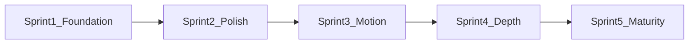

# TraderCity Homepage — Code Implementation Guide

**Version:** 1.0  
**Status:** Living document — Cursor execution guide  
**Parent strategy:** [`00_Homepage_Refinement_Strategy.md`](00_Homepage_Refinement_Strategy.md)

> This guide turns the refinement strategy into **PR-sized sprints** with exact files, acceptance criteria, and copy-paste agent prompts. Read **00** for why; read **11** for how.

---

## Product Decisions (Locked)

| Decision | Implementation |
|----------|----------------|
| VIP upgrade CTAs | Route to **pricing plan section** — `#plan-selector` on homepage; `/pricing#plan-selector` cross-page |
| Free membership CTAs | Keep `/login?plan=free` |
| No redesign | 8 sections, same order, same copy |
| No new packages | Framer Motion, Tabler, Lucide already in stack |

---

## Execution Rules (Every Sprint)

- **Branch:** `refine/homepage-sprint-{N}`
- **Read order:** 00 → 11 (this sprint) → 10 → affected files
- **Scope:** `src/components/home/**`, `src/components/pricing/**`, `src/app/globals.css`, `src/app/layout.tsx`
- **Forbidden:** section add/remove/reorder, copy changes, new packages, backend, `admin/**`, `dashboard/**`
- **Verify:** `npm run build` + desktop 1440px + mobile 390px spot-check
- **Gate:** Do not start Sprint N+1 until Sprint N acceptance criteria pass

---

## Sprint Overview

| Sprint | Phase | Scope | Status |
|--------|-------|-------|--------|
| 1 | Foundation | ~10 files — metadata, fonts, tokens, CTAs, renames | See below |
| 2 | Premium Polish | ~20 files + `home/shared/` primitives | Pending Sprint 1 |
| 3 | Cohesion | Motion re-enable + reduced-motion | Pending Sprint 2 |
| 4 | Depth | Research split + a11y + perf | Pending Sprint 3 |
| 5 | Maturity | Cross-surface tokens + QA baseline | Pending Sprint 4 |



---

## Sprint 1 — Foundation

**Goal:** Fix infrastructure gaps. Smallest diff, highest impact.

### Tasks

#### 1.1 Metadata and fonts

| File | Change |
|------|--------|
| `src/app/layout.tsx` | TraderCity `title`, `description`, basic `openGraph` |
| `src/app/globals.css` | `body { font-family: var(--font-sans)... }`; add `@theme` brand tokens |

Tokens added in Sprint 1 (migration to classes in Sprint 2):

```css
--color-tc-navy: #05081A;
--color-tc-purple: #9B5DE5;
--color-tc-gold: #D4AF37;
--color-tc-cyan: #06D6F7;
--color-tc-muted: #8F9BB3;
--color-tc-section: #03040C;
```

#### 1.2 CTA routing

| File | Change |
|------|--------|
| `src/components/pricing/Pricing.tsx` | Add `id="pricing"` on section |
| `src/components/pricing/PricingContent.tsx` | Add `id="plan-selector"` on plans grid; VIP CTA → `#plan-selector` |
| `src/components/home/membership-comparison/MembershipComparisonContent.tsx` | VIP CTA → `#plan-selector` (homepage scroll) |

Free CTAs unchanged: `/login?plan=free`

#### 1.3 Code hygiene

| Action | File |
|--------|------|
| Rename `CommunityIllustratiion.tsx` → `CommunityIllustration.tsx` | Update `Community.tsx` import |
| Fix `sm:-mt+6 lg:-mt+8` → `sm:-mt-6 lg:-mt-8` | `CommunityIllustration.tsx` |
| Rename export `LoginBackground` → `PricingBackground` | `PricingBackground.tsx` |
| Rename `Section3Content` → `ProblemAwarenessContent` | `ProblemAwarenessContent.tsx` |
| Rename `Section6Discord` → `CommunityDiscord` | `CommunityDiscord.tsx` |
| Rename `Section4Illustration` → `TraderSolutionIllustration` | `TraderSolutionIllustration.tsx` |

#### 1.4 Comment cleanup

Remove large historical commented blocks from:
- `CommunityDiscord.tsx`, `CommunityIllustration.tsx`
- `AnalystTeamContent.tsx` (keep active motion code; remove dead layout iterations)
- `MembershipComparisonContent.tsx` (remove stub at top)
- `TraderSolutionBackground.tsx`, `TraderSolutionIllustration.tsx`

**Keep** commented `whileInView` variants in Analyst/Community/Membership for Sprint 3.

#### 1.5 Assets

`public/images/` missing (51 paths). Sprint 1 actions:
- Verify `onError` fallbacks in `ResearchFrameworkContent.tsx` and `CommunityDiscord.tsx`
- Document gap in this guide — do not invent placeholders

### Sprint 1 Acceptance Criteria

- [ ] Geist Sans on body (not Arial)
- [ ] TraderCity metadata in layout
- [ ] VIP CTAs target pricing plan section (`#plan-selector`)
- [ ] `CommunityIllustration` rename compiles
- [ ] Export names match filenames
- [ ] `npm run build` passes
- [ ] No section order/copy/architecture changes

---

## Sprint 2 — Premium Polish

**Goal:** Typography, spacing, surfaces per [`homepage-pass.md`](../../Playbooks/homepage-pass.md).

### 2.1 Shared primitives

Create only when 3+ sections share pattern:

```
src/components/home/shared/
├── SectionEyebrow.tsx
├── SectionContainer.tsx
├── GradientText.tsx
└── GlassCard.tsx
```

Apply `SectionEyebrow` to sections 03–08 first.

### 2.2 Typography pass

| Token | Classes | Usage |
|-------|---------|-------|
| display-xl | `text-4xl sm:text-5xl lg:text-6xl` | Hero |
| display-lg | `text-3xl sm:text-4xl lg:text-5xl` | Section H2 |
| body | `text-base leading-relaxed` | Supporting copy |
| muted | `text-tc-muted` | Descriptions |

Files: all `home/**/*Content.tsx`, `pricing/PricingContent.tsx`

### 2.3 Spacing pass

| Section | Fix |
|---------|-----|
| Trader Solution | `py-2 lg:py-6` → `py-12 lg:py-16` band |
| All sections | Normalize to consistent vertical rhythm |

Containers: Hero `1200px`, S03–04 `1300px`, S05–08 `1440px`, Pricing `1080px`

### 2.4 Glass card pass

Unify: `bg-black/40 backdrop-blur-md border border-white/20 rounded-3xl`

Files: `AnalystTeamContent.tsx`, `MembershipComparisonContent.tsx`, `PricingContent.tsx`

### 2.5 Icon consolidation

Standardize on **Lucide** — migrate Tabler in Problem Awareness + Ecosystem Lite.

### Sprint 2 Acceptance Criteria

- [ ] `SectionEyebrow` in sections 03–08
- [ ] Consistent vertical rhythm Hero→Pricing
- [ ] Glass cards unified
- [ ] `font-sans` on all content wrappers
- [ ] Build + 390px/1440px check

---

## Sprint 3 — Cohesion (Motion)

### 3.1 Shared motion config

`src/components/home/shared/motion.ts`:

```typescript
export const fadeUp = {
  hidden: { opacity: 0, y: 24 },
  visible: { opacity: 1, y: 0, transition: { duration: 0.6, ease: [0.22, 1, 0.36, 1] } }
};
```

### 3.2 Re-enable scroll reveals

`whileInView` + `viewport: { once: true }` in:
- `AnalystTeamContent.tsx`
- `CommunityDiscord.tsx`
- `MembershipComparisonContent.tsx`

### 3.3 Reduced motion

`useReducedMotion()` or CSS `@media (prefers-reduced-motion: reduce)` in client components.

### 3.4 CTA micro-interactions

Extend `whileHover={{ x: 4 }}` to Pricing CTAs.

### Sprint 3 Acceptance Criteria

- [ ] Scroll reveals on Analyst, Community, Membership
- [ ] Motion respects `prefers-reduced-motion`
- [ ] Research Framework motion unchanged
- [ ] No layout shift from animations

---

## Sprint 4 — Depth (A11y + Performance)

### 4.1 Split ResearchFrameworkContent

```
research-framework/
├── ResearchFrameworkContent.tsx  # orchestrator <300 lines
├── FrameworkModePanel.tsx
├── ReportModePanel.tsx
├── TopicListPanel.tsx
├── ContentViewerPanel.tsx
├── FrameworkNav.tsx
└── RibbonCards.tsx
```

No behavior change — refactor only.

### 4.2 Accessibility

- Analyst carousel: `role="tablist"`, keyboard nav, `aria-selected`
- `focus-visible:ring-2` on interactive controls
- Heading audit: one H1 (Hero), H2 per section
- Image alt text
- Contrast check on muted text

### 4.3 Performance

- `next/image` for Community Discord + Knowledge Vault thumbnails
- Consider `dynamic()` import for Research Framework terminal

### Sprint 4 Acceptance Criteria

- [ ] ResearchFrameworkContent orchestrator <300 lines
- [ ] Analyst carousel keyboard-operable
- [ ] No Research Framework overflow at 390px
- [ ] Build passes

---

## Sprint 5 — Maturity

- Cross-surface `@theme` tokens with dashboards
- `12_Visual_QA_Baseline.md` screenshot viewports
- Archive or integrate `EcosystemDetailed.tsx` (product decision)
- Sync Chapter 10 with post-refactor tree

---

## Cursor Agent Prompt Template

```
You are implementing TraderCity Homepage Sprint {N}.

READ FIRST:
1. docs/AI/Agents/Homepage/00_Homepage_Refinement_Strategy.md
2. docs/AI/Agents/Homepage/11_Code_Implementation_Guide.md — Sprint {N} only
3. docs/AI/Agents/Homepage/10_Repository_Aware_Homepage_Engineering_Reference.md

SCOPE: src/components/home/**, src/components/pricing/**, src/app/globals.css, src/app/layout.tsx
FORBIDDEN: section add/remove/reorder, copy changes, new packages, backend, admin/dashboard files

Execute Sprint {N} tasks from 11_Code_Implementation_Guide.md.

VERIFY:
- npm run build
- Desktop 1440px + mobile 390px
- Section order and narrative preserved
- Definition of Done from 00 Section 11

Deliver: files changed summary + deferred items
```

---

## Verification Gates

| Gate | Check |
|------|-------|
| Build | `npm run build` |
| Lint | `npm run lint` |
| Scroll | `/` Hero → Pricing, no breaks |
| CTAs | Free → `/login?plan=free`; VIP → `#plan-selector` |
| Regression | 8 sections, same order, same copy |

---

## Risk Register

| Risk | Mitigation |
|------|------------|
| Missing `public/images/` | onError fallbacks; document; don't block Sprint 1 |
| CTA routing | Free unchanged; VIP only updated |
| Early primitive extraction | 3+ occurrences rule |
| Research split | No behavior change; test all nav paths |
| Agent B parallel work | No `admin/**` edits on homepage branch |

---

## Known Gaps (Post Sprint 1)

| Gap | Owner | Sprint |
|-----|-------|--------|
| `public/images/` missing (51 paths) | User/assets | 1 documented |
| Inline hex not using tokens | Design System | 2 |
| Commented motion dormant | Animation | 3 |
| ResearchFrameworkContent ~1500 lines | Frontend | 4 |

---

*Update this guide when each sprint completes. Mark sprint status in the table above.*
