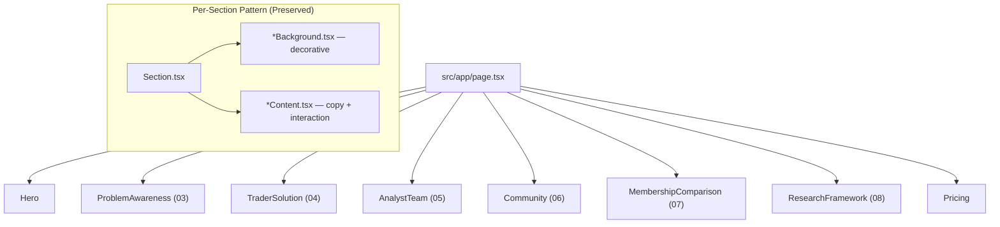
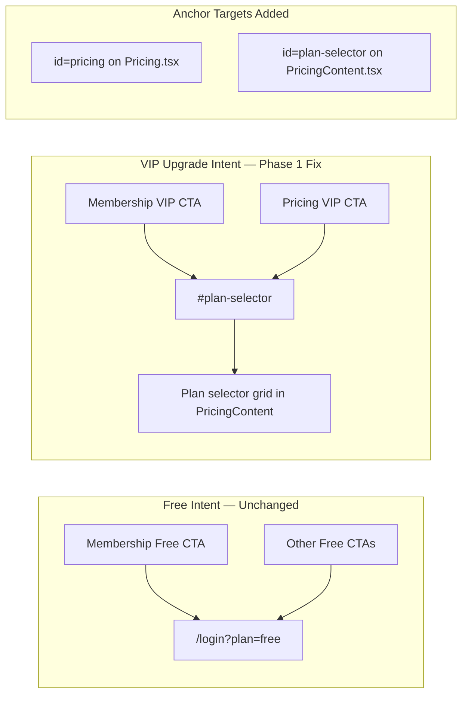
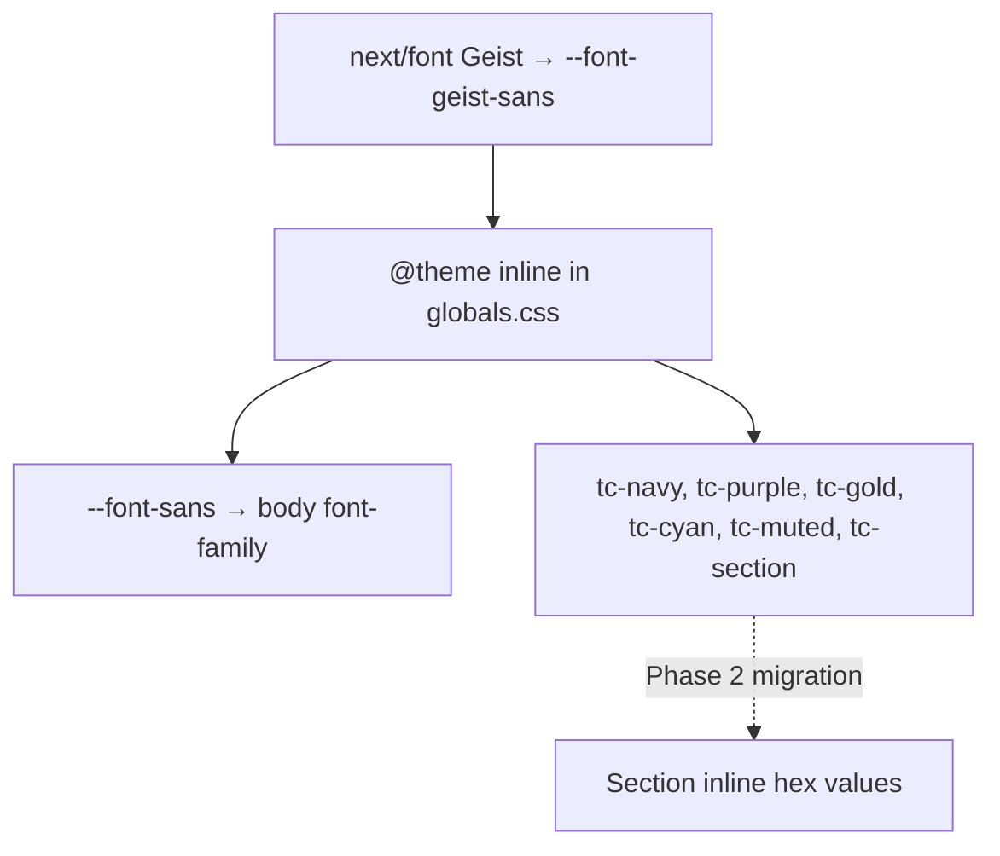

# Phase 01 — Homepage Foundation Refinement

**Document Type:** Engineering Phase Record  
**Module:** Homepage (`src/app/page.tsx`, `src/components/home/**`, `src/components/pricing/**`)  
**Status:** Complete  
**Date:** July 2026  
**AI Agent:** Homepage Refinement Agent (Agent A)  
**Related Handbook Chapters:** 00, 04, 05, 06, 10, 11  
**Implementation Guide:** [`docs/AI/Agents/Homepage/11_Code_Implementation_Guide.md`](../../AI/Agents/Homepage/11_Code_Implementation_Guide.md) — Sprint 1  
**Build Verification:** `npm run build` — passed (Next.js 16.2.6, Turbopack)

---

## Objective

### Why This Phase Exists

Phase 1 addressed infrastructure gaps that degraded premium perception and conversion clarity before any visual polish work. The homepage shipped with scaffold-level metadata, a font stack disconnect, misaligned VIP conversion paths, and accumulated iteration debt in source files.

### Business Problem

- Browser tabs and social previews displayed **"Create Next App"** instead of TraderCity branding.
- Body text rendered in **Arial** while Geist was loaded but never applied — undermining institutional typography.
- VIP upgrade CTAs routed users to **`/login?plan=free`**, conflating free signup with paid upgrade intent.
- Filename/export mismatches (`CommunityIllustratiion`, `Section6Discord`, `LoginBackground`) increased onboarding friction for engineers and AI agents.

### Engineering Problem

- No canonical brand color tokens in `globals.css`; sections used scattered inline hex values.
- No anchor targets for in-page pricing navigation (`#pricing`, `#plan-selector`).
- Thousands of lines of dead commented iteration blocks obscured active implementations.
- Invalid Tailwind classes (`sm:-mt+6`) produced unpredictable layout behavior.

### Expected Outcome

A smallest-diff foundation layer that:

1. Establishes correct metadata, typography wiring, and design token primitives.
2. Aligns VIP conversion CTAs with the pricing plan selector.
3. Normalizes naming to match the business-oriented folder structure.
4. Removes dead code without altering section order, copy, or architecture.
5. Passes production build with zero TypeScript errors.

**Phase 1 explicitly did not** perform typography normalization, spacing passes, shared primitive extraction, motion re-enablement, accessibility audits, or Research Framework decomposition. Those are deferred to Phases 2–5 per the implementation guide.

---

## Scope

### Included in Phase 1

| Category | Work Performed |
|----------|----------------|
| **Metadata** | TraderCity `title`, `description`, `openGraph` in root layout |
| **Typography (wiring only)** | Geist Sans applied to `body` via CSS variable chain |
| **Design Tokens** | Six `@theme` brand tokens added to `globals.css` (declaration only; no mass migration) |
| **CTA Routing** | VIP paths → `#plan-selector`; Free paths unchanged → `/login?plan=free` |
| **Anchor IDs** | `id="pricing"` on pricing section shell; `id="plan-selector"` on plan grid |
| **Naming Hygiene** | File rename, export renames, invalid class fix |
| **Dead Code Removal** | Large commented iteration blocks removed from 6 files |
| **Asset Resilience** | `onError` handler on Community Discord screenshot |
| **Build Verification** | `npm run build` passing |

### Explicitly Excluded from Phase 1

| Category | Deferred To |
|----------|-------------|
| Shared primitives (`SectionEyebrow`, `GlassCard`, etc.) | Phase 2 |
| Typography scale pass across `*Content.tsx` files | Phase 2 |
| Vertical rhythm / container width normalization | Phase 2 |
| Glass card recipe unification | Phase 2 |
| Icon library consolidation (Tabler → Lucide) | Phase 2 |
| Scroll reveal motion re-enablement | Phase 3 |
| `prefers-reduced-motion` handling | Phase 3 |
| Research Framework file split (~1500 lines) | Phase 4 |
| Carousel keyboard navigation / heading audit | Phase 4 |
| `` → `next/image` migration | Phase 4 |
| Cross-surface token sharing with dashboards | Phase 5 |
| `public/images/` asset delivery | External / future sprint |

---

## Files Modified

### `src/app/`

#### `layout.tsx`

| Attribute | Detail |
|-----------|--------|
| **Purpose** | Root HTML shell; font loading; site-wide metadata |
| **Reason** | Replace Next.js scaffold defaults with TraderCity branding |
| **Changes** | `metadata.title` → `"TraderCity — Crypto Intelligence Ecosystem"`; added `description` and `openGraph` block (`title`, `description`, `type: "website"`) |
| **Impact** | Correct SERP titles, link previews, and tab labels; no routing or layout structure changes |

#### `globals.css`

| Attribute | Detail |
|-----------|--------|
| **Purpose** | Global Tailwind theme, CSS variables, body defaults |
| **Reason** | Connect loaded Geist font to rendered text; seed brand token system |
| **Changes** | `body { font-family: Arial... }` → `font-family: var(--font-sans), system-ui, sans-serif`; added `@theme inline` tokens: `--font-sans`, `--font-mono`, `--color-tc-navy`, `--color-tc-purple`, `--color-tc-gold`, `--color-tc-cyan`, `--color-tc-muted`, `--color-tc-section` |
| **Impact** | Geist Sans renders site-wide; tokens available as `text-tc-gold`, `bg-tc-navy`, etc. in Tailwind v4 — inline hex values in sections remain unchanged until Phase 2 migration |

---

### `src/components/pricing/`

#### `Pricing.tsx`

| Attribute | Detail |
|-----------|--------|
| **Purpose** | Section shell composing `PricingBackground` + `PricingContent` |
| **Reason** | Enable cross-page and in-page anchor navigation to pricing |
| **Changes** | Added `id="pricing"` on root `<section>` |
| **Impact** | `/pricing#plan-selector` and homepage `#pricing` scroll targets work; section composition unchanged |

#### `PricingBackground.tsx`

| Attribute | Detail |
|-----------|--------|
| **Purpose** | Decorative grid background for pricing section |
| **Reason** | Export name did not match filename (`LoginBackground`) — copy-paste artifact from login page |
| **Changes** | Rewrote as minimal grid-only background; export renamed to `PricingBackground` |
| **Impact** | Import semantics match file responsibility; removes confusion with `src/components/login/LoginBackground.tsx` |

#### `PricingContent.tsx`

| Attribute | Detail |
|-----------|--------|
| **Purpose** | Client-side pricing UI — plan selector, feature list, VIP CTA |
| **Reason** | VIP CTA incorrectly sent upgrade-intent users to free login |
| **Changes** | Added `id="plan-selector"` on plans grid container; VIP CTA wrapper changed from `<Link href="/login?plan=free">` to `<a href="#plan-selector">`; removed unused `Link` import |
| **Impact** | "Become a VIP Member" scrolls/focuses plan selector on same page; conversion funnel aligns with product decision |

---

### `src/components/home/community/`

#### `Community.tsx`

| Attribute | Detail |
|-----------|--------|
| **Purpose** | Section shell for Community (Discord header + illustration) |
| **Reason** | Import path referenced misspelled filename |
| **Changes** | Import `./CommunityIllustratiion` → `./CommunityIllustration` |
| **Impact** | Compile-time path correctness; no layout changes |

#### `CommunityIllustration.tsx` *(new file)*

| Attribute | Detail |
|-----------|--------|
| **Purpose** | Client illustration — Analysts ↔ Discord ↔ Traders flow diagram with Collective Edge card |
| **Reason** | Replaced typo filename; fixed invalid Tailwind; removed ~240 lines of commented iterations |
| **Changes** | Renamed from `CommunityIllustratiion.tsx`; fixed `sm:-mt+6 lg:-mt+8` → `sm:-mt-6 lg:-mt-8`; active implementation only (57 lines of component logic) |
| **Impact** | Valid negative margin overlap on tablet/desktop; file is maintainable; motion wrapper preserved but `whileInView` variants not yet re-enabled (Phase 3) |

#### `CommunityIllustratiion.tsx` *(deleted)*

| Attribute | Detail |
|-----------|--------|
| **Reason** | Filename typo (`Illustratiion`); superseded by correctly named file |
| **Impact** | Eliminates import ambiguity |

#### `CommunityDiscord.tsx`

| Attribute | Detail |
|-----------|--------|
| **Purpose** | Client content — Community section header, copy, Discord screenshot |
| **Reason** | Export name mismatch; dead iteration comments; missing image fallback |
| **Changes** | Export `Section6Discord` → `CommunityDiscord`; removed ~180 lines of commented alternate layouts; added `onError` on Discord `` to hide broken image container; removed unused `motion` import after cleanup |
| **Impact** | Naming aligns with `CommunityDiscord.tsx` filename; graceful degradation when `/images/Community/Discord.png` is absent |

---

### `src/components/home/membership-comparison/`

#### `MembershipComparisonContent.tsx`

| Attribute | Detail |
|-----------|--------|
| **Purpose** | Client content — Free vs VIP comparison, OBSERVE→UPGRADE journey |
| **Reason** | VIP CTA used `/pricing` cross-page navigation instead of in-page plan focus; stub comment block at file top |
| **Changes** | VIP "View VIP Plans" `href` → `#plan-selector`; removed 19-line `Section7Content` stub at top; **preserved** commented `whileInView` motion variants for Phase 3 |
| **Impact** | Homepage VIP path scrolls to plan selector without full navigation; file reduced by stub only |

---

### `src/components/home/problem-awareness/`

#### `ProblemAwarenessContent.tsx`

| Attribute | Detail |
|-----------|--------|
| **Purpose** | Server content — 6-step trader journey, context-over-effort thesis |
| **Reason** | Export still named `Section3Content` from pre-refactor era |
| **Changes** | Export renamed to `ProblemAwarenessContent` |
| **Impact** | Filename, folder, and export are now consistent (`problem-awareness/ProblemAwarenessContent.tsx`) |

---

### `src/components/home/trader-solution/`

#### `TraderSolutionBackground.tsx`

| Attribute | Detail |
|-----------|--------|
| **Purpose** | Server decorative background — dark base + grid overlay |
| **Reason** | Contained commented legacy `Section4Background` / `Section5Background` iterations |
| **Changes** | Removed 20 lines of commented alternate background implementations |
| **Impact** | Active grid background unchanged; file clarity improved |

#### `TraderSolutionIllustration.tsx`

| Attribute | Detail |
|-----------|--------|
| **Purpose** | Server SVG — specialist blocks converging to TC hub → "BETTER DECISIONS" |
| **Reason** | Export was `Section4Illustration`; ~360 lines of commented alternate SVG below active code |
| **Changes** | Active export confirmed as `TraderSolutionIllustration`; truncated commented iteration block (file: 213 lines active, was 573) |
| **Impact** | 63% line reduction; active SVG pipeline illustration unchanged |

---

### `src/components/home/analyst-team/`

#### `AnalystTeamContent.tsx`

| Attribute | Detail |
|-----------|--------|
| **Purpose** | Client content — analyst carousel (Mattertrade, ChartInDepth, Heavyweight) |
| **Reason** | ~494 lines of commented Gemini iteration layouts below active implementation |
| **Changes** | Removed header comment and all dead iteration blocks; active file: 284 lines (was 778) |
| **Impact** | 63% line reduction; carousel behavior, copy, and styling unchanged |

---

### Files Not Modified (Confirmed Unchanged)

The following homepage files were **not** touched in Phase 1:

- `src/app/page.tsx` — section order preserved
- `src/components/home/hero/**`
- `src/components/home/research-framework/**` (except pre-existing `onError` verified)
- `src/components/home/EcosystemDetailed.tsx` — still unmounted orphan
- All `*Background.tsx` shells except `TraderSolutionBackground` and `PricingBackground`

---

## Architecture Changes

### Homepage Composition (Unchanged)

Phase 1 preserved the flat composition model in `page.tsx`:



No folder restructuring occurred. No shared primitives were extracted. The Background/Content split from Chapter 04 remains the canonical pattern.

### CTA Navigation Architecture (Changed)



**Cross-page behavior:** On `/pricing`, `#plan-selector` scrolls to the plan grid. On homepage `/`, `#plan-selector` scrolls within the mounted Pricing section at page bottom.

### Design Token Layer (Introduced, Not Migrated)



Tokens are **declared** but sections still use inline hex (`#D4AF37`, `#3B82F6`, etc.). Phase 2 will migrate usage incrementally.

### Naming Normalization

| Before | After | Location |
|--------|-------|----------|
| `CommunityIllustratiion.tsx` | `CommunityIllustration.tsx` | `community/` |
| `export Section6Discord` | `export CommunityDiscord` | `CommunityDiscord.tsx` |
| `export Section3Content` | `export ProblemAwarenessContent` | `ProblemAwarenessContent.tsx` |
| `export Section4Illustration` (commented) | `export TraderSolutionIllustration` (active) | `TraderSolutionIllustration.tsx` |
| `export LoginBackground` | `export PricingBackground` | `PricingBackground.tsx` |

---

## Components Added

### `CommunityIllustration.tsx`

| Attribute | Detail |
|-----------|--------|
| **Purpose** | Visual flow diagram below Discord screenshot — Analysts and Traders connected through TraderCity Discord hub |
| **Responsibility** | Pure presentation; `pointer-events-none` wrapper with `pointer-events-auto` on interactive subtree |
| **Dependencies** | `framer-motion` (wrapper only), `lucide-react` (Share2, Users, TrendingUp), inline Discord SVG |
| **Reusability** | Section-specific; not extracted to shared primitive (single occurrence) |
| **Future Improvements** | Re-enable `whileInView` scroll reveal (Phase 3); consider extracting `DiscordIcon` if duplicated elsewhere |

No other new components were created. Phase 1 did not introduce `src/components/home/shared/`.

---

## Components Refactored

### Community Illustration

```
Old: CommunityIllustratiion.tsx (300 lines, typo filename, invalid classes, 2 commented full iterations)
  ↓
New: CommunityIllustration.tsx (57 lines, correct filename, valid Tailwind)
  ↓
Benefits: Compiles reliably; margin overlap works on sm/lg breakpoints
  ↓
Future: Motion re-enable in Phase 3; no structural change needed
```

### Pricing Background

```
Old: PricingBackground.tsx exporting LoginBackground (login-page copy-paste)
  ↓
New: PricingBackground.tsx exporting PricingBackground (grid-only, pricing-specific)
  ↓
Benefits: Semantic correctness; no collision with login/LoginBackground.tsx
  ↓
Future: May share grid recipe with TraderSolutionBackground via token in Phase 2
```

### Analyst Team Content

```
Old: 778 lines (284 active + 494 commented iterations)
  ↓
New: 284 lines (active carousel only)
  ↓
Benefits: Engineers read one implementation; AI agents parse correct code
  ↓
Future: Carousel a11y (tablist, arrow keys) in Phase 4
```

---

## Design System Changes

### Typography

| Change | Before | After |
|--------|--------|-------|
| Body font | `Arial, Helvetica, sans-serif` | `var(--font-sans), system-ui, sans-serif` |
| Font variable chain | Geist loaded but unused on body | `--font-sans: var(--font-geist-sans)` in `@theme` |
| Section-level type scale | Unchanged | Unchanged — Phase 2 |

### Colors (Token Declaration)

| Token | Hex | Tailwind Class |
|-------|-----|----------------|
| `tc-navy` | `#05081A` | `text-tc-navy`, `bg-tc-navy` |
| `tc-purple` | `#9B5DE5` | `text-tc-purple`, `bg-tc-purple` |
| `tc-gold` | `#D4AF37` | `text-tc-gold`, `bg-tc-gold` |
| `tc-cyan` | `#06D6F7` | `text-tc-cyan`, `bg-tc-cyan` |
| `tc-muted` | `#8F9BB3` | `text-tc-muted`, `bg-tc-muted` |
| `tc-section` | `#03040C` | `text-tc-section`, `bg-tc-section` |

**No section files were migrated to token classes in Phase 1.** Inline hex remains the active styling method.

### Spacing, Cards, Motion, Icons

No changes in Phase 1. All deferred to Phase 2–3.

---

## Responsive Improvements

Phase 1 made one responsive **bug fix**, not a systematic pass:

| File | Fix | Breakpoints Affected |
|------|-----|---------------------|
| `CommunityIllustration.tsx` | `sm:-mt+6 lg:-mt+8` → `sm:-mt-6 lg:-mt-8` | `sm` (640px+), `lg` (1024px+) |

The invalid `+` syntax in Tailwind class names was non-functional. Correct negative margins restore the intended overlap composition between Discord screenshot and illustration diagram on tablet and desktop.

No container width normalization, section `py-*` rhythm changes, or mobile-specific layout adjustments were performed.

---

## Accessibility Improvements

Phase 1 accessibility changes were minimal and defensive:

| Area | Change | Scope |
|------|--------|-------|
| **Image alt text** | Preserved existing `alt="TraderCity Discord Community"` on Discord screenshot | `CommunityDiscord.tsx` |
| **Broken image handling** | `onError` hides img element when asset missing | `CommunityDiscord.tsx` |
| **Semantic structure** | Unchanged — no heading hierarchy audit performed | All sections |
| **Keyboard navigation** | Unchanged — analyst carousel not yet operable via keyboard | `AnalystTeamContent.tsx` |
| **Focus states** | Unchanged | All sections |
| **ARIA** | Unchanged | All sections |
| **Contrast** | Unchanged — `#8F9BB3` on dark backgrounds not audited | All sections |

`ResearchFrameworkContent.tsx` already contained `onError` handlers on Knowledge Vault thumbnails (lines 574, 661) — verified, not modified.

---

## Performance Improvements

| Category | Phase 1 Action |
|----------|----------------|
| **Dead code removal** | ~1,150 lines of commented blocks removed across 6 files — reduces parse/review overhead, not runtime bundle (comments are stripped at build) |
| **Bundle optimization** | None — no dynamic imports added |
| **Image optimization** | None — `` tags unchanged; `next/image` deferred to Phase 4 |
| **Lazy loading** | None |
| **Motion optimization** | None — scroll reveals remain commented |

Build output: 9 static routes compiled successfully; homepage prerendered as static content.

---

## Before vs After

### User-Visible

| Area | Before | After |
|------|--------|-------|
| Browser tab title | "Create Next App" | "TraderCity — Crypto Intelligence Ecosystem" |
| Social link previews | Generic / missing | TraderCity title + description |
| Body typography | Arial (system fallback) | Geist Sans |
| VIP "View VIP Plans" (Membership) | Navigated to `/pricing` page | Scrolls to plan selector on homepage |
| VIP "Become a VIP Member" (Pricing) | Sent to `/login?plan=free` | Scrolls to plan selector (`#plan-selector`) |
| Community illustration overlap | Broken margin classes on sm/lg | Correct negative margin composition |
| Missing Discord image | Broken image icon visible | Image hidden gracefully via `onError` |

### User-Invisible (Engineering)

| Area | Before | After |
|------|--------|-------|
| Export/filename alignment | 5 mismatches | 0 mismatches in modified files |
| Brand tokens | None in theme | 6 tokens + font wiring |
| AnalystTeamContent.tsx | 778 lines | 284 lines |
| TraderSolutionIllustration.tsx | 573 lines | 213 lines |
| CommunityDiscord.tsx | 254 lines | 97 lines |
| Build status | Passing (pre-phase) | Passing (verified post-phase) |

### Unchanged (By Design)

- 8 sections, same order, same copy
- Section visual design, spacing bands, glass card recipes
- Hero 3D grid, Research Framework terminal, analyst carousel behavior
- Free membership CTAs → `/login?plan=free`

---

## Technical Debt Removed

| Item | Resolution |
|------|------------|
| Scaffold metadata (`Create Next App`) | Replaced with TraderCity branding |
| Geist font loaded but not applied | Wired through `--font-sans` to `body` |
| VIP CTA misrouting to free login | Anchored to `#plan-selector` |
| `CommunityIllustratiion.tsx` filename typo | Renamed to `CommunityIllustration.tsx` |
| Invalid Tailwind `sm:-mt+6 lg:-mt+8` | Fixed to valid negative margin syntax |
| `LoginBackground` export in pricing module | Renamed to `PricingBackground` |
| `Section3Content` / `Section6Discord` legacy exports | Aligned to filename conventions |
| ~1,150 lines dead commented iterations | Removed from 6 files |
| `MembershipComparisonContent` stub block | Removed |
| Missing `onError` on Community Discord img | Added |

---

## Remaining Technical Debt

See [`TECHNICAL_DEBT.md`](TECHNICAL_DEBT.md) for the full prioritized register. Summary:

| Priority | Count | Examples |
|----------|-------|----------|
| Critical | 1 | Missing `public/images/` (51 referenced paths) |
| High | 5 | Inline hex not migrated to tokens; no shared primitives; Research Framework monolith; scroll motion disabled; price display inconsistencies |
| Medium | 6 | Spacing rhythm inconsistencies; glass card recipe duplication; Tabler/Lucide icon split; `EcosystemDetailed.tsx` orphan |
| Low | 4 | Commented motion variants pending Phase 3; `next/image` not adopted; heading hierarchy unverified; cross-page `/pricing#plan-selector` not tested in standalone route docs |

---

## Engineering Decisions

### Decision 1: VIP CTAs → `#plan-selector` (Not `/login?plan=free`)

| | |
|---|---|
| **Why** | Product decision: upgrade-intent users should evaluate plans before authentication. Routing VIP CTAs to free login conflated two conversion intents. |
| **Alternatives** | (A) Keep `/login?plan=free` for all CTAs; (B) Route to `/pricing` page; (C) In-page `#plan-selector` anchor |
| **Chosen** | (C) on homepage; anchor IDs also enable (B) for cross-page use |
| **Why preferred** | Preserves single-page narrative; reduces navigation friction; aligns OBSERVE→UPGRADE journey in Membership section with Pricing section on same scroll path |

### Decision 2: Declare Tokens First, Migrate Later

| | |
|---|---|
| **Why** | Mass-replacing inline hex across 8 sections in Phase 1 risked visual regressions and exceeded foundation scope |
| **Alternatives** | (A) Tokens + mass migration in one PR; (B) Tokens only, migrate in Phase 2; (C) No tokens until full design system pass |
| **Chosen** | (B) |
| **Why preferred** | Smallest diff with highest impact; Phase 2 typography pass naturally pairs with token adoption per Ch 06 extraction rules |

### Decision 3: Delete Commented Iterations, Preserve Motion Comments

| | |
|---|---|
| **Why** | Gemini/Antigravity iteration blocks (400–500 lines each) obscured active code; motion `whileInView` comments are intentional Phase 3 re-enablement targets |
| **Alternatives** | (A) Delete all comments including motion; (B) Delete iteration blocks only; (C) Move history to git only (already there) |
| **Chosen** | (B) + (C) |
| **Why preferred** | Git history retains iterations; active files become readable; Sprint 3 guide explicitly lists files needing motion re-enablement |

### Decision 4: `onError` Hide — Not Placeholder Images

| | |
|---|---|
| **Why** | `public/images/` directory does not exist; inventing placeholder assets violates AGENTS.md "premium over flashy" and blueprint asset policy |
| **Alternatives** | (A) Generate placeholder images; (B) CSS fallback gradient; (C) Hide on error; (D) Block phase on asset delivery |
| **Chosen** | (C) for Community Discord; Research Framework already uses (C) |
| **Why preferred** | Phase 1 unblocked without fake assets; missing Discord screenshot degrades gracefully; asset delivery tracked as Critical debt |

### Decision 5: No Shared Primitive Extraction in Phase 1

| | |
|---|---|
| **Why** | Ch 06 rule: extract only when 3+ sections share identical pattern; Phase 1 scope is infrastructure, not composition refactor |
| **Alternatives** | (A) Extract `SectionEyebrow` immediately; (B) Wait for Phase 2 audit |
| **Chosen** | (B) |
| **Why preferred** | Avoids premature abstraction; Phase 2 polishes typography/spacing when duplication is actively addressed |

### Decision 6: Pricing VIP CTA Uses `<a>` Not `<Link>`

| | |
|---|---|
| **Why** | `#plan-selector` is same-page hash navigation within `PricingContent.tsx` |
| **Alternatives** | (A) `next/link` with `href="#plan-selector"`; (B) native `<a>`; (C) `scrollIntoView` onClick handler |
| **Chosen** | (B) |
| **Why preferred** | Hash links do not require client-side routing; no `Link` prefetch benefit; simpler DOM |

---

## Lessons Learned

### Challenges

1. **Filename typos propagate silently** — `CommunityIllustratiion` compiled as long as import matched typo; only rename exposed the issue in tooling/search.
2. **Invalid Tailwind syntax is not caught by TypeScript** — `sm:-mt+6` required visual QA to detect; build passes regardless.
3. **Export/name drift from section renumbering** — `Section3Content`, `Section6Discord` survived the `section3/` → `problem-awareness/` folder migration.

### Better Approaches Discovered

1. **Foundation before polish** — metadata and font wiring are invisible in component-level diffs but disproportionately affect premium perception.
2. **Anchor-based CTA routing** — simpler than route changes; respects no-routing-change constraint in AGENTS.md.
3. **Surgical comment cleanup** — truncating files at active implementation boundary is faster and safer than line-by-line comment review.

### Architectural Insights

1. The homepage is production-viable as a **static composition** — Phase 1 changes required zero backend or routing modifications.
2. **Conversion path correctness** is architectural — CTA `href` values are as important as component structure.
3. Design tokens in Tailwind v4 `@theme inline` provide a migration path without a separate token file.

### Future Recommendations

1. Add ESLint rule or CI check for export name ↔ filename alignment in `home/` and `pricing/`.
2. Document anchor IDs (`#pricing`, `#plan-selector`) in Ch 10 repository reference.
3. Deliver `public/images/` before Phase 2 visual QA to avoid false-negative polish reviews.

---

## Recommended Next Phase

### Phase 2 — Premium Polish (Sprint 2)

| Attribute | Detail |
|-----------|--------|
| **Objective** | Typography scale, spacing rhythm, glass card unification, first shared primitive extraction |
| **Expected Benefits** | Consistent vertical scroll feel; reduced duplication; token adoption begins |
| **Estimated Complexity** | Medium — ~20 files, 4 new primitives |
| **Estimated Impact** | High — primary visual cohesion improvement users will notice |
| **Recommended Files** | All `*Content.tsx` under `home/` + `pricing/PricingContent.tsx`; new `src/components/home/shared/` |
| **Suggested Architecture** | Extract `SectionEyebrow` when eyebrow pattern audited across sections 03–08; migrate hex → `text-tc-*` incrementally |

See [`11_Code_Implementation_Guide.md`](../../AI/Agents/Homepage/11_Code_Implementation_Guide.md) Sprint 2 for file-level tasks.

---

## Changelog Entry

Recorded in [`CHANGELOG.md`](CHANGELOG.md).

---

## Engineering Review

### Biggest Improvements Achieved

1. **Brand integrity at the document level** — metadata and Geist typography now match TraderCity positioning from first paint.
2. **Conversion path correctness** — VIP upgrade intent no longer routes to free login; in-page plan selector is the upgrade destination.
3. **Codebase legibility** — ~1,150 lines of dead iteration code removed; export names match business-oriented folder structure.
4. **Design system seed** — six brand tokens and font wiring provide the foundation for Phase 2 migration without a breaking change.
5. **Build confidence** — production build verified; zero TypeScript errors introduced.

### Remaining Architectural Weaknesses

1. **No shared primitives** — eyebrow, glass card, and gradient headline patterns still duplicated across 6+ sections.
2. **Inline hex dominance** — tokens declared but unused in section files; design system exists in two parallel forms.
3. **Research Framework monolith** — `ResearchFrameworkContent.tsx` remains ~1,500 lines with embedded state, violating maintainability targets.
4. **Motion system dormant** — scroll reveals commented out; homepage feels static relative to Research Framework reference implementation.
5. **Asset layer missing** — entire `public/images/` tree absent; multiple sections depend on local image paths.

### Risks

| Risk | Severity | Mitigation |
|------|----------|------------|
| Missing images undermine premium perception | High | Prioritize asset delivery; `onError` prevents broken UI |
| Phase 2 scope creep into redesign | Medium | Enforce Ch 11 sprint gates; no copy/section changes |
| Token migration causes subtle color shifts | Medium | Side-by-side screenshot QA at 390px and 1440px |
| Price inconsistencies (UI vs payment backend) | High | Agent B scope — document only; do not fix in homepage phases |

### Recommended Phase 2 Objectives

1. Create `src/components/home/shared/` with `SectionEyebrow`, `SectionContainer`, `GradientText`, `GlassCard` — extract only after 3+ occurrence audit.
2. Apply typography scale (`display-xl`, `display-lg`, `body`, `muted`) across all Content files.
3. Normalize section vertical rhythm (`py-12 lg:py-16` band) and container max-widths per blueprint.
4. Unify glass card recipe: `bg-black/40 backdrop-blur-md border border-white/20 rounded-3xl`.
5. Begin `text-tc-*` / `bg-tc-*` migration for highest-frequency hex values (gold, muted, section bg).

Phase 1 laid the foundation. Phase 2 is where users will first perceive the refinement.

---

*This document is the permanent engineering record of Homepage Phase 1. It describes only changes present in the repository as of July 2026.*
