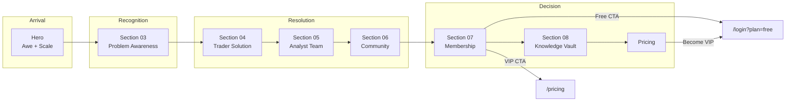
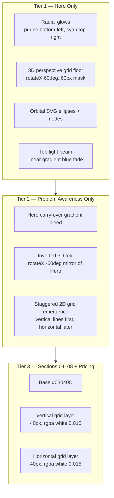
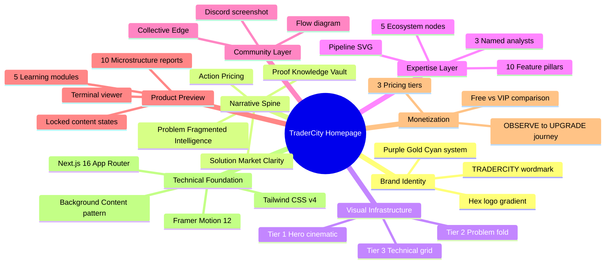

# TraderCity Homepage — Design & Engineering Blueprint

**Version:** 1.0  
**Status:** Living document  
**Last audited:** July 2026  
**Scope:** Homepage only (`src/app/page.tsx` and all mounted sections)

---

## Before You Change Anything

Every contributor — human or AI — must read this blueprint before modifying the homepage.

### Non-Negotiable Constraints

From [`AGENTS.md`](../../AGENTS.md), [`PROJECT_CONTEXT.md`](../../PROJECT_CONTEXT.md), and [`docs/Universal/TraderCity_Frontend_Constitution_V1.md`](../Universal/TraderCity_Frontend_Constitution_V1.md):

| Allowed | Forbidden |
|---------|-----------|
| Refine typography, spacing, hierarchy, polish | Change backend or routing |
| Improve responsiveness and accessibility | Add or remove sections |
| Subtle animation improvements | Install packages without approval |
| Reuse and extract components | Rewrite working architecture |
| Preserve the narrative spine | Propose or execute a redesign |

**Core positioning:** *One Ecosystem. Multiple Experts.*

**Homepage objective:** Every section should feel like part of one operating system — not isolated landing page blocks.

**Refinement playbook:** [`docs/AI/Playbooks/homepage-pass.md`](../AI/Playbooks/homepage-pass.md)

---

## 1. Executive Summary

TraderCity is a premium Trading Intelligence Platform combining education, research, community, analyst insights, and a Knowledge Vault. The homepage is a single-page narrative that converts serious traders by moving them from **recognition of fragmented intelligence** to **confidence in a unified ecosystem**.

This document is the permanent reference for how the homepage is built, why it exists, and how it should evolve over the next 12 months **without changing its core story or information architecture**.

### What This Document Is

- An as-built audit of every homepage component, pattern, and data structure
- A design system inventory of what is actually implemented in code
- A strategic guide for premium refinement, not replacement

### What This Document Is Not

- A redesign brief
- A proposal to restructure sections or rewrite messaging
- A backend or API specification (see [`TraderCity_Architecture_Rules.md`](../Universal/TraderCity_Architecture_Rules.md) for integration context)

### Tech Stack (As Implemented)

| Layer | Technology |
|-------|------------|
| Framework | Next.js 16 (App Router) |
| UI | React 19 |
| Language | TypeScript 5 (strict) |
| Styling | Tailwind CSS v4 via `@import "tailwindcss"` in [`globals.css`](../../src/app/globals.css) |
| Animation | Framer Motion 12 |
| Icons | `@tabler/icons-react`, `lucide-react`, inline SVG |
| Fonts | Geist Sans + Geist Mono via `next/font/google` in [`layout.tsx`](../../src/app/layout.tsx) |

---

## 2. Homepage Narrative & User Journey

### The Story in One Sentence

Crypto markets are too complex for any single perspective — TraderCity exists to unify expert intelligence, community, and structured knowledge into one conviction-building environment.

### Narrative Arc

The homepage follows a deliberate persuasion sequence. Each section answers a question the serious trader is already asking:

| Order | Section | Eyebrow | Question Answered | Emotional Beat |
|-------|---------|---------|-------------------|----------------|
| — | Hero | (none) | *What is this?* | Awe, clarity, scale |
| 03 | Problem Awareness | The Trader's Reality | *Why am I struggling?* | Empathy, recognition |
| 04 | Trader Solution | The Solution | *How does this fix it?* | Relief, structure |
| 05 | Analyst Team | The Analysts | *Who stands behind this?* | Credibility, trust |
| 06 | Community | Community | *Who else is here?* | Belonging, connection |
| 07 | Membership Comparison | Membership | *What do I get at each level?* | Choice architecture |
| 08 | Research Framework | Knowledge Vault | *How deep does this go?* | Proof, depth preview |
| — | Pricing | Pricing Plans | *What does it cost?* | Commitment, action |

> **Note:** Sections 01 and 02 are not numbered in the UI. The eyebrow system begins at **03**, reflecting an earlier IA where Hero and Ecosystem were separate numbered sections. The Constitution describes a slightly different section order (Hero → Why → Ecosystem → Traders → Community → Results → Pricing). The **implemented order** above is the source of truth; Ecosystem is embedded inside Hero via `EcosystemLiteContent`.

### Key Copy by Section

**Hero**
- Brand: `TRADERCITY`
- Headline: *"Crypto Is More Than One Market."*
- Problem line (gradient): *"No One Sees The Entire Picture."*
- Resolution: *"That's Why We Built TraderCity."*
- Ecosystem label: *"THE CENTRAL ECOSYSTEM"* → *"UNIFIED COMMUNITY"*

**Problem Awareness (03)**
- Intro: *"EVERY TRADER STARTS HERE."* / *"The same ambition. The same mistakes."*
- Core insight: *"The market wasn't the hard part. Finding clarity was."*
- Thesis: *"MOST TRADERS DON'T FAIL FROM LACK OF EFFORT. THEY FAIL FROM LACK OF CONTEXT."*
- Close: **FRAGMENTED INTELLIGENCE.** / *"Information everywhere. Confidence nowhere."*

**Trader Solution (04)**
- Thesis: *"TraderCity wasn't built to provide more opinions. It was built to provide context."*
- Close: **MARKET CLARITY.** / *"Different Expertise. One Conviction. Stronger Community."*

**Analyst Team (05)**
- Headline: *"The Analysts Behind The Conviction."*
- Sub: *"No single trader sees the entire market. Together, they cover every dimension that matters."*

**Community (06)**
- Headline: *"One Community. Real Traders. Real Connections."*
- Sub: *"One place where ideas converge and everyone grows."*

**Membership (07)**
- Thesis: *"Most communities give you information. TraderCity gives you context."*
- Badge: *"One Ecosystem. Two Levels. Endless Growth."*

**Research Framework (08)**
- Headline: *"Research. Frameworks. Context."*
- Preview disclaimer: *"This Is Just A Preview"*

**Pricing**
- Headline: *"Choose Your Membership Term"*
- Social proof: *"Join 800+ traders growing together in the TraderCity VIP community."*
- CTA: *"Become a VIP Member"*

### User Journey Diagram



### Conversion Paths

| CTA | Destination | Appears In |
|-----|-------------|------------|
| Join Free / Discord access | `/login?plan=free` | Membership Comparison, Pricing |
| View VIP / Upgrade | `/pricing` | Membership Comparison |
| Become a VIP Member | `/login?plan=free` | Pricing |

There is no global navigation header or footer on the homepage — the page is a self-contained scroll experience ending at Pricing.

---

## 3. Codebase Architecture

### Entry Points

```
src/app/
├── page.tsx          → Homepage section stack
├── layout.tsx        → Root HTML, Geist fonts, metadata
└── globals.css       → Tailwind v4 import, CSS variables, @theme inline
```

The homepage is rendered as a flat `<main>` with no layout wrapper, nav, or footer:

```tsx
// src/app/page.tsx
<main>
  <Hero />
  <ProblemAwareness />
  <TraderSolution />
  <AnalystTeam />
  <Community />
  <MembershipComparison />
  <ResearchFramework />
  <Pricing />
</main>
```

### Folder Structure

```
src/components/
├── home/
│   ├── hero/                    (3 files)
│   ├── problem-awareness/       (3 files)
│   ├── trader-solution/         (4 files)
│   ├── analyst-team/            (3 files)
│   ├── community/               (4 files)
│   ├── membership-comparison/   (3 files)
│   ├── research-framework/      (3 tsx + 2 ts data)
│   ├── ecosystem-lite/          (1 file — used inside Hero)
│   └── EcosystemDetailed.tsx    (orphan — not mounted)
└── pricing/                     (3 files — shared with /pricing route)
```

**Total homepage-related files:** 27 under `home/` + 3 under `pricing/` = **30 files**

### Section Architecture Pattern

Every mounted section follows the same decomposition:

```
SectionName.tsx
├── SectionNameBackground.tsx   → absolute inset-0, pointer-events-none
└── SectionNameContent.tsx        → relative z-10, copy + interactive UI
```

**Community** is the exception — it composes three content-level components instead of one:

```
Community.tsx
├── CommunityBackground.tsx
├── CommunityDiscord.tsx          → header + Discord screenshot
└── CommunityIllustratiion.tsx    → flow diagram (filename typo: triple "i")
```

### Server vs Client Components

| Type | Files |
|------|-------|
| Server (default) | All `*Background.tsx`, section shells (`Hero.tsx`, etc.), `HeroContent.tsx`, `ProblemAwarenessContent.tsx`, `TraderSolutionContent.tsx` |
| Client (`'use client'`) | `AnalystTeamContent.tsx`, `CommunityDiscord.tsx`, `CommunityIllustratiion.tsx`, `MembershipComparisonContent.tsx`, `ResearchFrameworkContent.tsx`, `PricingContent.tsx` |

Client components are used only where interactivity is required: state, carousel, terminal UI, plan selection, hover motion.

### Data Layer

| Source | Location | Future API |
|--------|----------|------------|
| Inline arrays | Content files (`journeySteps`, `features`, `freeItems`, `plans`, etc.) | — |
| Learning modules | `learningFrameworks.ts` | `GET /education/modules`, `GET /education/lessons` |
| Microstructure reports | `microstructureReports.ts` | `GET /reports`, `GET /reports/:id` |

Data files include explicit TODO comments for NestJS backend migration. The Research Framework terminal is designed as a **product preview** that will eventually consume live Arena/education data.

### Shared UI

The homepage imports **no shared UI library** (`src/components/ui/` does not exist yet). All cards, icons, buttons, and surfaces are implemented inline per section. This is a deliberate trade-off: maximum visual fidelity per section, at the cost of token duplication.

### Path Alias

`@/*` → `./src/*` (configured in `tsconfig.json`)

---

## 4. Complete Component Hierarchy

### Master Tree

```
page.tsx
│
├── Hero.tsx                          [section shell, min-h-screen]
│   ├── HeroBackground.tsx            [cinematic: glows, 3D grid, orbital SVG]
│   └── HeroContent.tsx               [brand, headline, scroll area]
│       └── EcosystemLiteContent.tsx    [5 expert nodes → TC hub → community]
│
├── ProblemAwareness.tsx
│   ├── ProblemAwarenessBackground.tsx  [Hero fold transition + staggered grid]
│   └── ProblemAwarenessContent.tsx     [two-column + 6-step journey + close]
│
├── TraderSolution.tsx
│   ├── TraderSolutionBackground.tsx    [40px dual-layer grid]
│   └── TraderSolutionContent.tsx       [message + feature grid + close]
│       └── TraderSolutionIllustration.tsx  [hub-and-spoke SVG pipeline]
│
├── AnalystTeam.tsx                     [id="analysts" anchor]
│   ├── AnalystTeamBackground.tsx
│   └── AnalystTeamContent.tsx          [3-card carousel, client]
│
├── Community.tsx                       [bg override: #050816]
│   ├── CommunityBackground.tsx
│   ├── CommunityDiscord.tsx            [header + screenshot, client]
│   └── CommunityIllustratiion.tsx      [Analysts↔Discord↔Traders diagram, client]
│
├── MembershipComparison.tsx
│   ├── MembershipComparisonBackground.tsx
│   └── MembershipComparisonContent.tsx [Free|Journey|VIP grid, client]
│
├── ResearchFramework.tsx
│   ├── ResearchFrameworkBackground.tsx
│   └── ResearchFrameworkContent.tsx    [terminal viewer, client]
│       ├── learningFrameworks.ts       [5 modules, 18 topics]
│       └── microstructureReports.ts    [5 categories, 10 reports]
│
└── Pricing.tsx                         [from src/components/pricing/]
    ├── PricingBackground.tsx           [exports as LoginBackground — naming artifact]
    └── PricingContent.tsx              [plan selector + CTA, client]
```

### Orphan Component

[`EcosystemDetailed.tsx`](../../src/components/home/EcosystemDetailed.tsx) — a full alternate ecosystem section (~300 lines) with analyst cards, community features, and Tabler icons. **Not imported anywhere.** Represents an earlier, more detailed ecosystem vision. Do not mount without explicit product decision.

### Section Numbering Map

| UI Number | Section | Accent Color |
|-----------|---------|--------------|
| — | Hero | Purple / Cyan gradient |
| 03 | Problem Awareness | `#A855F7` purple |
| 04 | Trader Solution | `#A855F7` purple |
| 05 | Analyst Team | `#D4AF37` gold |
| 06 | Community | `#3B82F6` blue |
| 07 | Membership | Purple (Free) / Gold (VIP) |
| 08 | Research Framework | `#D4AF37` gold |
| — | Pricing | Yellow / Gold |

### State & Interactivity Reference

**AnalystTeamContent**
```typescript
const [activeIndex, setActiveIndex] = useState(1); // 0=Mattertrade, 1=ChartInDepth, 2=Heavyweight
```
- 3-card carousel with side selectors + featured center card
- Desktop timeline nav with gradient connectors + `animate-ping` on active dot
- Mobile stacked dot navigation

**ResearchFrameworkContent**
```typescript
type ActiveMode = 'frameworks' | 'reports';
// State: activeModuleIdx, activeTopicIdx, activeCategoryIdx, activeReportIdx
```
- Terminal-style viewer with mode switcher
- Module/category tabs, lesson/report list, content viewer
- Locked topic states (`locked: true` in data)
- Closing ribbon with 4 value cards

**MembershipComparisonContent**
```typescript
const journeySteps = [
  { number: '1', label: 'OBSERVE', highlight: false },
  { number: '2', label: 'LEARN', highlight: false },
  { number: '3', label: 'PARTICIPATE', highlight: false },
  { number: '4', label: 'UPGRADE', highlight: true },
];
```

**PricingContent**
```typescript
const [selectedPlan, setSelectedPlan] = useState<'monthly' | 'quarterly' | 'yearly'>('quarterly');
```

### Data Structures

**Learning Framework** (`learningFrameworks.ts`)

```typescript
export type ContentLevel = 'Beginner' | 'Intermediate' | 'Advanced';

export interface Topic {
  id: string;
  slug: string;
  order: number;
  title: string;
  excerpt: string;
  readTime: string;
  level: ContentLevel;
  locked: boolean;
  thumbnail: string;
  image: string;
  content: TopicContent;
}

export interface LearningModule {
  id: string;
  title: string;
  summary: string;
  description: string;
  topics: Topic[];
}
```

**Modules:** Market Foundations, Trade Management, Market Structure & Orderflow, Trader Psychology, Execution & Performance

**Microstructure Reports** (`microstructureReports.ts`)

```typescript
export interface Report {
  id: string;
  slug: string;
  title: string;
  date: string;
  analyst: string;       // Mattertrade | ChartInDepth | Heavyweight
  thumbnail: string;
  reportUrl: string | null;
  summary: string;
  content: ReportContent;
}

export interface ReportCategory {
  id: string;
  title: string;
  reports: Report[];
}
```

**Categories:** BTC Weekly Quant, Market Structure, Orderflow, Funding & Positioning, Macro Context

**Analyst Team** (hardcoded in Content, not typed)

| Analyst | Accent | Specialty |
|---------|--------|-----------|
| Mattertrade | `#A855F7` | Macro & Market Structure |
| ChartInDepth | `#D4AF37` | Market Structure Specialist, 8+ years |
| Heavyweight | `#3B82F6` | Orderflow & Execution |

**Ecosystem Lite Nodes** (`EcosystemLiteContent.tsx`)

| Node | Color |
|------|-------|
| Orderflow | `#9B5DE5` |
| Macro | `#5E5CE6` |
| Price Action | `#0A84FF` |
| Quant | `#06D6F7` |
| Research | `#30D158` |

**Trader Solution Features** — 10 items across 3 color-coded columns (purple `#A855F7`, amber `#F59E0B`, cyan `#06D6F7`) plus a highlighted Community row spanning the grid.

**Pricing Plans** — official catalog (`src/lib/membership/plans.ts`)

| Plan | Price | Duration | Highlight |
|------|------:|----------|-----------|
| Monthly | $60/mo | 30 DAYS | New Member Offer note (secondary): Welcome Credit $10 → first payment $50; catalog stays $60 |
| Quarterly | $150/3mo | 90 DAYS | Most Popular (default); Save $30 vs 3× monthly |
| Yearly | $500/yr | 365 DAYS | Save $220 vs 12× monthly |

Pricing adjustments: `src/lib/membership/pricing/` (independent of catalog).

---

## 5. Design System (As Implemented)

TraderCity does not yet have a formal design token file. The design system lives **de facto** in inline Tailwind arbitrary values across 30 files. This section documents what is consistently repeated — the raw material for future token extraction.

### Color Palette

#### Backgrounds

| Token (informal) | Hex | Usage |
|------------------|-----|-------|
| Deep space | `#02030A` | Hero base |
| Section dark | `#03040C` | Sections 03–08 backgrounds |
| Community dark | `#050816` | Community section override |
| Card surface | `#0C0D12`, `#111111`, `#1F2129` | Pricing container, diagram cards |
| Ecosystem node | `#05081A` | Expert node circles |

#### Accent Colors

| Role | Hex Values | Sections |
|------|------------|----------|
| Purple | `#A855F7`, `#9B5DE5`, `#C084FC`, `#C86EFF` | Problem, Solution, Free tier, Hero gradient |
| Gold | `#D4AF37`, `#F59E0B`, `#FACC15`, `#F8C547` | Analysts, VIP tier, Pricing, Knowledge Vault |
| Blue/Cyan | `#0A84FF`, `#06D6F7`, `#3B82F6`, `#60A5FA` | Hero, Community, Heavyweight accent |
| Green | `#30D158`, `#10B981` | Research node, Traders card |
| Muted text | `#8F9BB3`, `#94A3B8`, `#64748B` | Body copy, descriptions |
| White alpha | `text-white/40` – `text-white/90` | Hierarchy within white |

#### Semantic Color Assignments

- **Purple** = problem awareness, free access, structural insight
- **Gold** = premium, VIP, analyst credibility, institutional grade
- **Blue/Cyan** = hero atmosphere, community, connectivity
- **Green** = growth, traders, research output

### Typography

#### Font Loading

Geist Sans and Geist Mono are loaded via `next/font/google` and exposed as CSS variables `--font-geist-sans` and `--font-geist-mono`. Tailwind maps these in `@theme inline` as `--font-sans` and `--font-mono`.

**Known gap:** `globals.css` sets `body { font-family: Arial, Helvetica, sans-serif }`, overriding Geist unless components explicitly apply `font-sans`.

#### Type Patterns

| Pattern | Classes | Usage |
|---------|---------|-------|
| Brand wordmark | `font-bold tracking-[0.25em] uppercase text-sm md:text-base` | TRADERCITY logo text |
| Section eyebrow | `tracking-[0.2em–0.3em] uppercase text-sm font-semibold` + number + hairline | Every numbered section |
| Display headline | `font-bold tracking-tight leading-[1.1]` + responsive arbitrary sizes | Section H2s |
| Gradient headline | `text-transparent bg-clip-text bg-gradient-to-r from-[...] to-[...]` | Key emotional lines |
| Body muted | `text-[#8F9BB3] text-[15px] leading-[1.8]` | Supporting paragraphs |
| Closing punch | `uppercase tracking-[0.3em–0.4em] font-bold` | FRAGMENTED INTELLIGENCE., MARKET CLARITY. |
| Feature title | `text-white font-medium text-[15px]` | Solution grid items |
| Micro label | `text-[8px]–text-[11px] tracking-widest uppercase` | Diagram cards |

#### Responsive Type Scale (Hero example)

```
text-[36px] sm:text-[40px] md:text-[42px] lg:text-[60px]   → primary headline
text-[28px] sm:text-[32px] md:text-[34px] lg:text-[30px]   → gradient subline
```

The homepage relies heavily on **arbitrary pixel values** rather than Tailwind's default scale — a refinement opportunity for rhythm consistency.

### Layout

#### Container Widths

| Section | Max Width |
|---------|-----------|
| Hero | `max-w-[1200px]` |
| Problem Awareness, Trader Solution | `max-w-[1300px]` |
| Analyst Team, Community, Membership, Research | `max-w-[1440px]` |
| Pricing | `max-w-[1080px]` |

#### Spacing

Section vertical padding varies significantly:
- Hero: `py-20`
- Problem Awareness: `py-12 lg:py-10`
- Trader Solution: `py-2 lg:py-6` (compressed)
- Community: `pt-20 lg:pt-28`
- Pricing: `py-16`

Horizontal padding is generally `px-4` to `px-6`, expanding to `lg:px-16` in wider sections.

#### Grid & Flex Patterns

- Two-column: `flex-col lg:flex-row`
- Feature grid: `grid-cols-1 md:grid-cols-2 lg:grid-cols-3`
- Membership: `lg:grid-cols-[minmax(0,1.1fr)_minmax(0,1.4fr)_auto_minmax(0,1.4fr)]`
- Analyst carousel: `lg:grid-cols-[18%_minmax(0,1fr)_18%]`

### Surfaces & Borders

#### Glass Card Recipe (Analyst Team featured card)

```
bg-black/40 backdrop-blur-md border border-white/20 rounded-3xl
shadow-[0_0_80px_rgba(212,175,55,0.15)] ring-inset ring-[#D4AF37]/20
```

#### Standard Borders

- Hairline dividers: `border-white/5`, `h-px bg-white/5`
- Card borders: `border-white/10`, `border-white/20`
- Accent borders: `border-[#A855F7]/30`, `border-[#D4AF37]/30`

#### Pricing Container

```
bg-[#0C0D12] border border-[#1F2129] rounded-[24px] p-8 lg:p-12
```

### Background System (Three Tiers)



Tier 2 is the **architectural bridge** — it sells the illusion that the Hero's 3D floor folds downward into the flat technical grid of subsequent sections. This is the homepage's strongest spatial continuity device and should be preserved in all future refinement.

### Iconography

| Library | Used In |
|---------|---------|
| `@tabler/icons-react` | Problem Awareness journey steps, Ecosystem Lite nodes, EcosystemDetailed (orphan) |
| `lucide-react` | Analyst Team, Community illustration, Pricing |
| Inline SVG | Hero hex logo, Research Framework icons, Membership icons, social icons (X, Discord, Telegram, YT) |

**Inconsistency:** Two icon libraries coexist. A unified icon system is a refinement opportunity, not a redesign requirement.

### CSS Theme (globals.css)

```css
:root {
  --background: #ffffff;
  --foreground: #171717;
}

@theme inline {
  --color-background: var(--background);
  --color-foreground: var(--foreground);
  --font-sans: var(--font-geist-sans);
  --font-mono: var(--font-geist-mono);
}
```

Dark mode via `prefers-color-scheme: dark` flips to `#0a0a0a` / `#ededed`. The homepage is **always dark** regardless — it uses hardcoded hex values, not these CSS variables.

---

## 6. Visual Language & Branding

### Brand Pillars

From product context and Constitution:

| Pillar | Expression on Homepage |
|--------|------------------------|
| Professional | Institutional typography, numbered sections, structured grids |
| Institutional | Terminal UI in Knowledge Vault, report archive framing |
| Minimal | Dark backgrounds, restrained color, no clutter |
| Premium | Glass cards, neon SVG glows, gradient headlines, backdrop blur |

### Emotional Goal

Users should feel: **Intelligence, Trust, Professionalism, Community, Elite expertise**

Users should NOT feel: signal service, crypto casino, prop-firm marketing

### Design Philosophy Split

Constitution defines: **70% Futuristic Ecosystem / 30% Premium Elite**

On the homepage this manifests as:
- **Futuristic:** 3D grids, orbital diagrams, hub-and-spoke SVG pipelines, terminal viewer
- **Premium Elite:** Gold accents, glass cards, wide-tracked uppercase closers, analyst credibility cards

### Visual Metaphors

| Metaphor | Visual Expression | Meaning |
|----------|-------------------|---------|
| Market infrastructure | Technical grid backgrounds | TraderCity operates on structured intelligence |
| Unified hub | Hex logo, central TC node in diagrams | Multiple inputs converge to one platform |
| Expert convergence | Ecosystem Lite bezier curves, TraderSolution pipeline SVG | Different expertise → better decisions |
| Collective edge | Community flow diagram (Analysts → Discord → Traders → Collective Edge) | Community amplifies individual intelligence |
| Knowledge depth | Terminal-style Research Framework | Institutional-grade research, not blog posts |

### Illustration Strategy

| Type | Sections | Implementation |
|------|----------|----------------|
| Inline SVG with glow filters | Hero, TraderSolution | Code-generated, no asset dependency |
| CSS diagram cards + gradient connectors | Community, Ecosystem Lite | Lightweight, responsive |
| Raster screenshot + CSS mask fade | Community Discord | `/images/Community/Discord.png` |
| Data-driven terminal UI | Research Framework | React state + typed content |
| Icon + card comparison | Membership, Pricing | Lucide/inline SVG + Tailwind surfaces |

### Asset Inventory

**Code-generated (no external files):** Hero atmosphere, Ecosystem Lite diagram, TraderSolution pipeline SVG, Community flow diagram, all section grid backgrounds.

**Referenced raster assets (51 paths under `/images/`):**

| Category | Count | Path Pattern |
|----------|-------|--------------|
| Community | 1 | `/images/Community/Discord.png` |
| Education thumbnails + full | 36 | `/images/education/{slug}.webp`, `{slug}-thumb.webp` |
| Report thumbnails | 10 | `/images/reports/{slug}-thumb.webp` |
| Legacy (commented) | 4 | `/images/Backgrounds/...`, `/community/discord-preview.webp` |

**Known gap:** `public/images/` directory is **missing from the repository**. Referenced assets will 404 unless added locally or served externally. Research Framework handles broken images via `onError` fallbacks. Community Discord screenshot will render broken without the asset.

**No `next/image` usage** on homepage — native `` tags only.

**Standalone report:** `public/reports/btc-weekly-quant-124.html` exists and is linked from `microstructureReports.ts`.

---

## 7. Animation & Interaction Strategy

### Design Intent

Motion on the TraderCity homepage should feel **institutional and precise** — not playful, bouncy, or crypto-hype. The Research Framework section is the motion reference implementation. Motion confirms interactivity; it should never compete with content hierarchy.

**Preferred easing:** `[0.22, 1, 0.36, 1]` (defined in commented `fadeUp` variant in MembershipComparisonContent)

### Active vs Dormant Motion

| Section | Active | Dormant (commented in code) |
|---------|--------|----------------------------|
| Hero | None | — |
| Problem Awareness | None | — |
| Trader Solution | None | — |
| Analyst Team | CSS `hover:-translate-y-1`, `transition-all duration-300` | Framer `whileInView` scroll variants |
| Community | Static `motion.div` wrappers | `whileInView` opacity + y transforms |
| Membership | `whileHover={{ x: 4 }}` on CTA links | `fadeUp` stagger scroll animation |
| Research Framework | `AnimatePresence` cross-fades (0.15–0.18s), button `scale` on hover/tap, link slide `x: 2–3` | — |
| Pricing | Card `scale: 1.01` hover / `0.99` tap; CTA `scale: 1.02` / `0.98` | — |

**Critical observation:** Scroll-triggered `whileInView` animations are **prepared but disabled** across Analyst Team, Community, and Membership. The page feels visually static between Hero and Research Framework. Re-enabling these with consistent timing is a high-value refinement — not a redesign.

### Interaction Patterns

**Analyst Carousel**
- Click side cards or timeline dots to switch `activeIndex`
- Featured center card expands with focus areas, deliverables, social strip
- Chevron prev/next at `xl` breakpoint
- Active dot uses `animate-ping`

**Research Framework Terminal**
- Mode toggle: Frameworks ↔ Reports
- Tab navigation across modules/categories
- List panel selects topic/report; content viewer cross-fades via `AnimatePresence mode="wait"`
- Prev/Next navigation with disabled states at boundaries
- Locked topics show lock icon (content gated for members)

**Membership Comparison**
- Side-by-side Free vs VIP cards with icon lists
- Central journey column (desktop): OBSERVE → LEARN → PARTICIPATE → UPGRADE
- Mobile journey strip replaces vertical column
- CTAs link to `/login?plan=free` and `/pricing`

**Pricing**
- Plan card selection toggles `selectedPlan` state
- Quarterly pre-selected as "Most Popular"
- Single CTA: "Become a VIP Member" → `/login?plan=free`

### Code Archaeology

Most homepage files contain large blocks of commented iteration history — prior layouts, alternate copy, disabled Framer variants. This preserves design decisions in code but reduces readability. Future contributors should treat commented blocks as git history, not active alternatives.

---

## 8. Responsive Implementation

### Breakpoints

Tailwind defaults used throughout:

| Breakpoint | Width | Primary Usage |
|------------|-------|---------------|
| (default) | < 640px | Mobile-first base styles |
| `sm` | 640px | Journey row layout, typography bumps |
| `md` | 768px | Two-column grids, carousel grid |
| `lg` | 1024px | Side-by-side layouts, desktop nav, journey column |
| `xl` | 1280px | Column max-widths, carousel arrows |

### Responsive Patterns

**Layout switching**
- `flex-col lg:flex-row` — Problem Awareness, Trader Solution, section headers
- `hidden lg:block` — vertical divider, desktop-only elements
- `hidden lg:flex` / `flex lg:hidden` — Membership journey column vs mobile strip

**Typography scaling**
- Arbitrary pixel values at each breakpoint (not Tailwind scale)
- Community headline: `text-[20px] sm:text-[30px] lg:text-[48px]`
- Analyst headline: `text-4xl sm:text-5xl lg:text-7xl`

**Component-specific behavior**

| Component | Mobile | Desktop |
|-----------|--------|---------|
| Ecosystem Lite | Stacked nodes, no bezier curves | Horizontal layout with SVG connectors (`md+`) |
| Problem journey | `flex-col` rows | `sm:flex-row` with 45/55 split |
| Analyst carousel | Single column, dot nav | 3-column grid with side selectors |
| Community illustration | Smaller cards (`w-20`), `mt-12` separation | Overlap composition (`sm:-mt-12`) |
| Research terminal | List panel `max-h-[260px]` | Full height `lg:h-[840px]` |
| Pricing | Single column grid | `lg:grid-cols-12` split layout |

### Known Responsive Issues

1. **`CommunityIllustratiion.tsx` line 22:** Invalid Tailwind classes `sm:-mt+6 lg:-mt+8` (likely intended `sm:-mt-6 lg:-mt-8`). Overlap composition may not work on tablet/desktop.
2. **Hero scroll indicator:** Commented out — no visual scroll cue on mobile.
3. **Geist font not applied to body:** Components using `font-sans` get Geist; others inherit Arial.
4. **TraderSolutionIllustration:** Fixed `w-[1800px]` SVG — relies on overflow crop; may behave unexpectedly on narrow viewports.

---

## 9. Strengths & Weaknesses

### Strengths

1. **Cohesive narrative arc** — The 03→08 eyebrow numbering creates a guided story, not a feature list.
2. **Strong visual identity** — Dark space palette with purple/gold/cyan is distinctive and institutional.
3. **Modular architecture** — Background/Content split enables per-section refinement without cross-contamination.
4. **Hero → Problem transition** — The 3D grid fold is a sophisticated spatial device that sells "one environment."
5. **Research Framework credibility** — The terminal viewer is the richest interactive element and credibly previews the product.
6. **Inline SVG strategy** — Core story visuals (Hero, pipeline diagram, ecosystem) have zero asset dependency.
7. **Typed data layer** — `learningFrameworks.ts` and `microstructureReports.ts` are production-shaped with clear API migration paths.
8. **Premium pass alignment** — Codebase is ready for typography/spacing/polish refinement without structural changes.

### Weaknesses

1. **No formal design tokens** — Colors, spacing, and type sizes duplicated across 30 files; drift risk is high.
2. **Font wiring gap** — Geist loaded but body defaults to Arial; inconsistent type rendering.
3. **Missing assets** — 51 referenced `/images/` paths with no `public/images/` directory in repo.
4. **Commented code volume** — Iteration history inline reduces readability and increases AI/human confusion.
5. **Dual icon libraries** — Tabler and Lucide coexist without documented rules for when to use each.
6. **Dormant scroll motion** — Prepared Framer scroll animations are commented out; page feels static mid-scroll.
7. **Placeholder metadata** — `layout.tsx` still exports default Next.js `"Create Next App"` title/description.
8. **Orphan files** — `EcosystemDetailed.tsx` unmounted; `CommunityIllustratiion.tsx` filename typo; `PricingBackground.tsx` exports `LoginBackground`.
9. **Inconsistent section spacing** — Vertical rhythm varies from `py-2` to `py-20` without documented rationale.
10. **Constitution vs implementation drift** — Documented section order differs from mounted order; Ecosystem is embedded in Hero rather than standalone.

---

## 10. Opportunities for Refinement

All opportunities below are **premium pass improvements** — they maximize perceived quality without changing the story, sections, or architecture.

### Design Tokens & Consistency

- Extract brand hex values into `@theme inline` in `globals.css` or a shared `constants/colors.ts`
- Define spacing scale for section vertical rhythm (e.g., `--section-py-mobile`, `--section-py-desktop`)
- Unify glass card recipe across Analyst, Membership, and Pricing cards
- Standardize eyebrow component (number + divider + label) as reusable `<SectionEyebrow />`

### Typography

- Wire Geist Sans to `body` in `globals.css`
- Audit arbitrary pixel sizes against a defined type scale (e.g., display-lg, display-md, body, caption)
- Ensure all sections use `font-sans` consistently

### Motion

- Re-enable scroll reveals with unified timing: duration 0.6s, ease `[0.22, 1, 0.36, 1]`, `viewport: { once: true }`
- Add `prefers-reduced-motion: reduce` fallbacks — disable transforms, keep opacity-only or no animation
- Extend Research Framework's `AnimatePresence` patterns to section entrances for consistency

### Spacing & Layout

- Normalize section padding to a documented rhythm while preserving Hero's `min-h-screen`
- Review Trader Solution's compressed `py-2 lg:py-6` — may feel cramped relative to neighbors
- Fix Community illustration margin typo (`sm:-mt-6 lg:-mt-8`)

### Assets & Performance

- Restore `public/images/` directory with optimized WebP assets
- Migrate raster images to `next/image` with explicit dimensions
- Lazy-load Research Framework terminal (largest client component)
- Review TraderSolutionIllustration `w-[1800px]` crop strategy for mobile

### Code Hygiene

- Remove commented iteration blocks (preserve in git history)
- Rename `CommunityIllustratiion.tsx` → `CommunityIllustration.tsx` (requires import update)
- Fix `PricingBackground.tsx` export name
- Update `layout.tsx` metadata to TraderCity branding

### Accessibility

- Audit contrast ratios on `#8F9BB3` muted text against `#03040C` backgrounds
- Add keyboard navigation to Analyst carousel (arrow keys, focus management)
- Ensure all interactive elements have visible focus states
- Add `aria-label` to carousel dots and plan selector buttons

---

## 11. Homepage Mind Map



---

## 12. Phased Roadmap — 12 Months

This roadmap assumes continuous refinement without changing the core story, section order, or information architecture.

### Phase 1 — Foundation (Months 1–2)

**Goal:** Fix infrastructure gaps that undermine premium perception.

| Task | Outcome |
|------|---------|
| Extract color/spacing tokens to `@theme` or constants | Single source of truth for brand values |
| Wire Geist Sans to body | Consistent typography rendering |
| Update metadata in `layout.tsx` | Correct title, description, OG tags |
| Restore `public/images/` assets | No broken images in Community or Knowledge Vault |
| Fix Community margin typo, PricingBackground export name | Clean technical debt |
| Remove large commented blocks | Improved code readability |

**Success metric:** Zero broken images; consistent font rendering; no placeholder metadata.

### Phase 2 — Polish (Months 3–5)

**Goal:** Typography, spacing, and surface consistency per [`homepage-pass.md`](../AI/Playbooks/homepage-pass.md).

| Task | Outcome |
|------|---------|
| Define and apply type scale | Rhythmic headline/body hierarchy |
| Normalize section vertical spacing | Cohesive scroll rhythm |
| Unify glass card recipe | Analyst, Membership, Pricing feel like one system |
| Standardize borders, shadows, backdrop blur | Consistent depth language |
| Create reusable `<SectionEyebrow />` | Identical eyebrow treatment across sections |
| Unify icon library (pick Tabler or Lucide) | Visual consistency |

**Success metric:** Side-by-side section comparison shows consistent spacing, type, and card treatment.

### Phase 3 — Motion (Months 6–8)

**Goal:** Subtle, institutional motion that connects sections into one environment.

| Task | Outcome |
|------|---------|
| Re-enable scroll reveals with unified easing | Sections breathe on entry |
| Implement `prefers-reduced-motion` | Accessible motion fallbacks |
| Extend micro-interactions consistently | Hover/tap feedback on all CTAs and cards |
| Explore grid parallax on Tier 3 backgrounds | Ambient "market pulse" depth |

**Success metric:** Scroll feels continuous; motion is noticeable but never distracting; reduced-motion users see static layout.

### Phase 4 — Depth (Months 9–10)

**Goal:** Product credibility and performance.

| Task | Outcome |
|------|---------|
| Migrate images to `next/image` | Optimized loading, explicit dimensions |
| Lazy-load Research Framework terminal | Improved initial page load |
| Prepare API hooks for education/reports data | Backend-ready data fetching layer |
| Full accessibility audit | WCAG AA contrast, keyboard nav, focus states |
| Analyst carousel keyboard support | Inclusive interaction |

**Success metric:** Lighthouse performance score improvement; Knowledge Vault ready for live data; accessibility checklist passed.

### Phase 5 — Cohesion (Months 11–12)

**Goal:** Final premium QA — the homepage feels like one operating system.

| Task | Outcome |
|------|---------|
| Cross-section lighting continuity audit | Hero → Problem → Grid transition feels seamless |
| Performance budget enforcement | No section regresses load time |
| Desktop + mobile QA pass on all 8 sections | Pixel-confident at all breakpoints |
| Cross-surface token sharing with dashboard pages | Homepage tokens consumed by `/dashboard/*` |
| Document final token set in this blueprint (v2) | Living blueprint updated with formalized system |

**Success metric:** Stakeholder review confirms "one environment" feel; blueprint v2 documents extracted design tokens.

---

## 13. Long-Term Design Vision

### If TraderCity Refines This Homepage for 12 More Months — What Should It Feel Like?

The finished experience should feel like opening a **Bloomberg terminal inside a private members' club**:

- **Dark, precise, alive with subtle depth** — not flat, not flashy
- **Scrolling moves through one continuous intelligence environment** — the Hero's grid fold sets the expectation; every subsequent section inherits that spatial logic
- **Every interaction confirms competence** — "These people understand markets AND design"
- **The Knowledge Vault terminal IS the product preview** — scrolling to Section 08 should feel like peeking inside the platform, not reading marketing copy
- **Community section proves density** — the Discord screenshot and flow diagram show real activity, not empty promises
- **Pricing feels like membership enrollment** — not a SaaS checkout page

The homepage should leave serious traders thinking: *"This is where I belong"* — not *"This is another crypto group."*

### Principles That Must Never Be Compromised

1. **One ecosystem, multiple experts** — Never collapse into a single-analyst or signal-service identity
2. **Context over opinions** — Messaging and structure prioritize unified understanding over hot takes
3. **Premium over flashy** — Refinement, not animation arms race; no crypto-casino aesthetics
4. **Institutional tone** — Professional, trustworthy, elite — never hype-driven
5. **Preserve the narrative spine** — Problem → Solution → Trust → Community → Decision → Proof → Action
6. **Preserve information architecture** — No section additions, removals, or reordering without explicit product decision
7. **Modular Background/Content architecture** — The decomposition pattern is a engineering asset
8. **No unnecessary complexity** — No new packages, routing changes, or shared UI libraries unless approved and justified
9. **Less is more** — Apple, Stripe, Linear, Raycast, Vercel as reference points, not competitors to imitate literally

### Unexplored Opportunities (Within Identity)

These are creative territories that **extend** the current vision without replacing it:

| Opportunity | Description | Anchor in Current Code |
|-------------|-------------|------------------------|
| Atmospheric section transitions | Extend Hero→Problem fold logic to subtle light shifts between all sections | `ProblemAwarenessBackground.tsx` fold pattern |
| Scroll-linked grid pulse | Tier 3 background grids respond to scroll position — ambient market heartbeat | Shared 40px grid in `*Background.tsx` files |
| Knowledge Vault as live preview | Terminal loads real (or near-real) data from NestJS education module | `learningFrameworks.ts` TODO comments |
| Unified illustration language guide | Document SVG glow, connector, and card recipes for future sections | `TraderSolutionIllustration.tsx` neonGlow filter |
| Cross-surface design tokens | Homepage tokens consumed by Free/VIP dashboards for brand continuity | `globals.css` `@theme inline` foundation |
| Progressive enhancement | Static-first rendering; motion as polish layer for capable devices | Commented Framer variants ready to re-enable |
| Reduced-motion excellence | Industry-leading `prefers-reduced-motion` support as premium signal | Not yet implemented |
| EcosystemDetailed integration | Orphan component could become an expanded "Inside TraderCity" modal or sub-page — not a new homepage section | `EcosystemDetailed.tsx` |
| Semantic HTML landmarks | `<section aria-labelledby>` per numbered section for screen reader navigation | Section shells currently use `<section>` without aria |

---

## Appendix A: Complete File Index

### `src/components/home/` (27 files)

| Path | Role |
|------|------|
| `hero/Hero.tsx` | Section shell |
| `hero/HeroBackground.tsx` | Tier 1 cinematic background |
| `hero/HeroContent.tsx` | Brand, headline, ecosystem embed |
| `ecosystem-lite/EcosystemLiteContent.tsx` | 5-node ecosystem diagram |
| `problem-awareness/ProblemAwareness.tsx` | Section shell |
| `problem-awareness/ProblemAwarenessBackground.tsx` | Tier 2 fold transition |
| `problem-awareness/ProblemAwarenessContent.tsx` | Journey + close |
| `trader-solution/TraderSolution.tsx` | Section shell |
| `trader-solution/TraderSolutionBackground.tsx` | Tier 3 grid |
| `trader-solution/TraderSolutionContent.tsx` | Message + feature grid |
| `trader-solution/TraderSolutionIllustration.tsx` | Pipeline SVG |
| `analyst-team/AnalystTeam.tsx` | Section shell (`#analysts`) |
| `analyst-team/AnalystTeamBackground.tsx` | Tier 3 grid |
| `analyst-team/AnalystTeamContent.tsx` | Carousel (client) |
| `community/Community.tsx` | Section shell |
| `community/CommunityBackground.tsx` | Tier 3 grid |
| `community/CommunityDiscord.tsx` | Header + screenshot (client) |
| `community/CommunityIllustratiion.tsx` | Flow diagram (client) |
| `membership-comparison/MembershipComparison.tsx` | Section shell |
| `membership-comparison/MembershipComparisonBackground.tsx` | Tier 3 grid |
| `membership-comparison/MembershipComparisonContent.tsx` | Free/VIP grid (client) |
| `research-framework/ResearchFramework.tsx` | Section shell |
| `research-framework/ResearchFrameworkBackground.tsx` | Tier 3 grid |
| `research-framework/ResearchFrameworkContent.tsx` | Terminal viewer (client) |
| `research-framework/learningFrameworks.ts` | 5 modules, 18 topics |
| `research-framework/microstructureReports.ts` | 5 categories, 10 reports |
| `EcosystemDetailed.tsx` | **Orphan** — not mounted |

### `src/components/pricing/` (3 files)

| Path | Role |
|------|------|
| `Pricing.tsx` | Section shell |
| `PricingBackground.tsx` | Tier 3 grid (exports `LoginBackground`) |
| `PricingContent.tsx` | Plan selector + CTA (client) |

---

## Appendix B: Related Documentation

| Document | Purpose |
|----------|---------|
| [`AGENTS.md`](../../AGENTS.md) | AI agent constraints and workflow |
| [`PROJECT_CONTEXT.md`](../../PROJECT_CONTEXT.md) | Product, audience, brand summary |
| [`TraderCity_Frontend_Constitution_V1.md`](../Universal/TraderCity_Frontend_Constitution_V1.md) | Frontend rules, color system, emotional goals |
| [`TraderCity_Architecture_Rules.md`](../Universal/TraderCity_Architecture_Rules.md) | Backend integration assumptions |
| [`homepage-pass.md`](../AI/Playbooks/homepage-pass.md) | Allowed refinement scope |
| [`review-checklist.md`](../AI/Playbooks/review-checklist.md) | Pre-merge review checklist |
| [`00_Homepage_Refinement_Strategy.md`](../AI/Agents/Homepage/00_Homepage_Refinement_Strategy.md) | **Primary execution guide** — phased refinement plan, passes, debt register |

---

*This blueprint is a living document. Update it when sections are refined, tokens are extracted, or architectural decisions change. Version increments should be noted at the top.*
