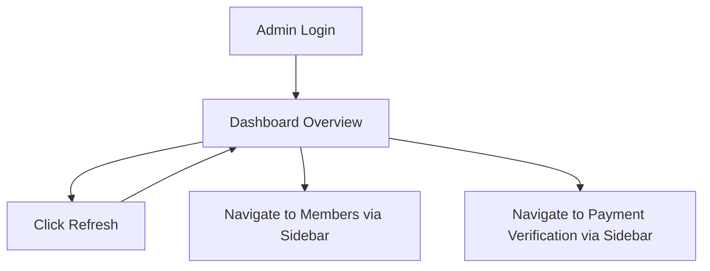

# Dashboard Overview

**Module:** Dashboard Overview (Home)  
**Navigation Position:** Sidebar item 1 — "Home"  
**Route:** `/dashboard`

---

## Purpose

The Dashboard Overview is the administrator's landing page after login. It answers one question at a glance: *How healthy is the membership platform right now?*

The page is read-only. It does not manage members or payments directly — it surfaces aggregate metrics, trends, and recent activity so the admin can decide where to act next (typically Members or Payment Verification).

**Page subtitle:** "Real-time platform analytics and insights."

---

## Displayed Information

### Hero Banner

- Page title: **Dashboard Overview**
- Subtitle describing real-time analytics
- **Refresh** button — reloads all dashboard data; shows a loading spinner while updating

### Metric Cards (5-up grid)

| Card | Information Shown |
|------|-------------------|
| Total Users | Count of all registered members |
| Active Users | Members with active subscriptions |
| Expiring Soon | Members whose subscriptions are nearing expiry |
| Expired Users | Members with lapsed subscriptions |
| Total Revenue | All-time revenue total (formatted as currency) |

Each card includes:
- A colored icon representing the metric type
- A **trend badge** (e.g., "+12.5%") indicating directional change
- A "This Month" delta label beneath the main value

### Charts Row (2-column layout)

| Chart | Type | Data Shown |
|-------|------|------------|
| User Growth Trend | Area chart | Total Users vs Active Users over the last 12 months |
| Revenue Trend | Bar chart | Monthly revenue over the last 12 months |

### Bottom Row (3 cards)

**User Distribution (pie chart)**
- Segments: Active, Expired, Expiring Soon
- Visual breakdown of membership health

**Recent Activity (feed)**
- Up to 5 most recent events
- Each item shows: username, action label, join date
- Action labels include: "registered", "joined the platform", "subscribed to a plan", "recently joined", "added to the group"

**Performance Metrics (progress bars)**
- Active members — count, percentage, progress bar
- Expired members — count, percentage, progress bar
- Expiring Soon — count, percentage, progress bar
- Static **User Satisfaction** gauge showing 92.3%

---

## Admin Actions

| Action | Location | Behavior |
|--------|----------|----------|
| Refresh | Hero banner | Reloads all dashboard metrics and charts |
| Retry | Error state | Re-attempts data load if the page fails |

No create, edit, or delete actions exist on this page.

---

## Interface Sections

1. Gradient hero card (title + refresh)
2. Five metric cards in a responsive grid
3. Two charts side by side
4. Three analytics cards in a footer row

---

## Filtering, Search, and Tables

None. The Dashboard Overview is entirely read-only with no filters, search, or data tables.

---

## Navigation Flow

The dashboard does not link directly to individual members or payments — the admin uses sidebar navigation to drill into operational pages.

---

## Current UI Organization

The page follows a top-down information hierarchy:

1. **Alert level** — Hero with refresh (actionable header)
2. **Summary level** — Five KPI cards (instant health check)
3. **Trend level** — Growth and revenue charts (historical context)
4. **Detail level** — Distribution, activity feed, performance bars (diagnostic depth)

Visual style: gradient hero banner, glass/blur card surfaces, rounded corners, dark/light theme support.

---

## Notes

- Trend badges and satisfaction gauge appear to use static/placeholder values rather than live calculations
- No date-range filter for charts — always shows last 12 months
- Recent Activity is a lightweight feed, not a full audit log
- Revenue is displayed without a privacy toggle on this page (unlike Members and the sidebar widget)

---

## TraderCity Knowledge Transfer

### Ideas to Definitely Reuse
- Five-card KPI grid as the admin landing pattern (Total, Active, Expiring, Expired, Revenue)
- User Distribution pie chart for instant membership health visualization
- Recent Activity feed for operational awareness
- Refresh action in the hero banner

### Ideas to Simplify
- Remove or replace static trend badges with real calculated deltas
- Consolidate Performance Metrics progress bars with the pie chart (redundant data)
- Replace static satisfaction gauge with a real metric or remove it

### Ideas to Merge
- Recent Activity feed could merge with a future Audit Log module
- Revenue metric on Dashboard overlaps with sidebar revenue widget and Members revenue cards — consolidate in TraderCity

### Ideas to Redesign (for TraderCity)
- Add clickable KPI cards that navigate to filtered views (e.g., click "Expiring Soon" → Members filtered by expiring)
- Add date-range selector for charts
- Add platform health indicators per TraderCity PRD (churn rate, LTV, NPS, system uptime)

### Most Useful Interface Patterns
- KPI card grid as admin home
- Chart + feed + progress bar trio for layered analytics
- Hero banner with primary action (Refresh)
