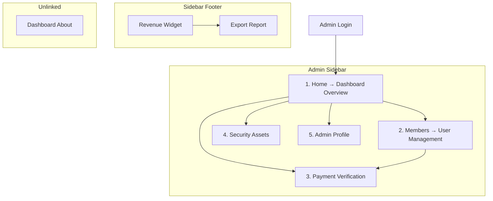

# Interface Modules — Master Catalog

This document catalogs every admin interface module discovered in the Arena product, plus modules that were requested but **not implemented**.

---

## Global Admin Shell

Before individual modules, every admin page shares a common interface shell:

| Element | Description |
|---------|-------------|
| **Sidebar** | Left navigation with 5 items; collapsible on desktop; mobile drawer overlay |
| **Top Navbar** | Fixed bar with "Arena Admin Dashboard" title, theme toggle, avatar dropdown (email + Log out) |
| **Main Content** | Scrollable area below the navbar |
| **Toast Feedback** | Bottom-center notifications for action success/error |
| **Sidebar Revenue Widget** | Footer widget showing Last 7 Days, Last 30 Days, All Time revenue with show/hide toggle and Export Report |

**Entry flow:** Login → redirect to Dashboard Home → sidebar drives all navigation.

---

## Module 1: Dashboard Overview

| Field | Detail |
|-------|--------|
| **Module Name** | Dashboard Overview |
| **Purpose** | High-level platform analytics and membership health at a glance |
| **Navigation Position** | Sidebar item 1 — "Home" |
| **Route** | `/dashboard` |

**Displayed Information:** 5 metric cards, 2 charts (User Growth, Revenue), User Distribution pie, Recent Activity feed, Performance Metrics progress bars.

**Admin Actions:** Refresh, Retry on error.

**Interface Sections:** Hero banner, metrics grid, charts row, 3-card footer.

**Filtering / Search / Tables:** None.

**Dialogs:** None.

See [01_Dashboard_Overview.md](01_Dashboard_Overview.md) for full detail.

---

## Module 2: Members (User Management)

| Field | Detail |
|-------|--------|
| **Module Name** | Arena Members |
| **Purpose** | Central CRUD and monitoring for all subscription members |
| **Navigation Position** | Sidebar item 2 — "Members" |
| **Route** | `/members` |

**Displayed Information:** 3 revenue summary cards, searchable/filterable member table (10 columns), pagination (100/page).

**Admin Actions:** Add User, Edit, Delete, Hide/Unhide, Export CSV, Refresh, Toggle revenue visibility.

**Interface Sections:** Page header, revenue cards, filter card, data table, Add/Edit modal, Delete confirmation modal.

**Filtering Options:** Status dropdown (8 options), date range (From/To), username search.

**Dialogs:** Add/Edit User form, Delete confirmation.

See [05_User_Management_Interface.md](05_User_Management_Interface.md) and [03_Subscription_Interface.md](03_Subscription_Interface.md).

---

## Module 3: Payment Verification

| Field | Detail |
|-------|--------|
| **Module Name** | Payment Verification |
| **Purpose** | Review and approve crypto payment submissions |
| **Navigation Position** | Sidebar item 3 — "Payment Verification" |
| **Route** | `/admin/payment-verification` |

**Displayed Information:** 4 stat cards, searchable/filterable transaction table (8 columns).

**Admin Actions:** Approve, Copy transaction hash, Refresh.

**Interface Sections:** Hero banner, stats grid, search/filter card, transaction table, Approve confirmation modal.

**Filtering Options:** Status pill filters (All, PENDING, VERIFIED, SUCCESS, FAILED), text search.

**Dialogs:** Approve Payment confirmation.

See [04_Payment_Interface.md](04_Payment_Interface.md).

---

## Module 4: Security Assets (Platform Settings)

| Field | Detail |
|-------|--------|
| **Module Name** | Arena Security Assets |
| **Purpose** | Manage sensitive platform configuration values |
| **Navigation Position** | Sidebar item 4 — "Security" |
| **Route** | `/admin/security` |

**Displayed Information:** Two configuration cards — Official Telegram Community Link, Main Transaction Wallet Address.

**Admin Actions:** Modify (enter inline edit mode), Cancel, Update Link / Update Wallet.

**Interface Sections:** Two stacked cards with read-only → edit → save flow. Only one card editable at a time (ring highlight on active card).

**Filtering / Search / Tables:** None.

**Dialogs:** None (inline edit within cards).

**Notes:** This is the closest thing to a Settings page. Only 2 fields exist — no general settings hub.

---

## Module 5: Admin Profile

| Field | Detail |
|-------|--------|
| **Module Name** | Admin Profile |
| **Purpose** | Administrator self-service profile management |
| **Navigation Position** | Sidebar item 5 — "Admin Profile" |
| **Route** | `/admin/admin-profile` |

**Displayed Information:** Profile overview card (avatar, name, role badge, contact info, join date, last login), Personal Information card (editable fields), Account Statistics card (static demo metrics).

**Admin Actions:** Edit Profile, Save Changes, Cancel, Avatar upload.

**Interface Sections:** 1/3 + 2/3 grid layout with profile card, detail card, and stats card.

**Filtering / Search / Tables:** None.

**Dialogs:** None (inline edit mode).

---

## Module 6: Sidebar Revenue Widget (Embedded)

| Field | Detail |
|-------|--------|
| **Module Name** | Sidebar Revenue Widget |
| **Purpose** | Persistent revenue snapshot accessible from any admin page |
| **Navigation Position** | Sidebar footer (not a page) |

**Displayed Information:** Last 7 Days, Last 30 Days, All Time revenue amounts.

**Admin Actions:** Toggle show/hide (eye icon masks amounts as `$••••••`), Export Report (downloads revenue file).

**Notes:** Collapsed sidebar shows icon-only show/hide and export buttons.

---

## Module 7: Dashboard About (Orphan Page)

| Field | Detail |
|-------|--------|
| **Module Name** | Beyond Every Group You've Known |
| **Purpose** | Internal marketing/overview of Arena programs |
| **Navigation Position** | **Not linked in sidebar** — orphaned route |
| **Route** | `/dashboard/about` |

**Displayed Information:** Hero, stats (5k+ members, 100+ lessons, 24/7 support, 99% success rate), Core Mentorship Programs cards, Telegram Arena section, Proprietary Trading Tools features.

**Admin Actions:** None (read-only informational).

**Notes:** Exists inside the admin shell but has no navigation link. Appears to be leftover marketing content.

---

## Modules NOT Implemented in Arena

The following management interfaces were requested but **do not exist** in the Arena admin product:

| Module | Status | Adjacent Surface |
|--------|--------|------------------|
| **Subscription Management (dedicated page)** | Not implemented | Merged into Members page |
| **Referrals Management** | Not implemented | Marketing page only (`/funding-account` with affiliate links) |
| **Discord Management** | Not implemented | Platform is Telegram-only |
| **Notifications Center** | Not implemented | Toast notifications only |
| **Reports (dedicated page)** | Partial | CSV export on Members; revenue export in sidebar widget |
| **Education CMS** | Not implemented | Static member-facing lesson reader (`/education`) |
| **General Settings** | Partial | Security page has 2 fields only |
| **Audit Logs** | Not implemented | Recent Activity feed on Dashboard is closest |
| **Support / Tickets** | Not implemented | "Contact support" text in member education lock state only |
| **Analytics (dedicated page)** | Partial | Embedded in Dashboard + sidebar widget |

---

## Navigation Map

---

## Information Architecture Summary

Arena's admin IA is **flat** — five sidebar items with no grouped sections (no "Operations / Finance / Settings" grouping). The two most operationally important pages are **Members** (daily member management) and **Payment Verification** (payment approval queue). Everything else is analytics (Dashboard), configuration (Security), or self-service (Admin Profile).

---

## TraderCity Knowledge Transfer

### Ideas to Definitely Reuse
- Five-item sidebar navigation as a lean admin IA starting point
- Clear separation of operational pages (Members, Payments) from analytics (Dashboard) and config (Security)
- Sidebar revenue widget for persistent financial awareness

### Ideas to Simplify
- Flat nav could benefit from grouped sections in TraderCity (Operations, Finance, Settings, Account)
- Remove orphan About page — no admin value

### Ideas to Merge
- Security's 2 fields should merge into a broader Settings module in TraderCity
- Sidebar revenue widget should merge into Dashboard or a dedicated Reports page
- Members page serves triple duty (users + subscriptions + manual payments) — split into focused modules in TraderCity

### Ideas to Redesign (for TraderCity)
- Add all missing modules: Referrals, Notifications, Audit Logs, Support, Education CMS, Analytics
- Group sidebar items into logical sections
- Add user detail view (Arena uses table + modal only)

### Most Useful Interface Patterns
- Flat sidebar with icon + label navigation
- Persistent sidebar widget for cross-page metrics
- Page-per-concern model (one page = one job)
