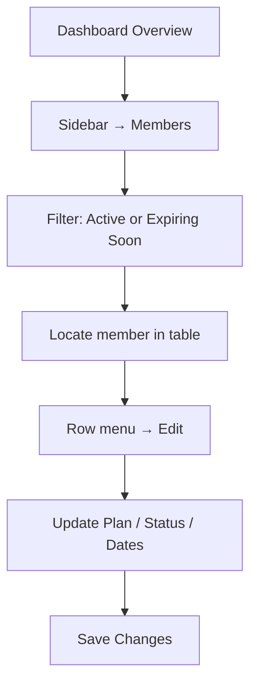
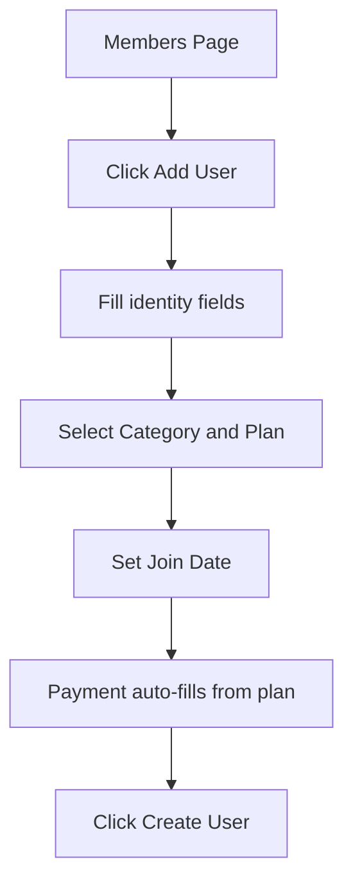
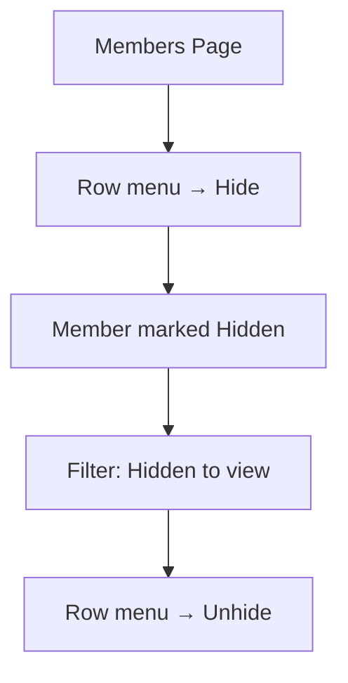

# Subscription Interface

**Primary Location:** Members page (`/members`)  
**Secondary Location:** Dashboard Overview metrics (`/dashboard`)

There is **no dedicated Subscription Management page** in Arena. All subscription interface ideas live within the Members page and Dashboard analytics.

---

## Purpose

Allow administrators to view, create, edit, and monitor member subscriptions — including plan assignment, expiry tracking, renewal counts, VIP/Lifetime tiers, and membership status lifecycle.

---

## Subscription List (Members Table)

The primary subscription interface is a paginated data table titled **"Users Management"**.

### Table Header
- Section title: "Users Management"
- Badges: Total member count, "100/page" indicator

### Table Columns

| Column | Information Displayed |
|--------|----------------------|
| Name | Avatar initial circle + first name |
| Username | Telegram-style @username |
| Category | **VIP** badge (violet) or "Standard" text |
| Plan | Monthly, 3 Months, 1 Year, Lifetime, or Custom |
| Joined at | Subscription start date |
| Expires / Left at | Expiry date; shows "Left at" when Left Users filter is active; VIP shows **Lifetime** badge |
| Status | Color-coded badge (see Status Badges below) |
| Days Left | Numeric count with urgency color coding; VIP shows ∞ |
| Renew | Renewal count (e.g., "2×") |
| Amount | Total paid amount (toggle show/hide with eye icon) |
| Actions | Row overflow menu (⋮) |

### Pagination
- 100 records per page
- Previous / Next buttons + numbered page buttons
- "Page X of Y" label

---

## Membership Tiers and Plans

### Categories
| Category | Behavior |
|----------|----------|
| Standard | Full plan selection, date fields, payment required |
| VIP | Auto-sets Lifetime plan, unlimited days, $0 payment, forced Active status |

### Plans (Standard members)
| Plan | Display Price |
|------|---------------|
| Monthly | $150 |
| 3 Months | $400 |
| 1 Year | $1,400 |
| Lifetime | $2,000 |
| Custom | Admin-defined expiry date |

Plan selection auto-fills the payment amount field.

---

## Subscription Status System

### Status Badges

| Status | Badge Color | Meaning |
|--------|-------------|---------|
| Active | Emerald (green) | Current valid subscription |
| Expired | Rose (red) | Lapsed subscription |
| Suspended | Amber (yellow) | Temporarily paused |
| Hidden | Slate (gray) | Member hidden from default views (overrides subscription status) |

### Status Filter Options (dropdown)
1. All Status
2. Active
3. Expired
4. Suspended
5. Left Users
6. VIP Members
7. Hidden
8. New Joiners

---

## Expiry and Renewal Interface

### Days Left Column
- **Red** when fewer than 7 days remain
- **Amber** when fewer than 30 days remain
- **Green** otherwise
- VIP members show **∞** (infinity symbol)

### Renewal Tracking
- **Renew column** in table shows count (e.g., "2×")
- **User Renewal Count** field in Add/Edit form — editable number
- No dedicated renewal queue or automation screen exists

### Expiry Date Display
- Standard members: expiry date in "Expires / Left at" column
- Left Users filter: column header changes to "Left at" showing departure date
- VIP: "Lifetime" badge instead of date

---

## Statistics Cards

### On Members Page (3 cards)
| Card | Color Theme | Privacy |
|------|-------------|---------|
| Total Revenue | Green | Toggle show/hide |
| This Month | Blue | Toggle show/hide |
| Last 7 Days | Purple | Toggle show/hide |

### On Dashboard Overview (5 cards)
Total Users, Active Users, Expiring Soon, Expired Users, Total Revenue — see [01_Dashboard_Overview.md](01_Dashboard_Overview.md).

---

## Filters and Search

| Control | Type | Options / Behavior |
|---------|------|-------------------|
| Search | Text input | "Search by username…" (debounced) |
| Status | Dropdown | 8 status options (see above) |
| Date Range | From / To pickers | Filter by join or expiry date |
| Clear | Button | Appears when any filter is active; resets all |

---

## Admin Actions

### Toolbar Actions
| Action | Icon/Label | Behavior |
|--------|-----------|----------|
| Toggle revenue visibility | Eye icon | Masks/unmasks dollar amounts |
| Refresh | Refresh icon | Reloads member data |
| Export | Export label | Downloads CSV file (`members_export_YYYY-MM-DD.csv`) |
| Add User | Add label | Opens create member modal |

### Row Actions (overflow menu ⋮)
| Action | Behavior |
|--------|----------|
| Edit | Opens edit member modal with pre-filled subscription data |
| Hide / Unhide | Toggles member visibility without deleting |
| Delete | Opens destructive confirmation modal |

---

## Dialogs

### Add New User / Edit User Modal

**Title:** "Add New User" or "Edit User"  
**Subtitle:** "Create or update member with subscription details"

| Field | Required | Notes |
|-------|----------|-------|
| First Name | Yes | |
| Last Name | No | |
| Username | Yes | Telegram-style identifier |
| Category | — | Standard or VIP dropdown |
| Plan | — | Disabled when VIP selected |
| Join Date | — | Date picker; disabled for VIP |
| Expiry Date | — | Shown only for Custom plan |
| Status | — | Active, Expired, Suspended, Left User; disabled for VIP |
| Days Remaining | — | Read-only calculated field; "Unlimited" for VIP |
| User Renewal Count | — | Editable number |
| Payment Amount ($) | — | Auto-filled from plan; "Add Payment ($)" on edit; disabled for VIP |

**Footer:** Cancel, Save Changes / Create User  
**Validation:** Inline error banner if First Name or Username missing

### Delete Member Modal
- Warning icon with member name and username
- Copy: "This action cannot be undone"
- Actions: Cancel, Delete (destructive rose button)

---

## Quick Actions Summary

| Action | Location |
|--------|----------|
| Add User | Toolbar |
| Edit subscription | Row menu → Edit |
| Change status | Edit modal → Status dropdown |
| Change plan | Edit modal → Plan dropdown |
| Record payment | Edit modal → Payment Amount field |
| Hide member | Row menu → Hide |
| Export all members | Toolbar → Export |
| Filter by status | Filter card → Status dropdown |
| Filter by date | Filter card → Date pickers |

---

## Workflow Diagrams

### Update Expiring Subscription


### Create New Member with Subscription


### Hide a Member


---

## Current UI Organization

```
Members Page
├── Page Header ("Arena Members")
├── Revenue Cards (3) — with privacy toggle
├── Filter Card — search + status + date range + clear
├── Users Management Table — 10 columns + pagination
├── Add/Edit User Modal — full subscription form
└── Delete Confirmation Modal
```

---

## Notes

- No dedicated renewal screen or renewal queue — renewals are a numeric field only
- No pending subscription requests screen
- VIP/Lifetime is a special tier with overridden rules across all form fields
- "Left Users" is a distinct lifecycle state with its own filter and date column behavior
- Subscription and payment are partially coupled (payment amount in member form) but not linked to Payment Verification records

---

## TraderCity Knowledge Transfer

### Ideas to Definitely Reuse
- Comprehensive subscription table with plan, status, days left, renewal count, and amount columns
- Color-coded Days Left urgency (red < 7, amber < 30, green otherwise)
- Status filter dropdown with lifecycle states (Active, Expired, Suspended, Left, VIP, Hidden, New Joiners)
- VIP/Lifetime tier as a special category with auto-configured fields
- Add/Edit modal with plan-driven payment auto-fill
- Revenue summary cards with privacy toggle on the same page

### Ideas to Simplify
- Consolidate 8 status filters into grouped categories (Active States / Inactive States / Special)
- Reduce form fields visible at once — use progressive disclosure for Custom plan expiry and payment
- Remove duplicate revenue displays (Dashboard + Members + Sidebar)

### Ideas to Merge
- Subscription creation and manual payment entry are one modal today — TraderCity could separate "Create Member" from "Record Payment"
- Dashboard subscription KPIs and Members revenue cards show overlapping data

### Ideas to Redesign (for TraderCity)
- Add a dedicated Subscription Detail view (drawer or page) instead of modal-only editing
- Add renewal queue/workflow screen for upcoming expirations
- Add pending subscription requests screen
- Link member rows to their payment history

### Most Useful Interface Patterns
- Table + modal CRUD for subscription management
- Status badge color system
- Plan-driven auto-fill for payment amounts
- Filter card with search + dropdown + date range + clear
