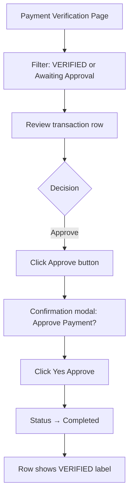
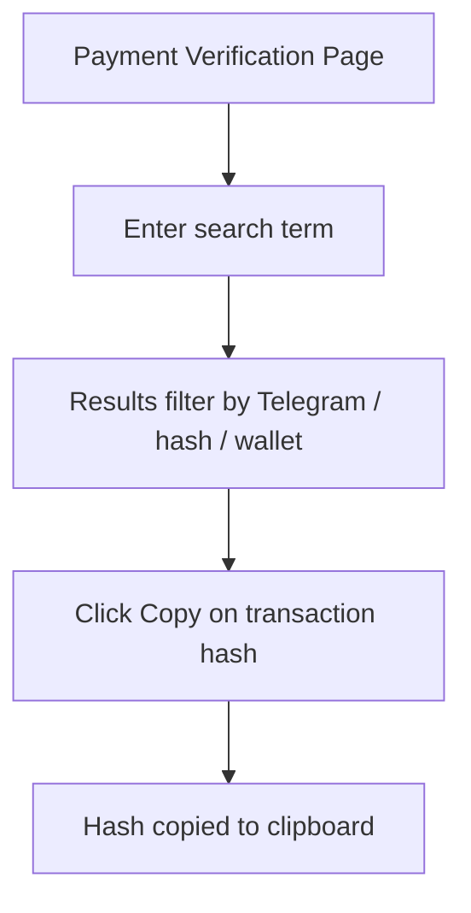
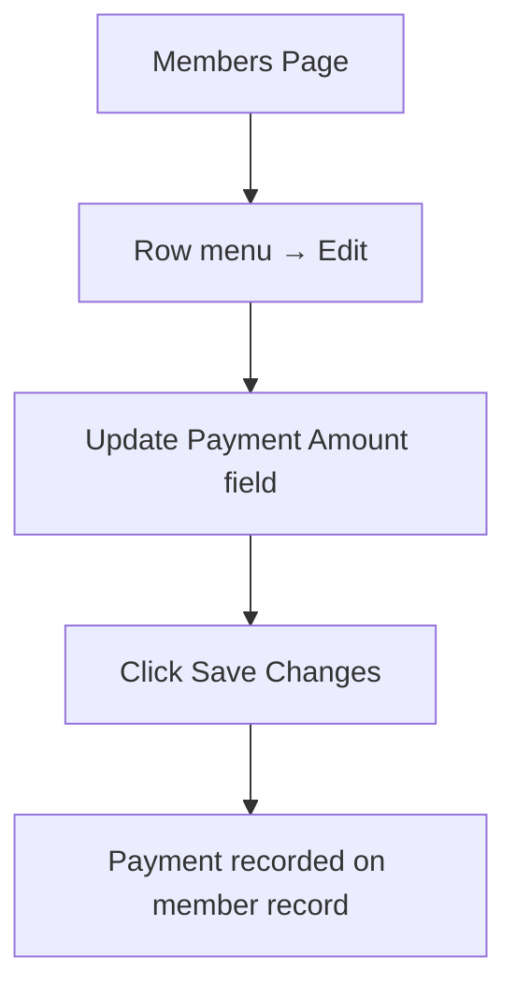

# Payment Interface

**Primary Location:** Payment Verification page (`/admin/payment-verification`)  
**Secondary Locations:** Members page (manual payment entry), Dashboard (revenue metrics), Sidebar widget (revenue snapshot)

---

## Purpose

Allow administrators to review, search, and approve crypto payment submissions before membership is activated. This is the financial approval queue — the primary payment management interface in Arena.

**Page subtitle:** "Streamlined verification and management of crypto transactions."

---

## Payment Verification Page

### Hero Banner
- Title: **Payment Verification**
- Subtitle describing crypto transaction management
- Visual style: animated gradient hero

### Statistics Cards (4-up grid)

| Card | Label | Color | Meaning |
|------|-------|-------|---------|
| 1 | Total Payments | Blue | All payment records in the system |
| 2 | Awaiting Approval | Blue/Indigo | On-chain verified, needs admin sign-off |
| 3 | Completed | Green | Successfully approved payments |
| 4 | Failed | Red | Failed payment attempts |

**Note:** PENDING and REJECTED statuses do not have dedicated stat cards.

---

## Transaction History Table

**Section title:** "Transaction History"  
**Subtitle:** "X of Y total records"

### Table Columns

| Column | Information Displayed |
|--------|----------------------|
| Date & Time | Created date (e.g., "Jun 30, 2026") + time (e.g., "02:30 PM") |
| Merchant | Telegram @username + network badge (e.g., MAINNET) |
| Selected Plan | Plan label (Monthly, 3 Months, 1 Year, Lifetime, Custom Access) + list price |
| Amount | On-chain amount + token symbol (e.g., USDT) + "On-Chain Verified" sublabel |
| Transaction | Truncated transaction hash with **Copy** button; from → to wallet addresses (truncated) |
| Status | Color-coded status badge |
| Action | Approve button or static "VERIFIED" label |

---

## Status Badges

| Status | UI Label | Badge Color | Admin Action Available |
|--------|----------|-------------|----------------------|
| PENDING | Pending | Amber | Approve |
| VERIFIED_ON_CHAIN | Admin Verify Pending | Blue | Approve |
| SUCCESS | Completed | Emerald (green) | None (shows "VERIFIED" label) |
| FAILED | Failed | Red | None |
| REJECTED | Rejected | Slate gray | None |

**Key insight:** The primary admin work queue is **Awaiting Approval** (VERIFIED_ON_CHAIN) — payments that have been verified on-chain but need human sign-off.

---

## Search and Filters

### Search Bar
- Placeholder: "Search by Telegram, transaction hash, or wallet address…"
- Searches across multiple payment identifiers

### Status Pill Filters
| Pill | Filters To |
|------|-----------|
| All Payments | No filter |
| PENDING | Pending payments |
| VERIFIED | On-chain verified, awaiting admin |
| SUCCESS | Completed payments |
| FAILED | Failed payments |

**Not available:** Date range filters, plan filters, amount filters.

### Other Controls
- **Refresh** button — reloads payment list

---

## Admin Actions

| Action | When Available | Behavior |
|--------|----------------|----------|
| **Approve** | Any status except SUCCESS | Opens confirmation modal |
| **Copy** transaction hash | Always | Copies hash to clipboard + toast confirmation |
| **Refresh** | Always | Reloads payment list |

### Actions NOT Available in UI
- **Reject** — REJECTED badge exists but no admin action to set it
- **View full transaction details** — no detail drawer or dedicated page
- **Bulk approve** — no multi-select or batch actions
- **Edit payment** — no edit capability

---

## Approve Payment Dialog

**Title:** "Approve Payment?"

**Copy:** Confirms that approval will mark the payment as successful and send a confirmation email to the user.

**Actions:**
- Cancel
- "Yes, Approve" (shows loading spinner while processing)

---

## Manual Payment Entry (Members Page Overlap)

Manual payment is **not a standalone screen**. It exists within the Members Add/Edit User modal:

| Context | Field Label | Behavior |
|---------|-------------|----------|
| Add User | "Payment Amount ($)" | Auto-filled from selected plan price |
| Edit User | "Add Payment ($)" | Allows recording additional payment on save |
| VIP member | Payment field | Disabled, amount set to $0 |

Plan prices auto-fill the amount:
- Monthly: $150
- 3 Months: $400
- 1 Year: $1,400
- Lifetime: $2,000

---

## Revenue Surfaces (Read-Only)

Revenue information appears in three locations across the admin product:

| Location | Metrics Shown | Privacy Toggle |
|----------|----------------|----------------|
| Dashboard Overview | Total Revenue card | No |
| Members Page | Total Revenue, This Month, Last 7 Days | Yes (eye icon) |
| Sidebar Widget | Last 7 Days, Last 30 Days, All Time | Yes (eye icon) |

### Sidebar Revenue Widget Actions
- Toggle show/hide amounts
- **Export Report** — downloads revenue export file

---

## Member Checkout Context (Reference)

While not an admin interface, the member payment flow informs what admins later verify:

1. Member selects plan on pricing page
2. Payment page collects Telegram ID and email
3. Payment confirmation page shows transfer instructions
4. Payment appears in admin Payment Verification queue

---

## Workflow Diagrams

### Payment Approval Flow


### Payment Search Flow


### Manual Payment via Members


---

## Current UI Organization

```
Payment Verification Page
├── Hero Banner
├── Statistics Cards (4)
├── Search & Filter Card — search bar + status pills + refresh
├── Transaction History Table — 8 columns
└── Approve Payment Modal — confirmation dialog

Members Page (overlap)
└── Add/Edit Modal → Payment Amount field

Sidebar Widget (overlap)
└── Revenue periods + Export Report

Dashboard (overlap)
└── Total Revenue metric card
```

---

## Gap Analysis

| Expected Feature | Arena Status |
|-----------------|--------------|
| Payment dashboard with stats | Implemented (4 stat cards) |
| Pending payments queue | Implemented (VERIFIED filter) |
| Approved/completed payments | Implemented (SUCCESS filter) |
| Rejected payments | Badge exists, no reject action |
| Payment details screen | Not implemented |
| Verification/approve workflow | Implemented |
| Status indicators | Implemented (5 badge types) |
| Search | Implemented (multi-field) |
| Filtering | Implemented (status pills) |
| Statistics | Implemented (4 cards) |
| Transaction table | Implemented (8 columns) |
| Quick review actions | Approve + Copy only |
| Bulk actions | Not implemented |
| Member ↔ payment link | Not implemented |
| Manual payment log | Only via member edit modal |

---

## Notes

- Payment Verification and Members operate independently — no cross-link between a member row and their payment records
- The "Awaiting Approval" queue (VERIFIED_ON_CHAIN) is the highest-priority admin workflow
- No reject/decline workflow despite REJECTED status badge existing in the UI
- Revenue appears in three separate places with partial privacy controls

---

## TraderCity Knowledge Transfer

### Ideas to Definitely Reuse
- Payment verification queue with stat cards (Total, Awaiting, Completed, Failed)
- Status pill filters for quick queue switching
- Transaction table with merchant, plan, amount, hash, and status columns
- Approve confirmation dialog before finalizing
- Copy transaction hash action with toast feedback
- Multi-field search (Telegram, hash, wallet)

### Ideas to Simplify
- Consolidate three revenue display locations into one
- Reduce stat cards to focus on actionable queue (Awaiting Approval count is most important)

### Ideas to Merge
- Payment Verification and Members should link — clicking a merchant username should open member detail
- Manual payment entry (Members modal) and crypto verification (Payment page) should appear in unified payment history per member
- Sidebar revenue widget should merge into Dashboard or Reports

### Ideas to Redesign (for TraderCity)
- Add Reject/Decline action with reason field
- Add payment detail drawer/page (full transaction info, timeline, linked member)
- Add bulk approve for batch processing
- Add date-range and plan filters
- Add per-member payment history tab
- Separate manual payments from crypto verification into distinct views or a unified timeline

### Most Useful Interface Patterns
- Approval queue with stat cards showing queue depth
- Status pill filters for one-click queue switching
- Confirmation modal before irreversible approve action
- Copy-to-clipboard for transaction identifiers
