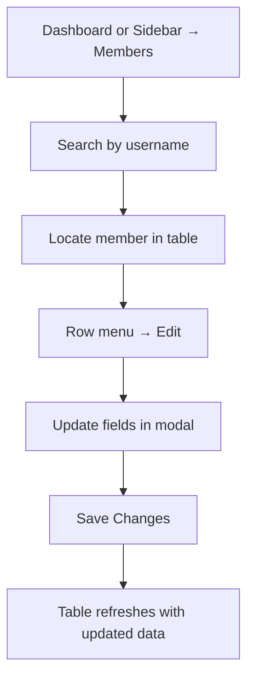
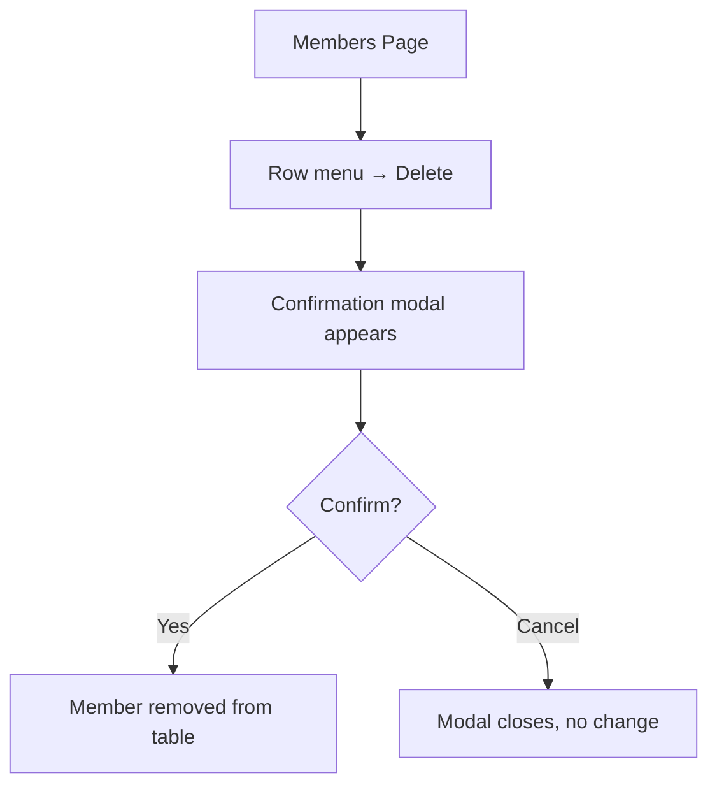
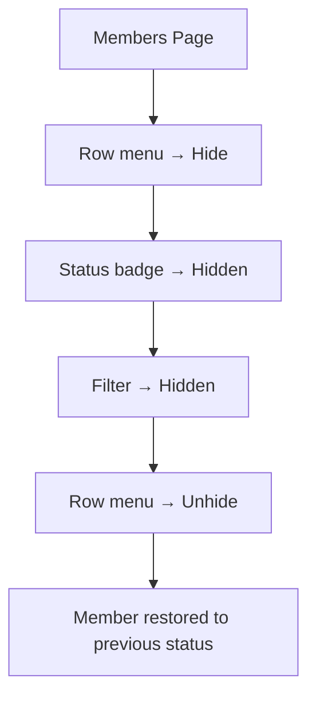
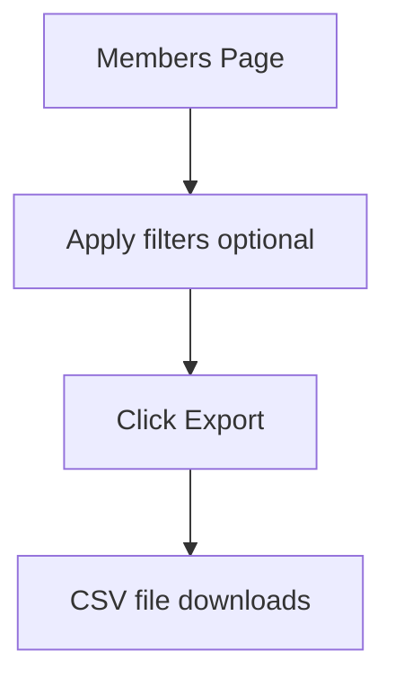

# User Management Interface

**Primary Location:** Members page (`/members`)  
**Reference Location:** Member-facing profile (`/user-profile`)

---

## Purpose

Provide administrators with a centralized interface to view, search, filter, create, edit, hide, and delete member accounts — with subscription, plan, and payment information managed inline.

Arena has **no dedicated user detail page or drawer**. All user management happens through a data table and modal overlays.

**Page title:** "Arena Members"  
**Page subtitle:** "Manage and monitor all members in real time."

---

## User List (Members Table)

### Table Structure

**Section title:** "Users Management"

| Column | Information | Visual Treatment |
|--------|-------------|-----------------|
| Name | Avatar initial (colored circle) + first name | Avatar + text |
| Username | @username | Monospace-style identifier |
| Category | Standard or VIP | VIP = violet badge; Standard = plain text |
| Plan | Subscription plan name | Text label |
| Joined at | Subscription start date | Formatted date |
| Expires / Left at | Expiry or departure date | Date; "Lifetime" badge for VIP; "Left at" when filtered |
| Status | Membership status | Color-coded badge |
| Days Left | Remaining subscription days | Color-coded number; ∞ for VIP |
| Renew | Renewal count | Numeric with × suffix |
| Amount | Total paid | Currency; toggle mask with eye icon |
| Actions | Row menu | Overflow menu (⋮) |

### Table Header Badges
- Total member count
- "100/page" pagination indicator

### Pagination
- 100 records per page
- Previous / Next + numbered page buttons
- "Page X of Y" label

---

## Profile View

**Arena does not have a dedicated user profile view in admin.**

All member information is accessed through:
1. **Table row** — scan columns for summary data
2. **Edit modal** — full member form overlay for reading and editing

There is no:
- User detail page
- Side drawer
- Tabbed profile view
- Separate sections for subscription, payments, or referrals

---

## Add / Edit User Form (Modal)

### Identity Fields
| Field | Required | Notes |
|-------|----------|-------|
| First Name | Yes | |
| Last Name | No | |
| Username | Yes | Primary identifier (Telegram-style) |

### Membership Fields
| Field | Notes |
|-------|-------|
| Category | Standard or VIP |
| Plan | Monthly, 3 Months, 1 Year, Lifetime, Custom |
| Join Date | Date picker |
| Expiry Date | Only for Custom plan |
| Status | Active, Expired, Suspended, Left User |
| Days Remaining | Read-only calculated |
| User Renewal Count | Editable number |

### Payment Field
| Field | Notes |
|-------|-------|
| Payment Amount ($) | "Payment Amount ($)" on add; "Add Payment ($)" on edit; auto-filled from plan |

### VIP Override Behavior
When Category = VIP:
- Plan locked to Lifetime
- Join Date disabled
- Status forced to Active
- Days Remaining shows "Unlimited"
- Payment Amount disabled ($0)

---

## Membership Status

### Status Badges in Table

| Status | Color | Display |
|--------|-------|---------|
| Active | Emerald | Green pill badge |
| Expired | Rose | Red pill badge |
| Suspended | Amber | Yellow pill badge |
| Hidden | Slate | Gray pill badge (overrides other statuses) |

### Status Options in Edit Form
- Active
- Expired
- Suspended
- Left User

---

## Subscription Information

Subscription data is **inline in the table and edit form** — not in a separate tab or section.

| Data Point | Table Column | Edit Form Field |
|------------|-------------|-----------------|
| Plan | Plan column | Plan dropdown |
| Start date | Joined at column | Join Date picker |
| Expiry | Expires / Left at column | Expiry Date (Custom) or auto-calculated |
| Days remaining | Days Left column | Days Remaining (read-only) |
| Renewal count | Renew column | User Renewal Count field |
| Total paid | Amount column | Payment Amount field |

---

## Payment History

**Not implemented as a per-user view.**

The only payment-related data in admin is:
- **Amount column** in the members table (total paid per member)
- **Payment Amount field** in the Add/Edit modal (record new payment on edit)

There is no:
- Payment history list per member
- Link to Payment Verification records
- Transaction timeline

---

## Referral Information

**Not implemented in admin UI.**

Referrals exist only as a member-facing marketing page (`/funding-account`) with affiliate discount links. No admin interface for managing referrals, codes, or commissions.

---

## Search and Filters

### Search
- Text input: "Search by username…"
- Debounced input — filters as you type

### Status Filter (Dropdown)
| Option | Shows |
|--------|-------|
| All Status | All members |
| Active | Active subscriptions |
| Expired | Expired subscriptions |
| Suspended | Suspended members |
| Left Users | Members who left (shows "Left at" date) |
| VIP Members | VIP category only |
| Hidden | Hidden members only |
| New Joiners | Recently joined members |

### Date Range
- **From** date picker
- **To** date picker

### Clear Filters
- Button appears when any filter is active
- Resets search, status, and date range

---

## Admin Actions

### Toolbar
| Action | Description |
|--------|-------------|
| Toggle revenue visibility | Eye icon — masks/unmasks revenue card amounts |
| Refresh | Reloads member data with toast confirmation |
| Export | Downloads CSV file of current member data |
| Add User | Opens create member modal |

### Row Actions (⋮ menu)
| Action | Description |
|--------|-------------|
| Edit | Opens edit modal with member data pre-filled |
| Hide | Marks member as hidden (reversible) |
| Unhide | Restores hidden member to visible |
| Delete | Opens destructive confirmation modal |

---

## Dialogs

### Add / Edit User Modal
- Full-screen overlay
- Title changes: "Add New User" / "Edit User"
- Validation banner for missing required fields
- Cancel + Save/Create buttons

### Delete Member Modal
- Warning icon
- Shows member name and username
- "This action cannot be undone" warning
- Cancel + Delete (destructive) buttons

---

## Revenue Summary Cards

Three cards above the filter section:

| Card | Theme | Content |
|------|-------|---------|
| Total Revenue | Green | All-time revenue |
| This Month | Blue | Current month revenue |
| Last 7 Days | Purple | Recent week revenue |

All three support show/hide toggle (masked as `$••••••`).

---

## Member-Facing Profile (Reference)

The member profile page (`/user-profile`) shows what admins indirectly manage:

| Section | Information | Admin Equivalent |
|---------|-------------|-----------------|
| Avatar + Name | User identity | Name column + Edit modal |
| Email | Contact email | Not in admin table |
| Telegram Username | Linked Telegram ID | Username column |
| Subscription Status card | Plan, status pill, expiry, days left | Table columns + Edit modal |
| Empty state | "No Active Plan" with link to pricing | Expired/No status in table |

This reference helps identify what TraderCity admin should expose beyond Arena's current table columns.

---

## Workflow Diagrams

### Find and Edit a Member


### Delete a Member


### Hide and Restore a Member


### Export Member Data


---

## Current UI Organization

```
Members Page
├── Page Header
│   ├── Title: "Arena Members"
│   └── Subtitle
├── Revenue Cards (3) — with privacy toggle
├── Filter Card
│   ├── Search input
│   ├── Status dropdown
│   ├── Date range pickers
│   └── Clear button
├── Users Management Table
│   ├── Header badges (count, page size)
│   ├── 10-column data rows
│   ├── Row overflow menus
│   └── Pagination controls
├── Add/Edit User Modal
└── Delete Confirmation Modal
```

---

## Notes

- Telegram username is the primary identity key across admin (table, payment verification, member profile)
- No email column in admin table despite email existing on member profile
- Hide/Unhide is a visibility toggle, not a status change — Hidden badge overrides subscription status
- "Left Users" is a distinct lifecycle with its own filter and date column behavior
- 100 rows per page prioritizes power-user density over mobile-friendly browsing

---

## TraderCity Knowledge Transfer

### Ideas to Definitely Reuse
- Comprehensive member table with identity, plan, status, expiry, renewal, and amount columns
- Multi-filter system (search + status dropdown + date range + clear)
- Row overflow menu for contextual actions (Edit, Hide, Delete)
- Add/Edit modal with plan-driven field behavior
- VIP tier with auto-configured overrides
- CSV export with optional active filters
- Revenue summary cards with privacy toggle

### Ideas to Simplify
- Reduce 10 table columns by moving detail to a user profile view
- Group status filters into categories instead of 8 flat options
- Separate "Hide" from status badges — it's a visibility flag, not a subscription state

### Ideas to Merge
- User management, subscription management, and manual payment entry are one page today — TraderCity should consider a User Detail view with tabs (Profile, Subscription, Payments, Referrals)
- Member-facing profile fields (email, Telegram) should mirror admin data

### Ideas to Redesign (for TraderCity)
- Add dedicated User Detail page or drawer (Arena has table + modal only)
- Add per-user payment history tab linked to Payment Verification
- Add referral information section per user
- Add email column and contact info to admin view
- Add activity/audit timeline per user
- Reduce page size default (100 is dense) with configurable page size

### Most Useful Interface Patterns
- Table + modal CRUD (simple, effective for small teams)
- Filter card pattern (search + dropdown + date + clear)
- Row overflow menu for secondary actions
- Privacy toggle for sensitive financial data
