# Management Workflows

Navigation and interface flow diagrams for every major admin management feature in Arena.

Each workflow describes **what the administrator sees and clicks** — not backend processes.

---

## 1. Admin Entry

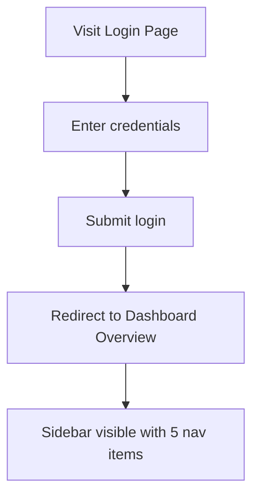
```mermaid
flowchart TD
  A[Visit Login Page] --> B[Enter credentials]
  B --> C[Submit login]
  C --> D[Redirect to Dashboard Overview]
  D --> E[Sidebar visible with 5 nav items]
```

**Notes:** Marketing site navbar shows "Dashboard" link for admin users instead of "My Profile".

---

## 2. Dashboard Monitoring

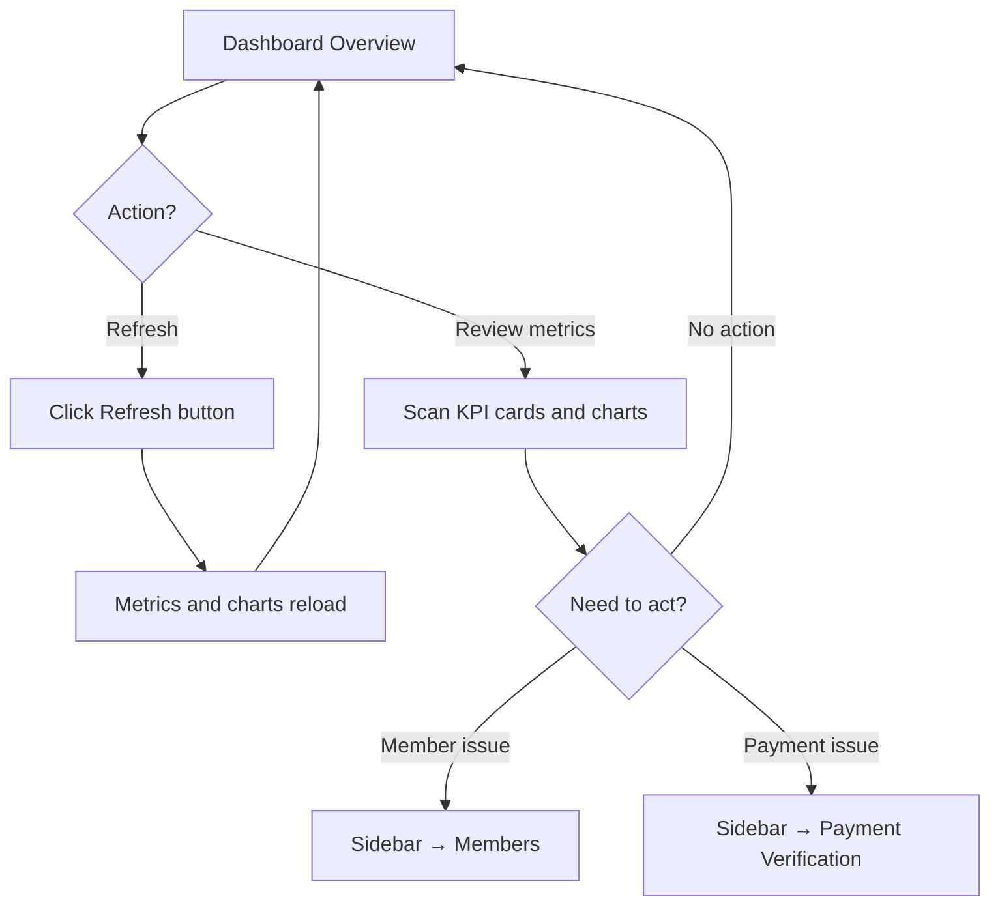
```mermaid
flowchart TD
  A[Dashboard Overview] --> B{Action?}
  B -->|Refresh| C[Click Refresh button]
  C --> D[Metrics and charts reload]
  D --> A
  B -->|Review metrics| E[Scan KPI cards and charts]
  E --> F{Need to act?}
  F -->|Member issue| G[Sidebar → Members]
  F -->|Payment issue| H[Sidebar → Payment Verification]
  F -->|No action| A
```

---

## 3. Member Onboarding (Admin-Created)

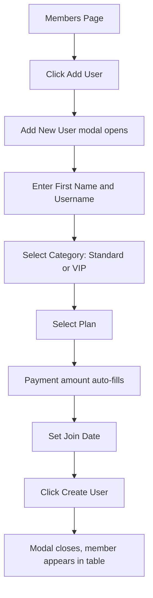
```mermaid
flowchart TD
  A[Members Page] --> B[Click Add User]
  B --> C[Add New User modal opens]
  C --> D[Enter First Name and Username]
  D --> E[Select Category: Standard or VIP]
  E --> F[Select Plan]
  F --> G[Payment amount auto-fills]
  G --> H[Set Join Date]
  H --> I[Click Create User]
  I --> J[Modal closes, member appears in table]
```

---

## 4. Member Lifecycle Update

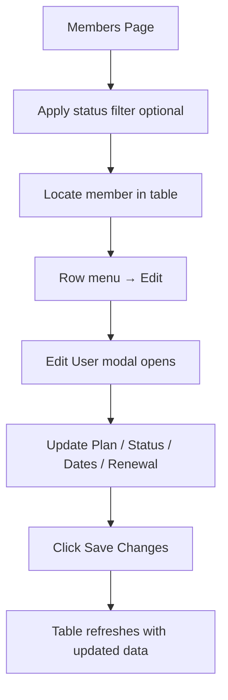
```mermaid
flowchart TD
  A[Members Page] --> B[Apply status filter optional]
  B --> C[Locate member in table]
  C --> D[Row menu → Edit]
  D --> E[Edit User modal opens]
  E --> F[Update Plan / Status / Dates / Renewal]
  F --> G[Click Save Changes]
  G --> H[Table refreshes with updated data]
```

---

## 5. Member Search and Filter

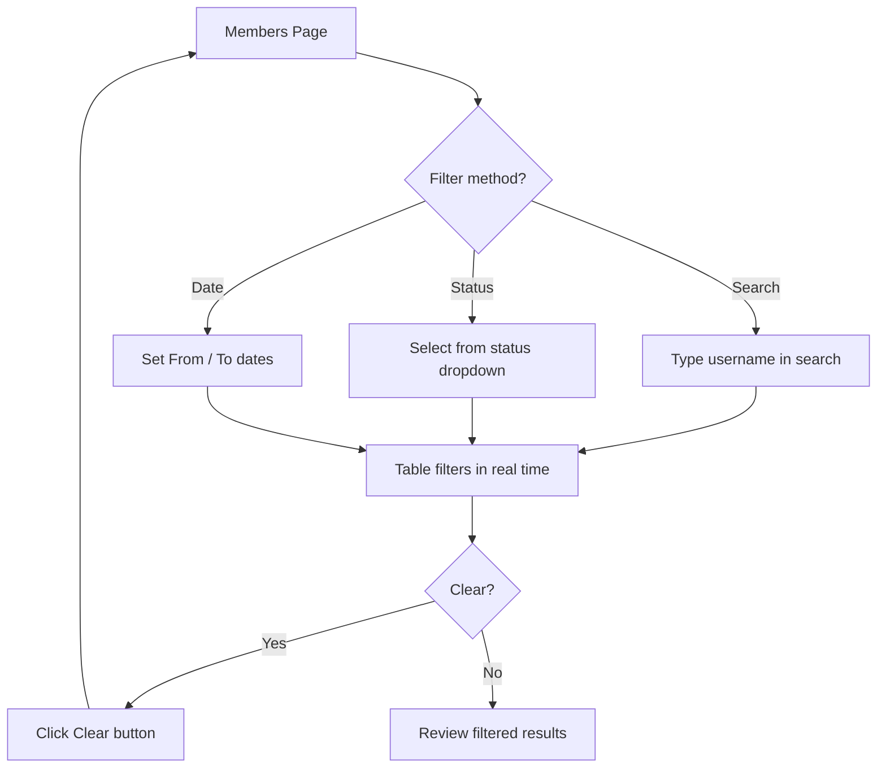
```mermaid
flowchart TD
  A[Members Page] --> B{Filter method?}
  B -->|Search| C[Type username in search]
  B -->|Status| D[Select from status dropdown]
  B -->|Date| E[Set From / To dates]
  C --> F[Table filters in real time]
  D --> F
  E --> F
  F --> G{Clear?}
  G -->|Yes| H[Click Clear button]
  H --> A
  G -->|No| I[Review filtered results]
```

---

## 6. Member Visibility (Hide / Unhide)

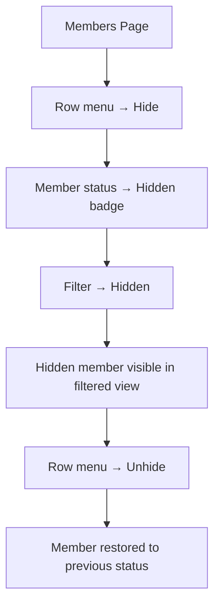
```mermaid
flowchart TD
  A[Members Page] --> B[Row menu → Hide]
  B --> C[Member status → Hidden badge]
  C --> D[Filter → Hidden]
  D --> E[Hidden member visible in filtered view]
  E --> F[Row menu → Unhide]
  F --> G[Member restored to previous status]
```

---

## 7. Member Removal

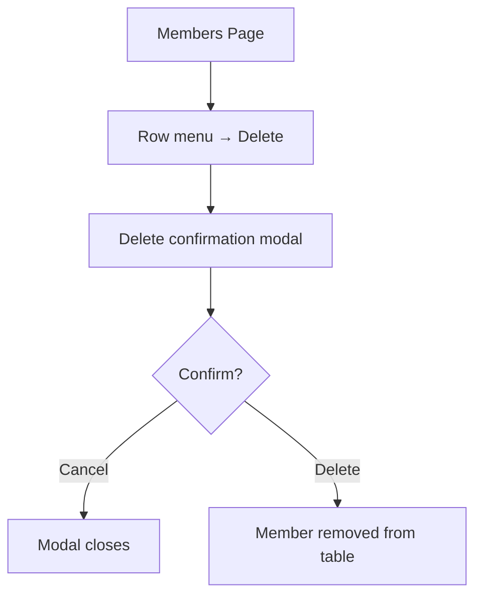
```mermaid
flowchart TD
  A[Members Page] --> B[Row menu → Delete]
  B --> C[Delete confirmation modal]
  C --> D{Confirm?}
  D -->|Cancel| E[Modal closes]
  D -->|Delete| F[Member removed from table]
```

---

## 8. Member Data Export

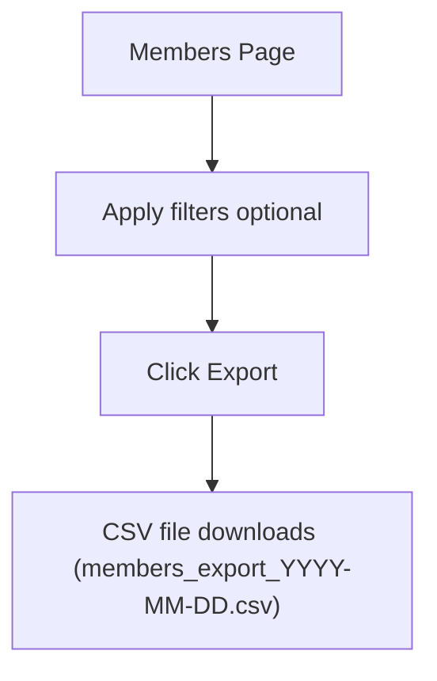
```mermaid
flowchart TD
  A[Members Page] --> B[Apply filters optional]
  B --> C[Click Export]
  C --> D["CSV file downloads (members_export_YYYY-MM-DD.csv)"]
```

---

## 9. Manual Payment Recording

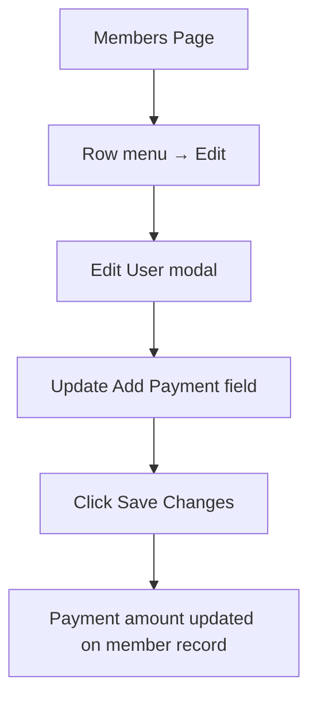
```mermaid
flowchart TD
  A[Members Page] --> B[Row menu → Edit]
  B --> C[Edit User modal]
  C --> D[Update Add Payment field]
  D --> E[Click Save Changes]
  E --> F[Payment amount updated on member record]
```

---

## 10. Payment Approval

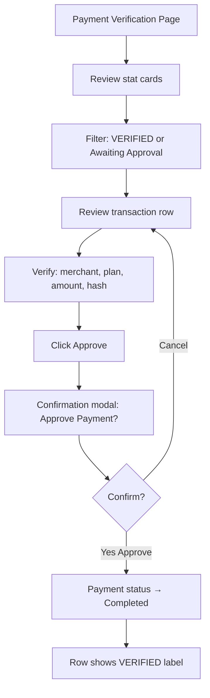
```mermaid
flowchart TD
  A[Payment Verification Page] --> B[Review stat cards]
  B --> C[Filter: VERIFIED or Awaiting Approval]
  C --> D[Review transaction row]
  D --> E[Verify: merchant, plan, amount, hash]
  E --> F[Click Approve]
  F --> G[Confirmation modal: Approve Payment?]
  G --> H{Confirm?}
  H -->|Cancel| D
  H -->|Yes Approve| I[Payment status → Completed]
  I --> J[Row shows VERIFIED label]
```

---

## 11. Payment Search and Copy

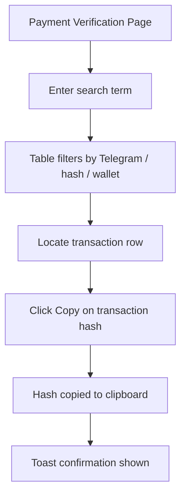
```mermaid
flowchart TD
  A[Payment Verification Page] --> B[Enter search term]
  B --> C[Table filters by Telegram / hash / wallet]
  C --> D[Locate transaction row]
  D --> E[Click Copy on transaction hash]
  E --> F[Hash copied to clipboard]
  F --> G[Toast confirmation shown]
```

---

## 12. Payment Status Filtering

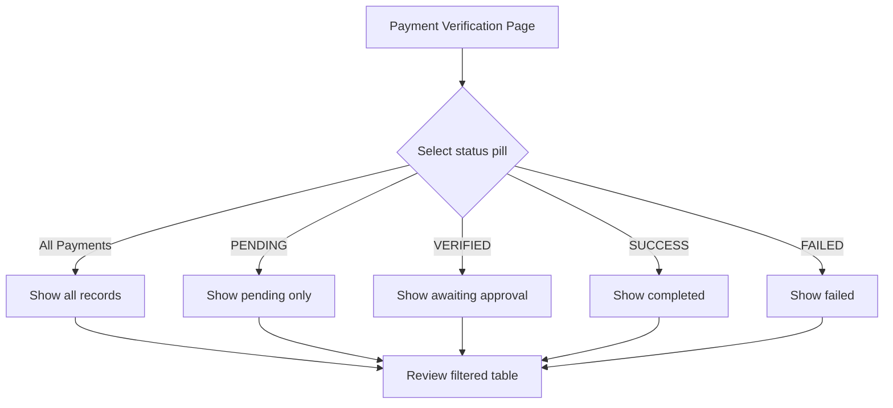
```mermaid
flowchart TD
  A[Payment Verification Page] --> B{Select status pill}
  B -->|All Payments| C[Show all records]
  B -->|PENDING| D[Show pending only]
  B -->|VERIFIED| E[Show awaiting approval]
  B -->|SUCCESS| F[Show completed]
  B -->|FAILED| G[Show failed]
  C --> H[Review filtered table]
  D --> H
  E --> H
  F --> H
  G --> H
```

---

## 13. Platform Configuration (Telegram Link)

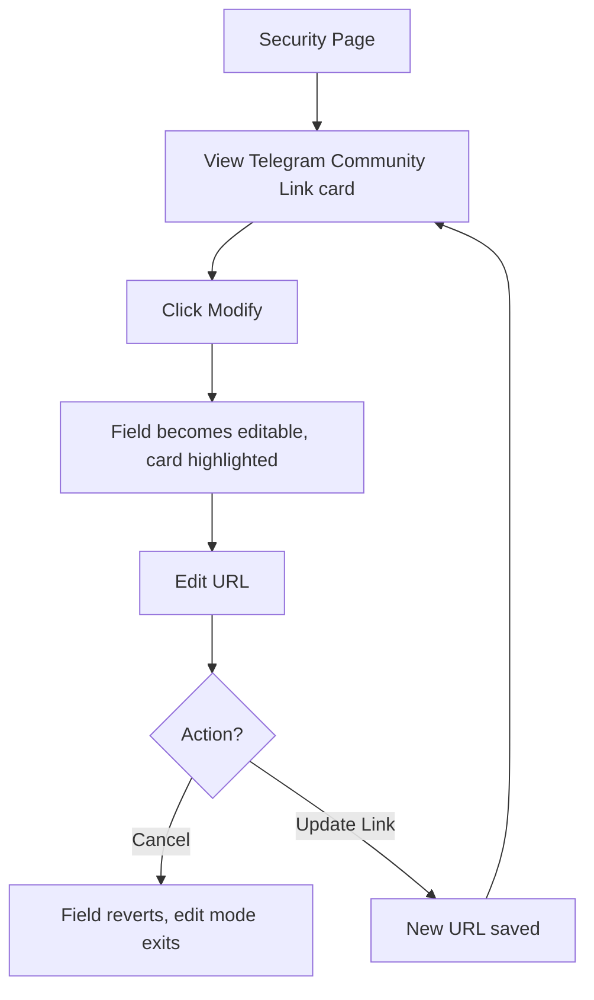
```mermaid
flowchart TD
  A[Security Page] --> B[View Telegram Community Link card]
  B --> C[Click Modify]
  C --> D[Field becomes editable, card highlighted]
  D --> E[Edit URL]
  E --> F{Action?}
  F -->|Cancel| G[Field reverts, edit mode exits]
  F -->|Update Link| H[New URL saved]
  H --> B
```

---

## 14. Platform Configuration (Wallet Address)

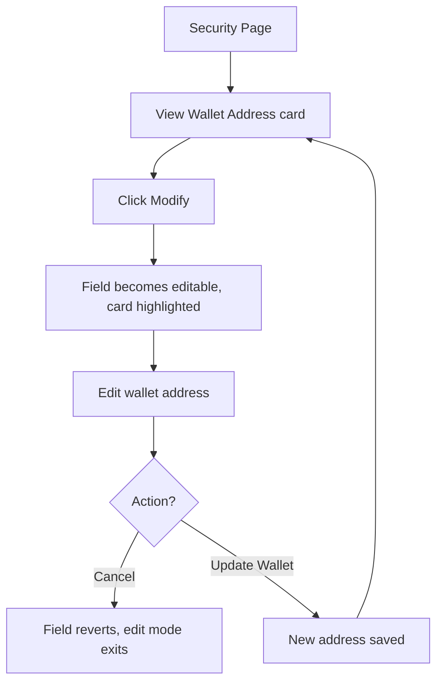
```mermaid
flowchart TD
  A[Security Page] --> B[View Wallet Address card]
  B --> C[Click Modify]
  C --> D[Field becomes editable, card highlighted]
  D --> E[Edit wallet address]
  E --> F{Action?}
  F -->|Cancel| G[Field reverts, edit mode exits]
  F -->|Update Wallet| H[New address saved]
  H --> B
```

**Note:** Only one card can be in edit mode at a time.

---

## 15. Admin Profile Update

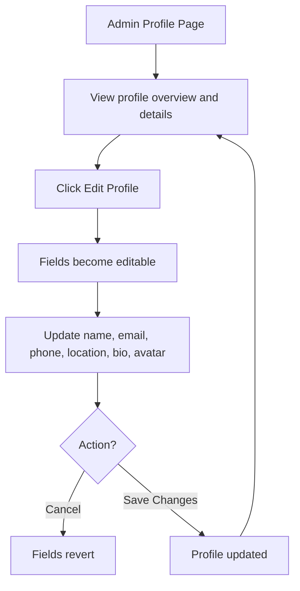
```mermaid
flowchart TD
  A[Admin Profile Page] --> B[View profile overview and details]
  B --> C[Click Edit Profile]
  C --> D[Fields become editable]
  D --> E[Update name, email, phone, location, bio, avatar]
  E --> F{Action?}
  F -->|Cancel| G[Fields revert]
  F -->|Save Changes| H[Profile updated]
  H --> B
```

---

## 16. Revenue Export

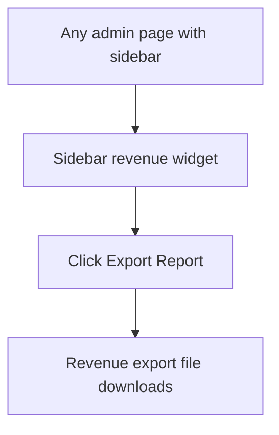
```mermaid
flowchart TD
  A[Any admin page with sidebar] --> B[Sidebar revenue widget]
  B --> C[Click Export Report]
  C --> D[Revenue export file downloads]
```

---

## 17. Revenue Privacy Toggle

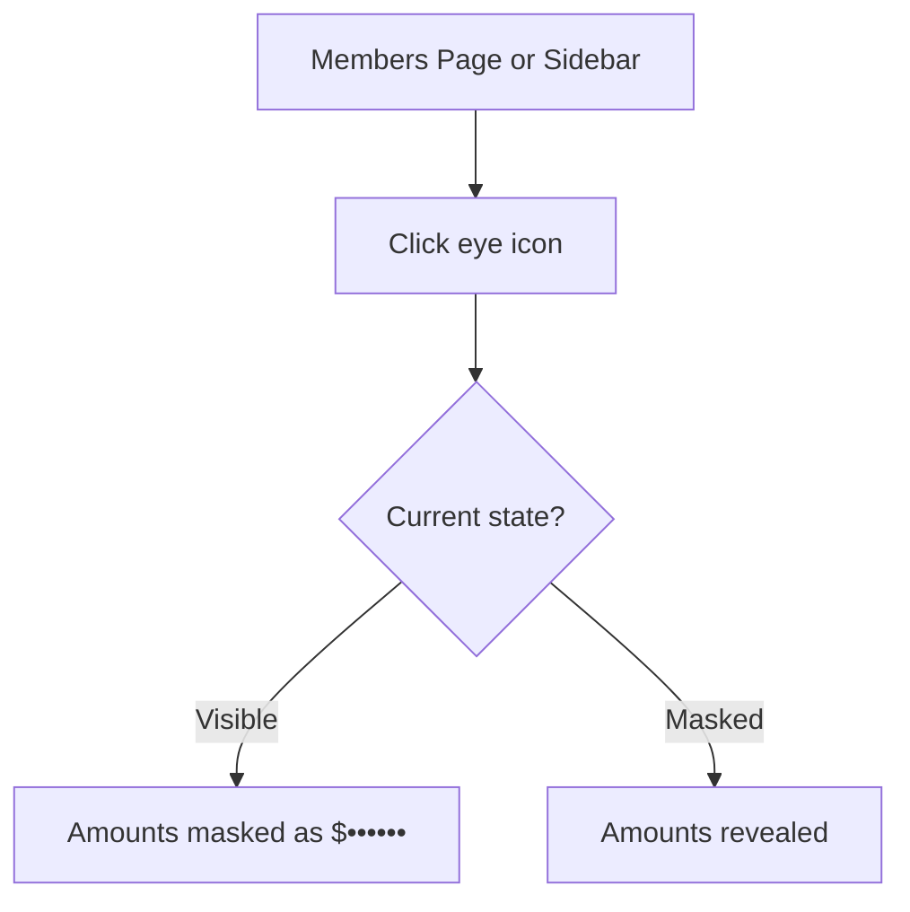
```mermaid
flowchart TD
  A[Members Page or Sidebar] --> B[Click eye icon]
  B --> C{Current state?}
  C -->|Visible| D[Amounts masked as $••••••]
  C -->|Masked| E[Amounts revealed]
```

---

## 18. Theme Toggle

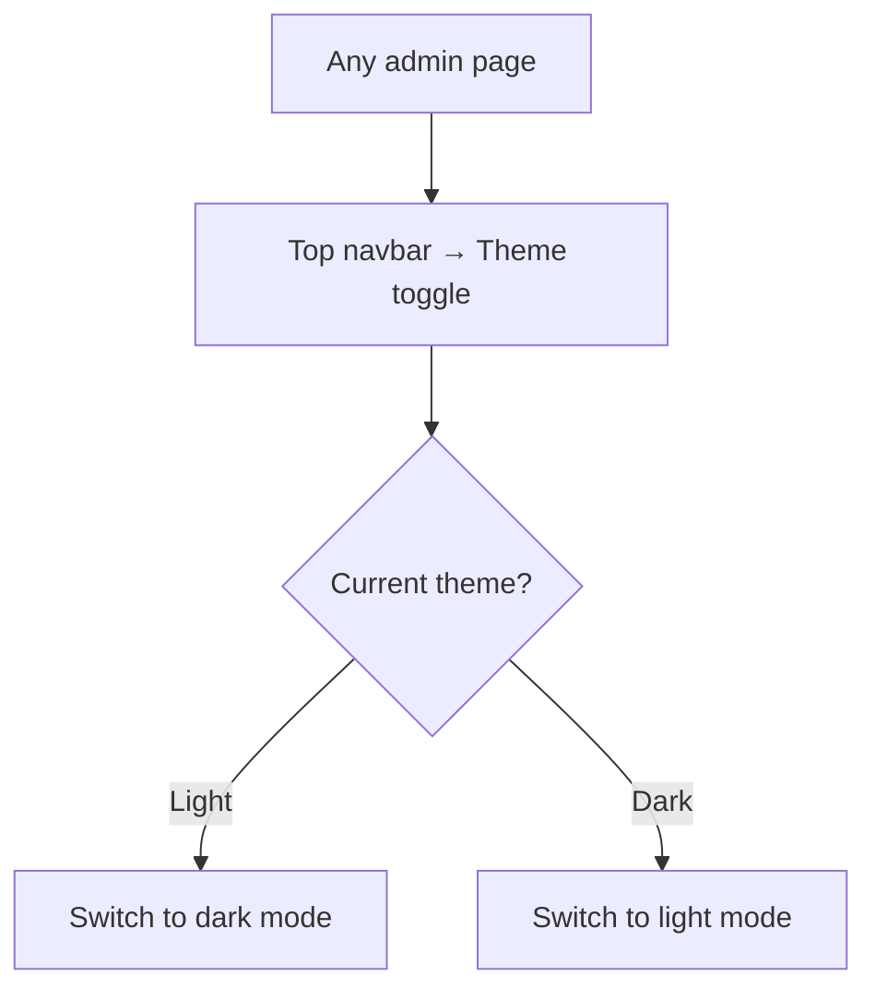
```mermaid
flowchart TD
  A[Any admin page] --> B[Top navbar → Theme toggle]
  B --> C{Current theme?}
  C -->|Light| D[Switch to dark mode]
  C -->|Dark| E[Switch to light mode]
```

---

## Cross-Module Gaps

These workflows **do not exist** in Arena but would be expected in a fuller admin product:

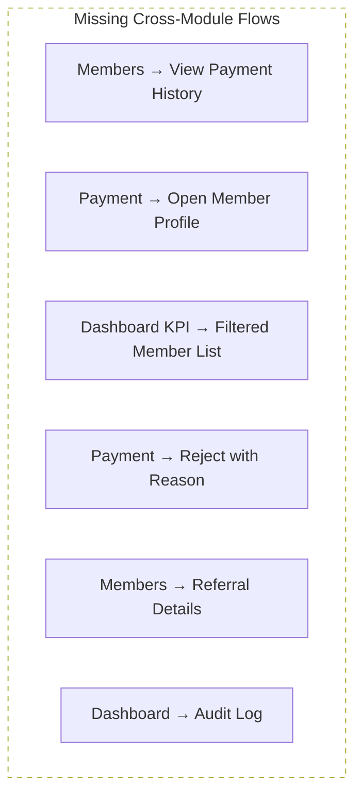
```mermaid
flowchart TD
  subgraph missing [Missing Cross-Module Flows]
    M1[Members → View Payment History]
    M2[Payment → Open Member Profile]
    M3[Dashboard KPI → Filtered Member List]
    M4[Payment → Reject with Reason]
    M5[Members → Referral Details]
    M6[Dashboard → Audit Log]
  end

  style missing fill:none,stroke-dasharray: 5 5
```

| Missing Flow | Why It Matters |
|-------------|----------------|
| Members → Payment History | Admin cannot see a member's transactions |
| Payment → Member Profile | Admin cannot jump from payment to member |
| Dashboard KPI → Filtered List | KPI cards are not clickable |
| Payment → Reject | No way to decline a payment |
| Members → Referral Details | No referral data in admin |
| Dashboard → Audit Log | Activity feed is not a full audit trail |

---

## Complete Admin Navigation Map

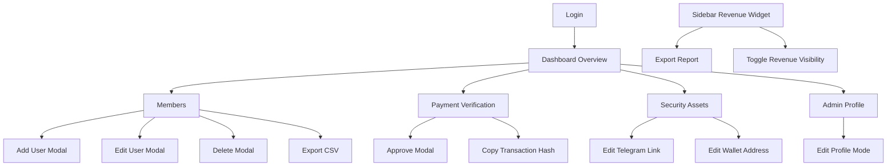
```mermaid
flowchart TB
  Login[Login] --> Dashboard[Dashboard Overview]

  Dashboard --> Members[Members]
  Dashboard --> Payments[Payment Verification]
  Dashboard --> Security[Security Assets]
  Dashboard --> Profile[Admin Profile]

  Members --> AddUser[Add User Modal]
  Members --> EditUser[Edit User Modal]
  Members --> DeleteUser[Delete Modal]
  Members --> ExportCSV[Export CSV]

  Payments --> ApprovePayment[Approve Modal]
  Payments --> CopyHash[Copy Transaction Hash]

  Security --> EditTelegram[Edit Telegram Link]
  Security --> EditWallet[Edit Wallet Address]

  Profile --> EditProfile[Edit Profile Mode]

  SidebarWidget[Sidebar Revenue Widget] --> ExportRevenue[Export Report]
  SidebarWidget --> TogglePrivacy[Toggle Revenue Visibility]
```

---

## TraderCity Knowledge Transfer

### Ideas to Definitely Reuse
- Linear approval workflow: Review → Confirm → Approve
- Filter → Act → Confirm pattern for destructive actions
- Inline edit with Cancel/Save for configuration (Security page pattern)
- Sidebar-accessible export from any page

### Ideas to Simplify
- Reduce steps for common actions (Edit member requires: find row → open menu → click Edit → modal — 3 clicks before editing)
- Add direct row click to open detail view

### Ideas to Merge
- Member onboarding and payment recording happen in one modal — split into guided steps in TraderCity
- Security's two-card edit flow could become a unified Settings page with sections

### Ideas to Redesign (for TraderCity)
- Add all missing cross-module flows (member ↔ payment linking, KPI drill-down, reject workflow)
- Add bulk workflows (bulk hide, bulk export filtered, bulk approve payments)
- Add notification-triggered workflows (expiring soon → admin action queue)

### Most Useful Interface Patterns
- Confirmation modal before irreversible actions (Delete, Approve)
- Filter → Review → Act three-step operational pattern
- One-edit-at-a-time for configuration (Security cards)
