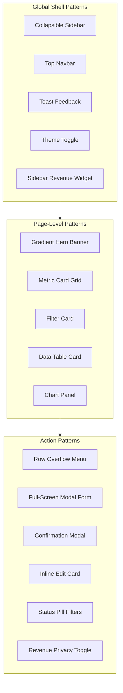

# UI Patterns

A catalog of reusable interface patterns discovered across the Arena admin product. Each pattern is described by what the administrator sees and how they interact with it.

---

## Pattern Hierarchy

---

## Global Shell Patterns

### 1. Collapsible Sidebar

| Attribute | Detail |
|-----------|--------|
| **Where used** | Every admin page |
| **Desktop behavior** | Toggle between full width (256px, labels visible) and collapsed (80px, icons only) |
| **Mobile behavior** | Hidden by default; hamburger opens full-width drawer overlay with backdrop |
| **Active state** | Current page highlighted; section label shown beneath logo |
| **Footer** | Revenue widget embedded at bottom |

### 2. Top Navbar

| Attribute | Detail |
|-----------|--------|
| **Where used** | Every admin page |
| **Contents** | "Arena Admin Dashboard" title, mobile menu button, theme toggle, avatar dropdown |
| **Avatar dropdown** | Shows admin email + Log out (no profile link) |
| **Position** | Fixed above scrollable main content |

### 3. Toast Feedback

| Attribute | Detail |
|-----------|--------|
| **Where used** | After any admin action (save, delete, approve, copy, export) |
| **Position** | Bottom-center of viewport |
| **Types** | Success (green) and error (red) messages |
| **Note** | This is NOT a notification center — toasts are ephemeral action confirmations |

### 4. Theme Toggle

| Attribute | Detail |
|-----------|--------|
| **Where used** | Top navbar |
| **Behavior** | Switches between light and dark mode |
| **Scope** | Applies to entire admin shell |

### 5. Sidebar Revenue Widget

| Attribute | Detail |
|-----------|--------|
| **Where used** | Sidebar footer on every admin page |
| **Contents** | Last 7 Days, Last 30 Days, All Time revenue |
| **Actions** | Show/hide toggle, Export Report |
| **Collapsed mode** | Icon-only show/hide and export buttons |

---

## Page-Level Patterns

### 6. Gradient Hero Banner

| Attribute | Detail |
|-----------|--------|
| **Where used** | Dashboard Overview, Members, Payment Verification |
| **Contents** | Page title, subtitle, primary action button (Refresh) |
| **Visual** | Gradient background, large typography, rounded container |
| **Purpose** | Establishes page context and provides the most common action |

### 7. Metric Card Grid

| Attribute | Detail |
|-----------|--------|
| **Where used** | Dashboard (5 cards), Members (3 cards), Payment Verification (4 cards) |
| **Structure** | Icon + label + large value + optional trend badge |
| **Colors** | Each card has a distinct color theme (blue, green, red, purple, etc.) |
| **Responsive** | Grid adjusts from 1 to 5 columns based on viewport |

### 8. Filter Card

| Attribute | Detail |
|-----------|--------|
| **Where used** | Members, Payment Verification |
| **Structure** | Contained card with search input + filter controls + clear button |
| **Members variant** | Text search + status dropdown + date range pickers |
| **Payment variant** | Text search + status pill buttons |
| **Clear behavior** | Button appears only when filters are active |

### 9. Data Table Card

| Attribute | Detail |
|-----------|--------|
| **Where used** | Members, Payment Verification |
| **Structure** | Card container with section title, header badges (count, page size), column headers, data rows, pagination |
| **Row actions** | Overflow menu (⋮) or inline action buttons |
| **Pagination** | Previous/Next + numbered pages + "Page X of Y" |

### 10. Chart Panel

| Attribute | Detail |
|-----------|--------|
| **Where used** | Dashboard Overview |
| **Types** | Area chart (User Growth), Bar chart (Revenue), Pie chart (User Distribution) |
| **Loading** | Charts load dynamically (lazy) |
| **Time range** | Fixed at 12 months — no user-selectable range |

---

## Action Patterns

### 11. Row Overflow Menu

| Attribute | Detail |
|-----------|--------|
| **Where used** | Members table |
| **Trigger** | Three-dot (⋮) icon at end of each row |
| **Items** | Edit, Hide/Unhide, Delete |
| **Behavior** | Dropdown menu anchored to the row |

### 12. Full-Screen Modal Form

| Attribute | Detail |
|-----------|--------|
| **Where used** | Members (Add/Edit User) |
| **Structure** | Overlay backdrop + centered form card with title, subtitle, fields, footer buttons |
| **Validation** | Inline error banner for missing required fields |
| **Modes** | Create (empty form) and Edit (pre-filled form) |
| **Conditional fields** | VIP category disables/resets certain fields; Custom plan shows expiry date |

### 13. Confirmation Modal

| Attribute | Detail |
|-----------|--------|
| **Where used** | Members (Delete), Payment Verification (Approve) |
| **Structure** | Warning/info icon + title + descriptive copy + Cancel + Confirm buttons |
| **Delete variant** | Rose/destructive confirm button, "cannot be undone" warning |
| **Approve variant** | Standard confirm button with loading spinner |

### 14. Inline Edit Card

| Attribute | Detail |
|-----------|--------|
| **Where used** | Security page |
| **Behavior** | Card starts read-only → "Modify" button → field becomes editable, card gets ring highlight → Cancel or Save |
| **Constraint** | Only one card editable at a time; other Modify buttons disabled |
| **Fields** | Large input with placeholder, read-only styling when inactive |

### 15. Status Pill Filters

| Attribute | Detail |
|-----------|--------|
| **Where used** | Payment Verification |
| **Structure** | Horizontal row of clickable pill buttons |
| **Active state** | Selected pill highlighted with distinct background |
| **Options** | All Payments, PENDING, VERIFIED, SUCCESS, FAILED |

### 16. Status Badges

| Attribute | Detail |
|-----------|--------|
| **Where used** | Members table, Payment Verification table |
| **Structure** | Small colored pill with text label |
| **Color system** | Green = active/success, Red = expired/failed, Amber = pending/suspended, Blue = awaiting, Gray = hidden/rejected |
| **Consistency** | Same color language across Members and Payments |

### 17. Revenue Privacy Toggle

| Attribute | Detail |
|-----------|--------|
| **Where used** | Members revenue cards, Sidebar revenue widget |
| **Trigger** | Eye icon button |
| **Behavior** | Toggles between visible amounts and masked `$••••••` |
| **Scope** | Per-surface (Members cards and sidebar toggle independently) |

### 18. Profile Split Layout

| Attribute | Detail |
|-----------|--------|
| **Where used** | Admin Profile |
| **Structure** | 1/3 column (profile overview with avatar) + 2/3 column (detail cards) |
| **Cards** | Profile overview, Personal Information, Account Statistics |
| **Edit mode** | Inline field editing with Save/Cancel |

### 19. Progress Bars

| Attribute | Detail |
|-----------|--------|
| **Where used** | Dashboard Performance Metrics |
| **Structure** | Label + count + percentage + horizontal progress bar |
| **Data** | Active, Expired, Expiring Soon as percentage of total users |

### 20. Activity Feed

| Attribute | Detail |
|-----------|--------|
| **Where used** | Dashboard Recent Activity |
| **Structure** | Vertical list of items with username, action label, and date |
| **Limit** | Maximum 5 items shown |
| **Note** | Lightweight feed, not a full audit log |

---

## Pattern Usage Matrix

| Pattern | Dashboard | Members | Payments | Security | Profile | Sidebar |
|---------|-----------|---------|----------|----------|---------|---------|
| Hero Banner | Yes | Yes | Yes | — | — | — |
| Metric Cards | 5 | 3 | 4 | — | — | 3 |
| Filter Card | — | Yes | Yes | — | — | — |
| Data Table | — | Yes | Yes | — | — | — |
| Charts | 3 | — | — | — | — | — |
| Modal Form | — | Yes | — | — | — | — |
| Confirm Modal | — | Yes | Yes | — | — | — |
| Inline Edit | — | — | — | Yes | Yes | — |
| Status Pills | — | — | Yes | — | — | — |
| Status Badges | — | Yes | Yes | — | — | — |
| Privacy Toggle | — | Yes | — | — | — | Yes |
| Row Menu | — | Yes | — | — | — | — |
| Progress Bars | Yes | — | — | — | — | — |
| Activity Feed | Yes | — | — | — | — | — |
| Profile Split | — | — | — | — | Yes | — |
| Toast | Yes | Yes | Yes | Yes | Yes | Yes |
| Theme Toggle | Yes | Yes | Yes | Yes | Yes | Yes |

---

## Visual Language Patterns

| Pattern | Description |
|---------|-------------|
| **Glass/blur cards** | Semi-transparent card backgrounds with backdrop blur |
| **Rounded corners** | Large border radius (rounded-3xl) on cards and containers |
| **Gradient backgrounds** | Hero banners and accent areas use color gradients |
| **Dark/light theme** | Full theme support across all admin pages |
| **Color-coded urgency** | Red/amber/green for days-left and status indicators |
| **Large typography** | Bold page titles with subtitle descriptions |
| **Icon + label nav** | Sidebar items use icon with text label (hidden when collapsed) |

---

## TraderCity Knowledge Transfer

### Ideas to Definitely Reuse
- Metric card grid as the standard page header pattern for operational pages
- Filter card (search + controls + clear) as the standard pre-table pattern
- Status badge color system (green/red/amber/blue/gray) across all modules
- Confirmation modal before destructive or irreversible actions
- Revenue privacy toggle for sensitive financial data
- Collapsible sidebar with mobile drawer fallback

### Ideas to Simplify
- Reduce hero banner usage — not every page needs a gradient hero (Security and Profile don't use one)
- Standardize metric card count (Arena uses 3, 4, or 5 depending on page)
- Unify privacy toggle to work globally instead of per-surface

### Ideas to Merge
- Filter card + data table card could become one unified "Data Explorer" pattern
- Inline edit card (Security) and profile split layout (Admin Profile) could become a unified "Settings Section" pattern
- Toast feedback could evolve into a notification center

### Ideas to Redesign (for TraderCity)
- Add drawer pattern for user detail (Arena only has modal)
- Add bulk action bar pattern (multi-select + batch actions)
- Add empty state pattern (Arena doesn't show empty states for zero-result filters)
- Add skeleton loading pattern (Arena uses spinners)

### Most Useful Interface Patterns (Ranked)
1. **Data table + filter card** — core operational pattern for Members and Payments
2. **Metric card grid** — instant context on page load
3. **Confirmation modal** — safety for destructive actions
4. **Status badge color system** — scannable status across tables
5. **Row overflow menu** — clean action access without cluttering rows
6. **Revenue privacy toggle** — practical sensitivity control
7. **Inline edit card** — elegant single-field configuration
8. **Collapsible sidebar** — space-efficient navigation
