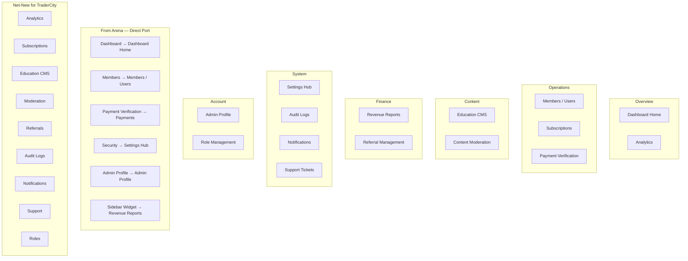

# TraderCity Interface Ideas

Synthesis document mapping Arena admin discoveries to TraderCity admin dashboard planning. This document translates Arena's existing product knowledge into actionable inspiration for TraderCity — without redesigning Arena itself.

---

## Executive Summary

Arena provides a **proven operational foundation** for three core admin workflows:
1. **Member/subscription management** (Members page)
2. **Payment approval** (Payment Verification page)
3. **Platform analytics** (Dashboard Overview)

These three modules, plus Security settings and Admin Profile, form ~40% of TraderCity PRD admin requirements. The remaining 60% (referrals, education CMS, audit logs, notifications, support, roles, analyst management, content moderation) must be net-new design work inspired by — but not copied from — Arena patterns.

---

## 1. Ideas to Definitely Reuse

These Arena interface ideas are mature, practical, and directly transferable to TraderCity:

### Member Management Table
| Arena Feature | TraderCity Application |
|--------------|----------------------|
| 10-column member table | Core user management grid |
| Status filter (8 options) | Subscription lifecycle filtering |
| Date range filter | Join/expiry date filtering |
| Username search | Primary identity search |
| Days Left color coding | Subscription urgency indicators |
| VIP/Lifetime tier | Premium/VIP tier management |
| Hide/Unhide visibility | Soft-delete / visibility toggle |
| CSV export | Data export capability |
| Row overflow menu | Contextual member actions |
| Add/Edit modal form | Member creation and editing |
| Plan-driven payment auto-fill | Subscription plan selection with pricing |

### Payment Verification Queue
| Arena Feature | TraderCity Application |
|--------------|----------------------|
| 4 stat cards (Total, Awaiting, Completed, Failed) | Payment queue dashboard |
| Transaction table (8 columns) | Payment review grid |
| Status pill filters | Quick queue switching |
| Approve confirmation modal | Payment approval safety |
| Copy transaction hash | Transaction reference access |
| Multi-field search | Payment lookup |

### Dashboard Analytics
| Arena Feature | TraderCity Application |
|--------------|----------------------|
| 5 KPI metric cards | Platform health overview |
| User Growth chart | Membership trend visualization |
| Revenue chart | Financial trend visualization |
| User Distribution pie | Membership health breakdown |
| Recent Activity feed | Operational awareness (evolve to audit log) |
| Refresh action | Manual data refresh |

### Configuration and Account
| Arena Feature | TraderCity Application |
|--------------|----------------------|
| Inline edit cards (Security) | Settings section pattern |
| Profile split layout (Admin Profile) | Admin account management |
| Revenue privacy toggle | Financial data sensitivity control |
| Sidebar revenue widget | Persistent financial snapshot |
| Export Report | Revenue data export |

### Global Shell
| Arena Feature | TraderCity Application |
|--------------|----------------------|
| Collapsible sidebar | Primary navigation |
| Mobile drawer | Responsive admin access |
| Theme toggle | Accessibility preference |
| Toast feedback | Action confirmation |
| Status badge color system | Consistent status language |

---

## 2. Ideas to Simplify

These Arena patterns work but should be streamlined for TraderCity:

| Arena Pattern | Simplification |
|--------------|---------------|
| Revenue in 3 locations (Dashboard, Members, Sidebar) | Single authoritative revenue view on Dashboard or Reports page |
| 8 flat status filters | Group into Active / Inactive / Special categories |
| Static trend badges on Dashboard | Remove or replace with real calculated deltas |
| Static satisfaction gauge (92.3%) | Remove or connect to real NPS/satisfaction data |
| Static admin profile stats | Remove demo metrics; show real admin activity |
| Gradient hero on 3 of 5 pages | Use hero only on Dashboard; simpler headers elsewhere |
| 100 rows/page fixed | Default to 25 with configurable page size |
| Toast-only feedback | Keep toasts for actions; add notification center for events |

---

## 3. Ideas to Merge

These Arena modules overlap and should be consolidated in TraderCity:

### Members + Payment Verification → Unified Member Experience
**Arena today:** Two separate pages with no cross-linking.

**TraderCity inspiration:** A Member Detail view (page or drawer) with tabs:
- **Profile** — identity, contact, Telegram/Discord links
- **Subscription** — plan, status, dates, renewal (from Arena Members table/form)
- **Payments** — transaction history linked to Payment Verification records (new)
- **Referrals** — referral codes, commissions (new, not in Arena)
- **Activity** — audit trail of admin actions on this member (new)

### Dashboard + Sidebar Widget → Unified Analytics
**Arena today:** Revenue appears on Dashboard card, Members cards, and sidebar widget.

**TraderCity inspiration:** Dashboard as the single analytics home. Remove sidebar widget. Add date-range selectors and drill-down links on KPI cards.

### Security → Settings Hub
**Arena today:** 2 configuration fields on a "Security" page.

**TraderCity inspiration:** A Settings module with sections:
- **Platform** — community links, wallet addresses (from Arena Security)
- **Billing** — plan prices, payment methods (new)
- **Notifications** — email templates, notification preferences (new)
- **Roles** — role definitions, permissions (new)
- **Branding** — logo, colors, platform name (new)

### Export Features → Reports Module
**Arena today:** CSV export on Members, revenue export in sidebar widget.

**TraderCity inspiration:** A Reports page with:
- Member export (from Arena)
- Revenue export (from Arena)
- Payment export (new)
- Subscription report (new)
- Referral report (new)
- Scheduled reports (new)

### Recent Activity → Audit Log
**Arena today:** 5-item activity feed on Dashboard.

**TraderCity inspiration:** Full Audit Log module with filterable, searchable admin action history. The activity feed pattern scales into a proper log.

---

## 4. Ideas to Redesign (Net-New for TraderCity)

These features are required by the TraderCity PRD but do not exist in Arena. Design from scratch using Arena's established patterns as inspiration:

| TraderCity Module | Arena Pattern to Adapt | New Design Needed |
|-------------------|----------------------|-------------------|
| **Referral Management** | Members table + filter card | Referral codes table, commission tracking, payout ledger, anti-fraud indicators |
| **Education CMS** | Members Add/Edit modal | Course builder, module editor, topic manager, media upload, publish/unpublish |
| **Notification Center** | Toast feedback | Notification inbox, send notification form, template management, delivery status |
| **Audit Logs** | Dashboard activity feed | Full searchable log with filters (admin, action, date, entity) |
| **Support / Tickets** | Payment Verification queue | Ticket list, status workflow, assignment, response thread |
| **Role Management** | Security inline-edit cards | Role list, permission matrix, assign roles to users |
| **Analyst Management** | Members table pattern | Analyst list, KYC status, earnings, content metrics, room management |
| **Content Moderation** | Members row overflow menu | Flagged content queue, moderation actions, escalation path |
| **Payment Reject Flow** | Payment approve confirmation | Reject modal with reason field, notification to user |
| **User Detail View** | Members modal form | Full page or drawer with tabbed sections |
| **Bulk Actions** | Not in Arena | Multi-select + batch action bar on tables |
| **Analytics Segmentation** | Dashboard charts | Filter by role, date, content type, analyst |
| **Discord Management** | Security inline-edit (Telegram link) | Discord server link, bot configuration, role sync |
| **Abuse/Fraud Alerts** | Dashboard KPI cards | Alert cards with severity, investigation workflow |

---

## 5. Most Useful Interface Patterns (Ranked)

| Rank | Pattern | Why It Works | TraderCity Priority |
|------|---------|-------------|-------------------|
| 1 | **Data table + filter card** | Core operational pattern; scannable, filterable, actionable | P0 — Members, Payments, all list views |
| 2 | **Metric card grid** | Instant page context; admin knows workload before scrolling | P0 — Dashboard, Payment queue, all module homes |
| 3 | **Confirmation modal** | Prevents accidental destructive actions | P0 — Delete, Approve, Reject, all irreversible actions |
| 4 | **Status badge color system** | Consistent green/red/amber/blue/gray across all modules | P0 — Global design token |
| 5 | **Approval queue with stat cards** | Queue depth visible at a glance; admin knows pending workload | P0 — Payments, Support tickets, Moderation queue |
| 6 | **Row overflow menu** | Clean action access without row clutter | P1 — All data tables |
| 7 | **Revenue privacy toggle** | Practical for shared screens and demo environments | P1 — All financial displays |
| 8 | **Inline edit card** | Elegant single-section configuration editing | P1 — Settings sections |
| 9 | **Collapsible sidebar** | Space-efficient navigation that scales to more items | P0 — Global shell |
| 10 | **Modal form for create/edit** | Works for simple entities; scale to drawer/page for complex ones | P1 — Simple CRUD; P0 detail view for complex entities |

---

## 6. Suggested TraderCity Admin IA (Inspired, Not Designed)

This is a structural inspiration map — not a final design. It shows how Arena's 5 items expand into TraderCity's broader requirements:

### Port Map: Arena → TraderCity

| Arena Module | TraderCity Destination | Action |
|-------------|----------------------|--------|
| Dashboard Overview | Dashboard Home | Port directly; enhance with drill-down and real metrics |
| Members | Members / Users | Port table + filters; add detail view with tabs |
| Payment Verification | Payments | Port queue; add reject flow and member linking |
| Security Assets | Settings Hub (Platform section) | Port inline-edit pattern; expand to full settings |
| Admin Profile | Admin Profile | Port directly; remove static stats |
| Sidebar Revenue Widget | Revenue Reports | Port metrics; move to dedicated page |
| Dashboard About | — | Do not port (orphan page) |
| — | Subscriptions | New module inspired by Members subscription columns |
| — | Analytics | New module inspired by Dashboard charts |
| — | Education CMS | New module; no Arena equivalent |
| — | Referrals | New module; no Arena equivalent |
| — | Audit Logs | New module inspired by Dashboard activity feed |
| — | Notifications | New module; no Arena equivalent |
| — | Support | New module inspired by Payment Verification queue |
| — | Roles | New module; no Arena equivalent |
| — | Content Moderation | New module; no Arena equivalent |

---

## 7. Implementation Priority Recommendation

Based on Arena coverage and TraderCity PRD requirements:

### Phase 1 — Port Arena Core (Highest Value, Lowest Effort)
1. Admin shell (sidebar, navbar, theme, layout)
2. Dashboard Home (KPI cards, charts, activity feed)
3. Members / Users (table, filters, CRUD, export)
4. Payment Verification (queue, approve, search, stat cards)
5. Settings — Platform section (Telegram/wallet inline edit)
6. Admin Profile

### Phase 2 — Enhance Ported Modules
7. User Detail view (drawer/page with tabs)
8. Payment reject workflow
9. Member ↔ payment cross-linking
10. Reports module (consolidated exports)
11. Subscription detail (renewal queue, expiry alerts)

### Phase 3 — Net-New Modules
12. Audit Logs
13. Notification Center
14. Referral Management
15. Education CMS
16. Support / Tickets
17. Role Management
18. Analytics Segmentation
19. Content Moderation
20. Analyst Management

---

## TraderCity Knowledge Transfer

### Ideas to Definitely Reuse
Everything listed in Section 1 above — the Members table, Payment queue, Dashboard KPIs, Security inline-edit, sidebar revenue concept, and global shell patterns form the proven foundation.

### Ideas to Simplify
Everything listed in Section 2 — consolidate revenue, remove static metrics, reduce hero usage, group filters, configurable page sizes.

### Ideas to Merge
Everything listed in Section 3 — unified member detail, unified analytics, settings hub, reports module, activity feed → audit log.

### Ideas to Redesign
Everything listed in Section 4 — all net-new modules required by TraderCity PRD that Arena does not cover.

### Most Useful Interface Patterns
The ranked list in Section 5 — prioritize Data table + filter card, Metric card grid, Confirmation modal, Status badges, and Approval queue patterns as the core TraderCity admin design vocabulary.

---

## Related Documents

| Document | Focus |
|----------|-------|
| [01_Dashboard_Overview.md](01_Dashboard_Overview.md) | Dashboard home analytics |
| [02_Interface_Modules.md](02_Interface_Modules.md) | Master module catalog |
| [03_Subscription_Interface.md](03_Subscription_Interface.md) | Subscription UI on Members page |
| [04_Payment_Interface.md](04_Payment_Interface.md) | Payment verification queue |
| [05_User_Management_Interface.md](05_User_Management_Interface.md) | Member CRUD and table |
| [06_Management_Workflows.md](06_Management_Workflows.md) | Navigation flow diagrams |
| [07_UI_Patterns.md](07_UI_Patterns.md) | Reusable pattern catalog |
| [08_Interface_Features.md](08_Interface_Features.md) | Feature inventory + PRD coverage |
| [09_Design_Observations.md](09_Design_Observations.md) | Strengths, weaknesses, critique |
